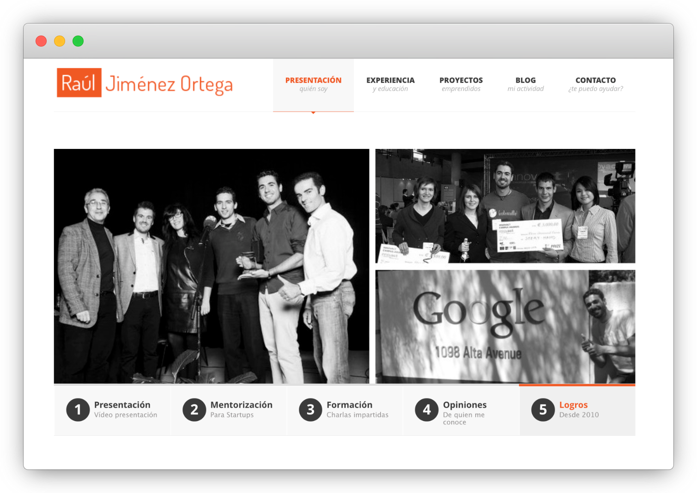

Welcome to my new website!, it was time for a change...😁

Some of you might remember [the old website](http://web.archive.org/web/20160322140938/http://rauljimenez.info/) I built back in 2013:

Back in the days, I decided to build that website to introduce myself, share some thoughts, and give updates about my life to my friends.

Today I have decided to replace it for this new website built with [docusaurus.io](https://docusaurus.io/) for several reasons, but mainly because I will be:
* **Easier to maintain and update** (no backend and almost everything in [markdown](https://en.wikipedia.org/wiki/Markdown)),
* Able to **share resources in Spanish and English**.
* **Allow you to contribute/repurpose the content I share** (it is [hosted on GitHub](https://github.com/hhkaos/hhkaos.github.io)).

So, the next step is to start migrating the content I could rescue [from my blog](https://blog.rauljimenez.info/) and put it here.

I have always thought that it is a pity to create resources and leave them in a drawer, so from now on I plan to start taking many of the resources that I have created over the years and share them in what I have defined as my ["🧠 Digital Brain"](/docs/digital-brain). 

I'm starting by compiling [all the resources I could share](https://github.com/hhkaos/hhkaos.github.io/issues/1), so please, if you are interested in one in particular let me know in the comments.

This tool is not meant to be a social tool where you can subscribe, so if you want to stay up to date on what I share I will be republishing my articles in two channels:
* https://medium.com/@hhkaos for Spanish speakers
* https://dev.to/hhkaos for English speakers

I hope you like it, and any suggestions are more than welcome.