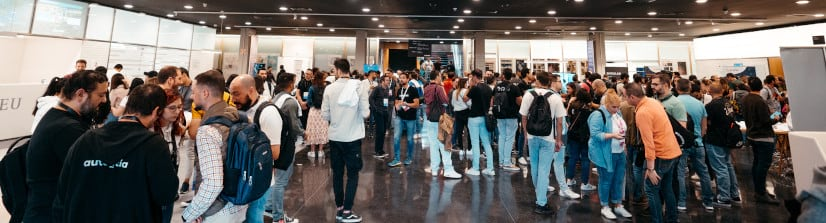
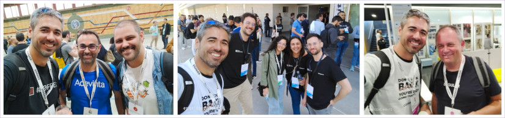
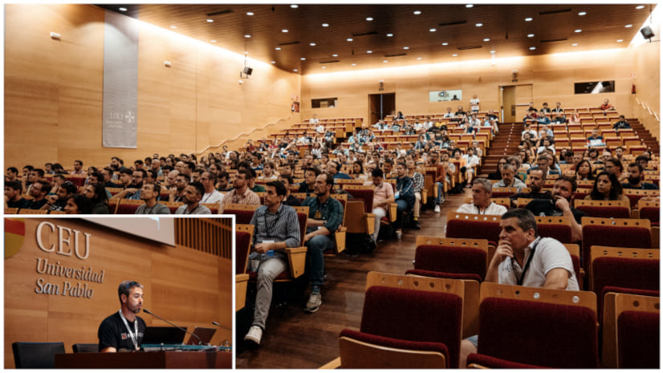
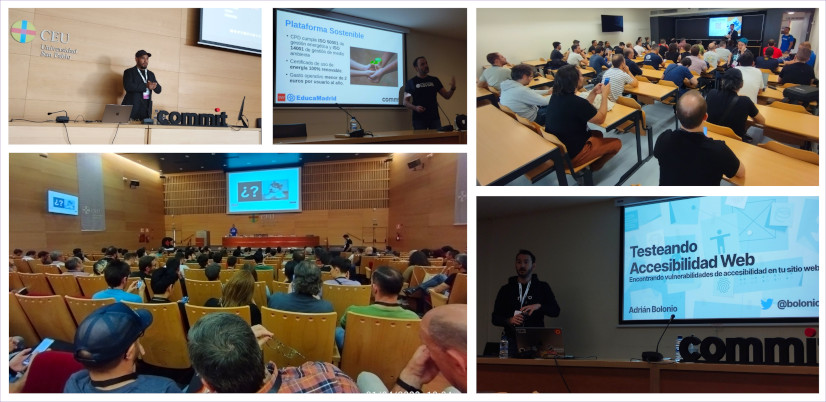

> **📄 Note**: The interactive version of this article is available at [Dev.to 🇺🇸🇬🇧](https://dev.to/hhkaos/why-attend-developer-conferences-59b3) & [Medium.com 🇪🇸](https://medium.com/@hhkaos/por-qu%C3%A9-asistir-a-conferencias-para-desarrolladores-4c22cbe132cf).

---

If you want to know what the benefits of attending developer conferences like [CommitConf](https://2023.commit-conf.com/en/) and why you should consider submitting a proposal for a talk or workshop, keep reading! 😄.

Recently, I was fortunate enough to attend CommitConf. It is one of the largest [events for developers that is held annually in Spain](https://twitter.com/i/lists/1571289000886910977). It is well attended and draws strong participation from around 50 Spanish technical communities.

## Why attend conferences like CommitConf?

At the conference, developers were brought together to **retrain, discover, and share new insight and knowledge about our profession**. For example, attendees shared information about:

* New tools and languages.
* New capabilities for the tools and languages already used by the community.
* How companies solve different software development challenges.
* Best practices in accessibility, security, and design patterns.
* New trends.

Additionally, the conference provided a place to meet new people and reconnect with those already known. At events like this, it’s not uncommon to run into people you know! In my case, I bumped into some of my former colleagues, and some developers who use **[ArcGIS to create Location-Aware apps or map applications](https://developers.arcgis.com/documentation/mapping-apis-and-services/)**.

## What made this conference special?

This event, like many others, gives us, developers, the opportunity to **present talks, workshops, and even [Open Spaces](https://en.wikipedia.org/wiki/Open_Space_Technology)**.

For attendees, a unique factor that sets this event apart from others is the system used to create the event‘s agenda, **allowing the communities themselves to be involved in the selection process of talks**. This system is called [Koliseo](https://koliseo.com/) and is free for anyone to use.

## Why submit a proposal?

Going to an event like CommitConf **is an opportunity to learn from and contribute to the developer community**. And, there are many different motivations for a person to send a proposal.

* There are people who simply **enjoy sharing knowledge and experiences**. 
* Other attendees want to **increase the visibility of their company** and to raise awareness of the cool work they do, **with the hope of attracting new talent**. 
* Some attendees want to **create a personal brand**.
* While others want to **discuss and find solutions to a problem with their colleagues**.

And if you are lucky enough to have a proposal accepted, as in my case, you can **attend the speakers’ dinner** the day before the event, where you meet a lot of experts on different topics 😍. 

## What did Esri bring to the conference?

From the company I work for ([Esri](http://esri.com/)), they have always encouraged me to attend to conferences and to send proposals that I thought might be relevant to other developers.

This time, I presented a variety of proposals:

* DataViz & Map Optimization
* Designing Beautiful and Intelligent Maps
* Using and Creating Collections in Postman Like a Pro
* **🔑🔒 OAuth, OpenID Connect and JWT for Dummies**

I was lucky that the conference organizers accepted “OAuth, OpenID Connect, and JWT for Dummies” because it gave me the **opportunity to share what these auth standards are and how they work**. I showed practical examples based on some of the resources that we have created from [Esri's Developer Experience team](https://www.youtube.com/playlist?list=PL0VMTWv3XRwWL4zG7rB8SlHkE5XXbd5OW), like the **[Authentication workspace in Postman](https://www.postman.com/esridevs/workspace/authentication-in-arcgis/overview)**.

In case you want, you can **[check the slides out here](https://bit.ly/oauth-commit)**. If you are interested in the topic and want me to repeat this talk online, just let me know in the comments!

## What did I learn at the conference?

Below are some of the takeaways from the sessions that I attended:

* **Local Communities Outside Big Cities (Open Space)**: This session was super interesting. I had the opportunity to share tips and ideas to overcome challenges in creating and maintaining developer communities with approximately thirty other people. Among them were representatives from different communities about Python, Software Crafting, Data, Machine Learning, generalists’ communities, Free Software, GNU/Linux, DevOps, Drupal, and us representing the [GeoDevelopers community](https://meetup.com/es-ES/geo-developers).

> **Note**: After the session, I decided to create a guide with what we learned and our own experience. If you are interested, save the article in favourites because we will add it **[here]** in a few weeks.

* **Detecting Web Performance Issues with Chrome DevTools**: [@nucliweb](https://twitter.com/nucliweb) gave an overview of the Chrome DevTools and showed us how they keep adding new tools like [Recorder](https://developer.chrome.com/docs/devtools/recorder/) and [Coverage](https://developer.chrome.com/docs/devtools/coverage/) to help evaluate your web performance and optimize it. Also, he showed us how the new AVIF image format improves WebP performance. More info at [web.dev](https://web.dev/).

* **Don’t Yell at Me, I Can’t See You**: [@javierabadia](https://twitter.com/javierabadia) and [@jameshedaweng](https://twitter.com/jameshedaweng) explained to us how to divide the responsibilities between an Engineering Manager and a Product Manager to avoid failure when creating a product. In summary, a PM must be responsible for *what* features to add and *why*, and the EM in the *how* and the *who*. The *when* should be a shared responsibility.

* **Why I Decided to Pursue the Developer Relations Path**: [@kinisoftware](https://twitter.com/kinisoftware) told us about his experience as a Staff Developer Relations Engineer, where he works to promote the expertise of Criteo’s technical team by facilitating participation in events and communities.

* **Testing Web Accessibility**: [@bolonio](https://twitter.com/bolonio) showed us a multitude of tools and resources for testing web accessibility: [axe-core](https://github.com/dequelabs/axe-core), [eslint-plugin-jsx-a11y](https://www.npmjs.com/package/eslint-plugin-jsx-a11y), [jest-axe](https://www.npmjs.com/package/jest-axe), [axe-core/cli](https://www.npmjs.com/package/@axe-core/cli), [pa11y](https://pa11y.org/), [pa11y-ci](https://github.com/pa11y/pa11y-ci), [axe chrome extension](http://deque.com/axe), [arc toolkit](http://paciellogroup.com/toolkit), [accessibilityinsights.io](http://accessibilityinsights.io/), [wave.webaim.org](https://wave.webaim.org/), and more.

* **The Mistake of Becoming a Manager**: [@npatarino](https://twitter.com/npatarino) explained to us that becoming a manager of people is not the only way to have leadership or increase your salary. He said that for those senior software engineers who want to continue growing, there are other positions such as Staff Software Engineer, Principal Software Engineer, Distinguished Software Engineer and Technical Fellow.

* **Past, Present and Future of EducaMadrid**: [@asanzdiego](https://twitter.com/asanzdiego) talked to us about the educational platform of the Community of Madrid that he leads; he told us about the technical challenges they suffered during the pandemic, when the number of active users grew exponentially, along with the strengths and limitations of his team and his technological stack based on free software.

In summary, if you don't use to go to developer conferences, **I hope my experience has encouraged you and given you arguments to attend in the future**. I would say also to the **[Esri Developer Summit in the USA](https://www.esri.com/en-us/about/events/devsummit/)** (or [in Europe](https://www.esri.com/en-us/about/events/devsummit-europe/save-date)), although this rather applies if you are an Esri partner or customer 😉.

Remember, **although much of the content of these conferences is then made available online, there are many other things that can only be achieved by attending.**

> If you want to leave comments, you can do it in [the article published in Dev.to](https://dev.to/hhkaos/why-attend-developer-conferences-59b3)