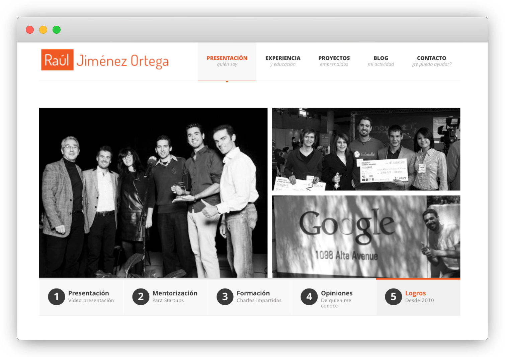

Bienvenidx a mi nueva web!, ya era hora... 😁

Algunas personas recordaréis [la antigua página](http://web.archive.org/web/20160322140938/http://rauljimenez.info/) que cree en 2013:

Por aquellos tiempos decidí crear una web que me permitiese presentarme, compartir algunas reflexiones y experiencias entre otras cosas para mantener a las personas de mi entorno al día sobre mi vida.

Mi vida ha cambiado mucho en los últimos 10 años, y por eso he decidido reemplazar esa web con esta hecha con [docusaurus.io](https://docusaurus.io/). Las razones son varias, pero principalmente porque:
* **Será más fácil mantenerla y actualizarla** (ya no necesito un backend y casi todo está hecho en [markdown](https://es.wikipedia.org/wiki/Markdown)).
* **Podré compartire recursos traducidos en Español e Inglés**.
* **Porque podréis reutilizar y contribuir a las cosas que os comparta** (todo está [alojado en GitHub](https://github.com/hhkaos/hhkaos.github.io)).

Así que, el próximo paso es empezar a migrar el contenido que pueda recuperar [de mi blog anterior](https://blog.rauljimenez.info/) y ponerlo aquí.

Por otro lado, siempre he pensado que es una pena crear recursos y dejarlos guardados en un cajón, así que de ahora en adelante, mi objetivo es empezar a publicar aquí muchos de los recursos que he ido creando a lo largo de los años y compartirlos en lo que he definido como mi ["🧠 Cerebro Digital"](/docs/digital-brain).

He empezado por recopilar [recursos que podría compartir](https://github.com/hhkaos/hhkaos.github.io/issues/1), así que por favor, si te interesa algún dímelo en los comentarios del issue.

Y como esta herramienta no pretende ser una herramienta social a la que nadie se pueda suscribir... si queréis estar al día de lo que comparto, estaré republicando estos artículos en dos canales:
* https://medium.com/@hhkaos para los hispanohablantes.
* https://dev.to/hhkaos para los angloparlantes.

Espero que te guste la idea, pero en cualquier caso las sugerencias son más que bienvenidas.
