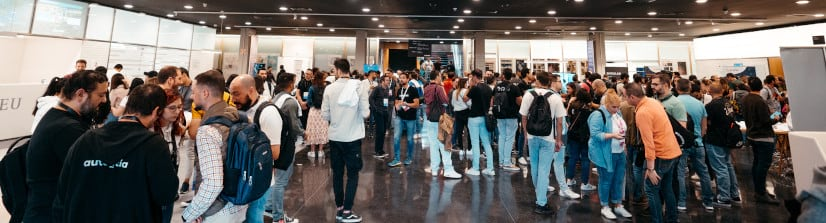
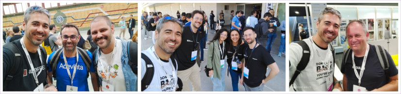
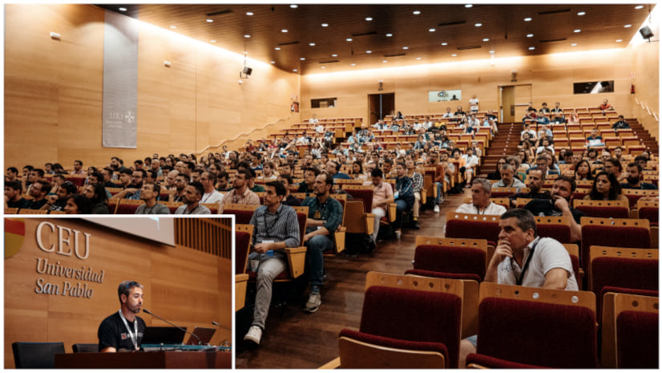
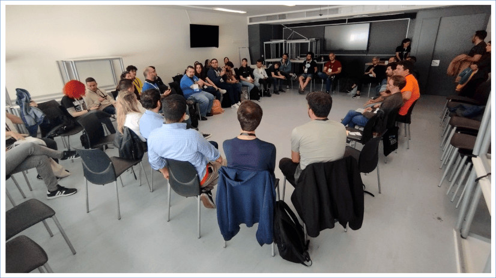
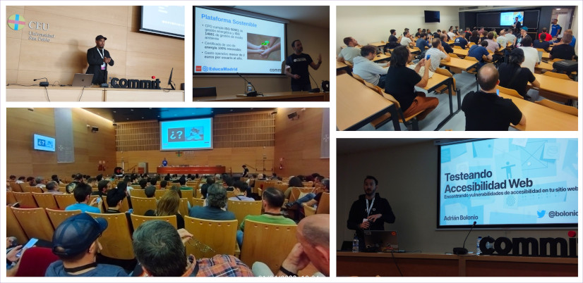

> **📄 Nota**: La versión interactiva de este artículo se encuentra en [Medium.com 🇪🇸](https://medium.com/@hhkaos/por-qu%C3%A9-asistir-a-conferencias-para-desarrolladores-4c22cbe132cf) & [Dev.to 🇺🇸🇬🇧](https://dev.to/hhkaos/why-attend-developer-conferences-59b3).

---

Si quieres saber cuáles son los beneficios de asistir a conferencias como [CommitConf](https://2023.commit-conf.com/es/) y por qué deberías considerar enviar una propuesta de charla, taller u [Open Space](https://en.wikipedia.org/wiki/Open_Space_Technology), ¡sigue leyendo! 😄.

Hace poco tuve la suerte de asistir a CommitConf, uno de los mayores [eventos para desarrolladores que se celebra anualmente en España](https://twitter.com/i/lists/1571289000886910977/members). Además de la gran asistencia, cuenta con la participación de unas 50 comunidades técnicas españolas.

## ¿Por qué asistir a eventos como CommitConf?

En las conferencias, los desarrolladores sirven normalmente para **reciclarnos, descubrir y compartir nuevas perspectivas y conocimientos con otros compañeros de profesión**. Por ejemplo:

* Nuevas herramientas y lenguajes de programación.
* Nuevas funcionalidades de las herramientas y lenguajes que ya utilizamos.
* Cómo otras empresas resuelven distintos retos del desarrollo.
* Buenas prácticas en accesibilidad, seguridad y patrones de diseño.
* Tendencias.

Además, las conferencias también sirven para conocer gente nueva y reencontrarse con gente conocida. En mi caso, en Commit, me topé con algunos de mis antiguos compañeros de trabajo, y algunos desarrolladores que usan **[ArcGIS para crear Location-Aware apps o aplicaciones con mapas](https://developers.arcgis.com/documentation/mapping-apis-and-services/)** 🗺️📍😄.

## ¿Qué hace especial a esta conferencia?

Este evento, como muchos otros, nos da quienes nos dedicamos al mundo de la tecnología, la oportunidad de **presentar charlas, talleres y en ocasiones… [Open Spaces](https://en.wikipedia.org/wiki/Open_Space_Technology).**

En mi opinión, un factor importante que diferencia este evento de otros, es el sistema utilizado para crear la agenda del evento, desde donde **invitan a las propias comunidades a participar en el proceso de selección de las charlas**.

> 💡 Si os interesa, la tecnología que usan se llama [Koliseo](https://koliseo.com/), y es de uso gratuito para cualquiera 😉.

## ¿Por qué presentar una propuesta?

Asistir a un evento como CommitConf es una **oportunidad para aprender, pero también de contribuir**.

Las motivaciones de cada persona para presentar una propuesta son muy variadas.

* Hay personas que simplemente **disfrutan compartiendo conocimiento y experiencias**.
* Otros asistentes quieren **aumentar la visibilidad de su empresa** y dar a conocer el gran trabajo que hacen, **con la esperanza de atraer talento a la empresa**.
* Algunos asistentes quieren **crear una marca personal**.
* Mientras que **otros desean debatir y encontrar soluciones a un problema con otras personas de la profesión**.

Y si tienes la suerte de que te acepten una propuesta, como en mi caso, además puedes **asistir a la cena de ponentes** el día antes del evento, donde conocerás a un montón de expertos en diferentes temas 😍.

## ¿Qué aportamos desde Esri a la conferencia?

Desde la empresa para la que trabajo ([Esri](http://esri.com/)), siempre me ha animado a asistir a conferencias y a enviar propuestas que creyese que podían ser relevantes para otros desarrolladores.

Esta vez presenté varias propuestas:

* DataViz & Map Optimization
* Designing Beautiful and Intelligent Maps
* Using and Creating Collections in Postman Like a Pro
* **🔑🔒 OAuth, OpenID Connect and JWT for Dummies**

Tuve suerte de que la comunidad y la organización de la conferencia aceptaran “*🔑🔒 OAuth, OpenID Connect, and JWT for Dummies*”, lo que **me dio la oportunidad de compartir qué son estos estándares y cómo funcionan**. Mostré ejemplos prácticos basados en algunos de los recursos que hemos creado desde el *[equipo de Developer Experience de Esri](https://www.youtube.com/playlist?list=PL0VMTWv3XRwWL4zG7rB8SlHkE5XXbd5OW)*, como el [***workspace* de Autenticación en Postman**](https://www.postman.com/esridevs/workspace/authentication-in-arcgis/overview).

Si quieres, puedes **[consultar las diapositivas aquí](https://bit.ly/oauth-commit)**. El vídeo de la charla lo compartiré en cuanto la organización lo haga público.

## ¿Qué aprendí en la conferencia?

A continuación os dejo algunas de las conclusiones de las sesiones a las que asistí:

* **Comunidades locales fuera de las grandes ciudades (*Open Space*)**: Esta sesión fue super interesante. Tuve la oportunidad de compartir consejos e ideas para superar retos en la creación y mantenimiento de comunidades de desarrolladores con aproximadamente otras treinta personas. Entre ellos había representantes de diferentes comunidades sobre Python, Software Crafting, Datos, Machine Learning, comunidades de generalistas, Software Libre, GNU/Linux, DevOps, Drupal, y yo representando a la [comunidad GeoDevelopers](https://meetup.com/es-ES/geo-developers).

> **Nota**: Tras la sesión, **me he decidido a crear una guía con lo que aprendí durante la sesión y lo aprendido en base a mi propia experiencia**. Si te interesa, guarda el artículo en favoritos porque lo añadiré **[aquí]** en unas semanas.

* **Detectando problemas de Web Performance con Chrome DevTools**: [@nucliweb](http://twitter.com/nucliweb) dio una visión general de las Chrome DevTools y nos mostró cómo siguen añadiendo nuevas herramientas como [Recorder](https://developer.chrome.com/docs/devtools/recorder/) y [Coverage](https://developer.chrome.com/docs/devtools/coverage/) para ayudar a evaluar tu rendimiento web y optimizarlo. Además, nos mostró cómo el nuevo formato de imagen AVIF mejora el rendimiento de WebP. Más información en [web.dev](https://web.dev/).

* **No me chilles que no te veo: el mágico equilibrio entre el *Product Manager* y el *Engineering Manager***. [@javierabadia](http://twitter.com/javierabadia) y [@jameshedaweng](http://twitter.com/jameshedaweng) nos explicaron cómo dividir las responsabilidades entre estos dos roles para evitar el fracaso a la hora de crear un producto. En resumen, un PM debe ser responsable de *qué* características añadir y *por qué*, y el EM en el *cómo* y el *quién*. El *cuándo* debe ser una responsabilidad compartida.

* **Why I decided to pursue the Developer Relations path**: [@kinisoftware](http://twitter.com/kinisoftware) nos contó su experiencia como *Staff Developer Relations Engineer*, donde trabaja para promover la experiencia del equipo técnico de Criteo facilitando entre otras cosas la participación en eventos y comunidades.

* **Testeando Accesibilidad Web**: [@bolonio](https://twitter.com/bolonio) nos mostró multitud de herramientas y recursos para probar la accesibilidad web: [axe-core](https://github.com/dequelabs/axe-core), [eslint-plugin-jsx-a11y](https://www.npmjs.com/package/eslint-plugin-jsx-a11y), [jest-axe](https://www.npmjs.com/package/jest-axe), [axe-core/cli](https://www.npmjs.com/package/@axe-core/cli), [pa11y](https://pa11y.org/), [pa11y-ci](https://github.com/pa11y/pa11y-ci), [axe chrome extension](http://deque.com/axe), [arc toolkit](http://paciellogroup.com/toolkit), [accessibilityinsights.io](http://accessibilityinsights.io/), [wave.webaim.org](https://wave.webaim.org/), y más.

* **El error de hacerte manager**: [@npatarino](https://twitter.com/npatarino) nos explicó que convertirse en gestor de personas no es la única forma de tener liderazgo o aumentar tu salario. Dijo que para aquellos ingenieros de software sénior que quieran seguir creciendo, existen otros puestos como *Staff Software Engineer*, *Principal Software Engineer*, *Distinguished Software Engineer* y *Technical Fellow*.

* **Pasado, presente y futuro de EducaMadrid**: [@asanzdiego](https://twitter.com/asanzdiego) nos habló de la plataforma educativa de la Comunidad de Madrid que dirige; nos contó los retos técnicos que sufrieron durante la pandemia, cuando el número de usuarios activos creció exponencialmente, junto con las fortalezas y limitaciones de su equipo y su stack tecnológico basado en software libre.

En resumen, si no eres de ir a conferencias de desarrolladores, **espero que mi experiencia te haya animado y dado argumentos para asistir en el futuro**. Te diría que también al [Developer Summit de Esri en USA](https://www.esri.com/en-us/about/events/devsummit/save-date) (o [al Europeo](https://www.esri.com/en-us/about/events/devsummit-europe/save-date)), aunque esto más bien aplica si eres partner o cliente de Esri 😉.

Recuerda, **aunque gran parte del contenido de estas conferencias luego se hace disponible online, hay otras muchas cosas que solo se pueden lograr asistiendo**.

> Si quieres dejar comentarios, puedes hacerlo en [el artículo publicado en Medium.com](https://medium.com/@hhkaos/por-qu%C3%A9-asistir-a-conferencias-para-desarrolladores-4c22cbe132cf)