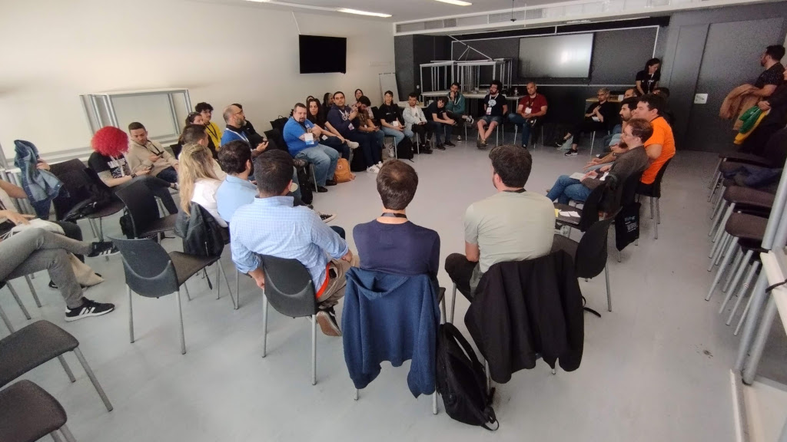
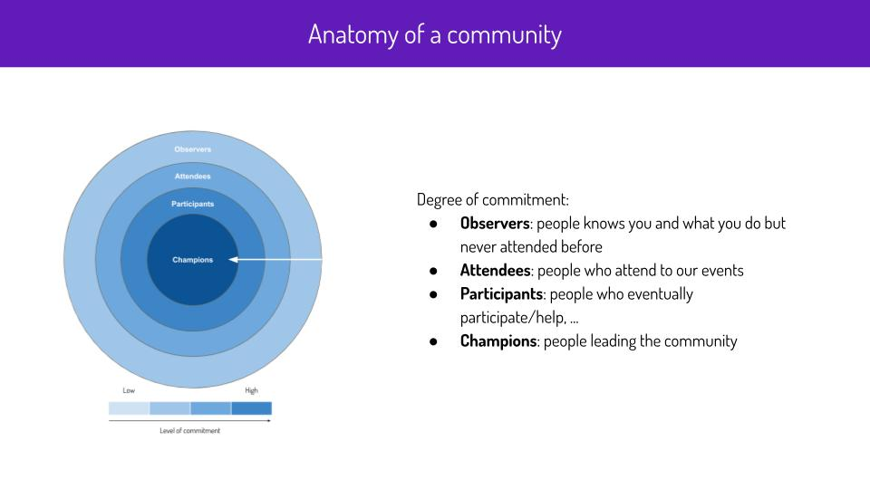
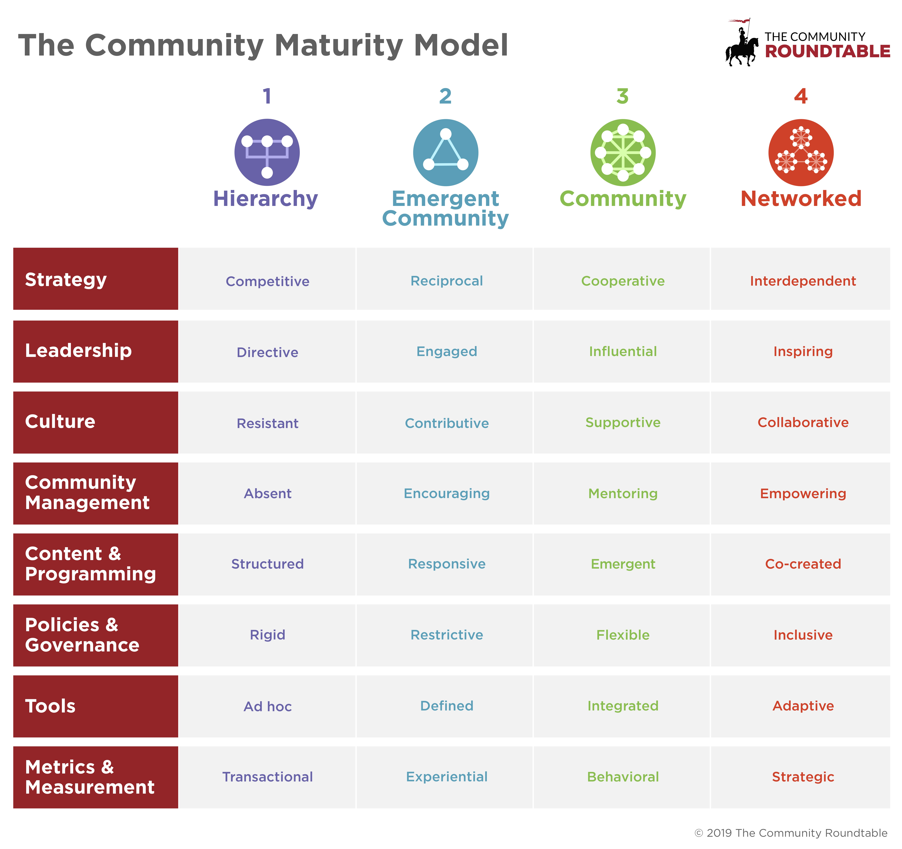
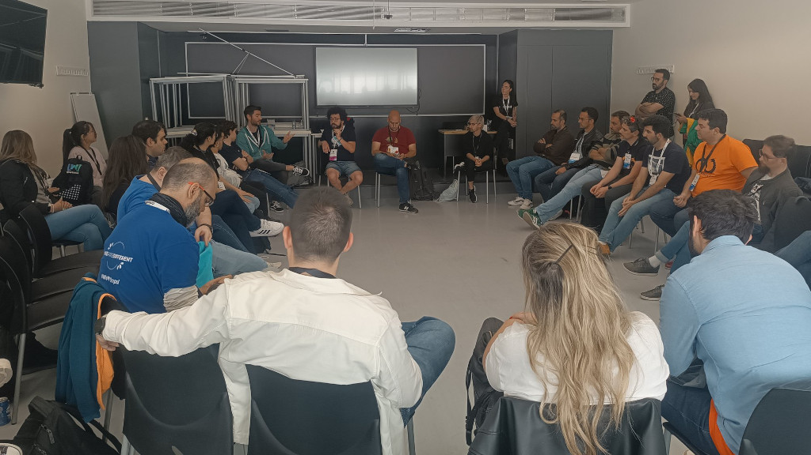

Hoy escribo para anunciar que en [🧠 Mi cerebro digital](/es/docs/digital-brain) he añadido un nuevo apartado para recopilar recursos dirigidos personas que dinamizan [🌈 Comunidades técnicas](/es/docs/category/-tech-communities) con la esperanza de que ayuden a **crear comunidades más sostenibles en el tiempo**.

<figure>

<figcaption>Fotografía del Open Space "Comunidades locales fuera de grandes ciudades" de CommitConf 2023</figcaption>
</figure>

## Nueva sección de recursos

A raíz del [documento que elaboré el año pasado tras el Open Space](https://docs.google.com/document/d/1txUERZ8vcXD2F99_WbiQO-lryAVk6ftUS3OuGwDVNZ4/edit?usp=sharing) **con ayuda de varias personas**, he publicado tres recursos:

* [📄 Cómo atraer a personas nuevas a nuestra comunidad](/es/docs/communities/how-to-attract-people-to-your-community)
* [📄 Cómo mantener el interés de las personas](/es/docs/communities/how-to-keep-peoples-interest)
* [📄 Cómo animar a personas nuevas a dar charlas](/es/docs/communities/how-to-encourage-people-to-participate)

También he creado varios "_placeholders_" sobre recursos que espero poder desarrollar en base a las aportaciones del próximo Open Space(1):

* [📄 Cómo financiar comunidades](/es/docs/communities/how-to-finance-communities)
* [📄 Cómo animar a otras personas a que dinamicen](/es/docs/communities/how-to-encourage-other-people-to-energize)
* [📄 Herramientas para gestionar una comunidad](/es/docs/communities/tools-to-manage-a-community)
* [📄 Otros recursos para *community leaders*](/es/docs/communities/other-resources-for-community-organizers)

> **(1)** La semana que viene se celebra [CommitConf 2024](https://2024.commit-conf.com/), donde tendrá lugar el OpenSpace sobre "**Cómo sostener comunidades técnicas**" que [Dani Rey](https://www.linkedin.com/in/daniel-rey-rey-9022702a/), [Oskar Calvo](https://www.linkedin.com/in/oskarcalvo) y yo hemos propuesto, que será "la continuación" del Open Space del año pasado donde se hablaron de algunos de los retos que afrontan las comunidades técnicas.

Al final **[he añadido un listado con las personas han contribuído](#contribuciones)** en este trabajo. 

## ¿Comunidades en receso?

¿Están las comunidades en receso?, ¿tienen las comunidades más problemas ahora que antes?.

Tras hablar con muchas personas, y en distintos foros, como el Open Space, mi percepción es que existe una sensación generalizada sobre la caída de la **actividad en muchas de las comunidades tecnológicas** (tanto en España como fuera) **en los últimos años**, especialmente desde la pandemia.

Con "caída de actividad" me refiero a una mezcla de cosas, pero principalmente me refiero a una menor asistencia a los encuentros (presenciales y online), interacciones en las listas de correo/IMs, etc.

Y esta situación, como es normal, nos preocupa a quienes dinamizamos comunidades.

Una de las preocupaciones que he escuchado recurrentemente es que la edad media de las personas que forman parte de estas comunidades no para de crecer, **o lo que es lo mismo, que cuesta atraer y enganchar a las nuevas generaciones**. 

Yo personalmente, me resisto a creer que se debe a que la experiencia que ofrecen las comunidades ya no aportan tanto valor a las nuevas generaciones como otros nuevos formatos, canales o "foros". 

Pero antes de seguir... ¿qué es una comunidad?.

## ¿Qué es una comunidad?

O más bien, ¿**a qué me refiero con comunidad, o comunidad tecnológica**?.

Quizás sea bueno empezar por esta pregunta, ya que por ejemplo, durante el Open Space de Commit, en mi opinión, hubo momentos en los que la conversación giró en torno a diferentes conceptos de "comunidad". 

<figure>

</figure>

Si buscamos el término [comunidad en el diccionario de la RAE](https://dle.rae.es/comunidad?m=form) veremos varias acepciones, aunque la que más se acerca a lo que yo me refiero es la acepción 4: "_Conjunto de personas vinculadas por características o intereses comunes_".

En mi caso, yo hablo de lo que se conoce como "[comunidades de práctica](https://es.wikipedia.org/wiki/Comunidad_de_pr%C3%A1ctica)", que en resumen son **grupo de personas **(grupos de usuarios, asociaciones, meetups...) que:

* **organizan encuentros periódicos** (presenciales y/u online).
* **comparten la pasión / profesión / inquietudes, ... por la tecnología** (software,  hardware, metodologías o buenas prácticas, ...).
* principalmente, **buscan colaborar entre ellas, de manera voluntaria y altruista**.
* **buscan el beneficio común** por encima del particular (incluido el interés particular de las organizaciones que les puedan apoyar/patrocinar).
* están **siempre abiertas a nuevas personas**.
* se sienten parte del grupo e identifican con él. 

Pero bueno, solo quería aclarar que:
1. Esta es en mi experiencia y está basada principalmente en el tipo de comunidades que acabo de describir. 
2. Creo que la mayoría de las ideas y consejos compartidos en [los documentos](/es/docs/category/-tech-communities), se pueden aplicar a este tipo de comunidades, ya sean locales (en pequeñas y en grandes ciudades), tanto como en online/virtuales, independientemente de que cada una tenga sus peculiaridades.

Dicho todo lo anterior, no quita que algunos de **los consejos también se puedan aplicar a personas que se dediquen a divulgar contenido online, o personas que organicen grandes conferencias**. 

> **Recomendado**: [este hilo de Jorge/@DevRelPuzzle](https://twitter.com/DevRelPuzzle/status/1653365948072484865) aborda otros muchos matices sobre el término "comunidad" que es recomendable tener en cuenta para evitar malentendidos.

## ¿Qué ha cambiado?

¿Por qué las personas que hemos estado dinamizando comunidades tenemos esta sensación/percepción?.

Por dar un poco de contexto, comentar que yo empecé a involucrarme con este tipo concreto de comunidades en la universidad (en ~2009), y desde entonces [he participado, contribuido, fundado y coorganizado bastantes comunidades](https://www.rauljimenez.info/es/docs/about-me/open-culture#communities), llegando a organizar cientos de encuentros (de todo tipo).

En base a esta experiencia, yo diría que la sensación de que la actividad está decayendo se debe principalmente a que **nos cuesta más aportar valor** como lo hacíamos antes.

Ahora la oferta es mayor y la atención se está diversificando con el aumento de comunidades, canales/medios (Discords, Slacks, RRSS, ...), pero también el auge de los [influencers](https://twitter.com/i/lists/828546487369990144/members). 

Personalmente también pienso que el contacto digital está comiéndole más terreno al físico, no hay más que ver que **ya casi todo se hace a través de apps**: pedir comida, un taxi, hablar/chatear, trámites con la administración, ... ¡hasta ligar! 😅, y no me cabe duda que esto también tiene consecuencias. 

Por eso creo, que no es que las comunidades no aporten valor, si no que simplemente **tienen que tener en cuenta este cambio de contexto y reinventarse/modernizarse**.

Espero que compartir algunos de los **consejos** que escuché en el Open Space, y otros míos propios, sirva para **ayudar a reflotar algunas comunidades y a que surjan otras nuevas.**

> Un libro que me gusta mucho y que habla sobre adaptarse al cambio: [¿Quién se ha llevado mi queso?](https://www.amazon.es/%C2%BFQui%C3%A9n-llevado-queso-Narrativa-empresarial/dp/8495787091) 🧀🐁 . Como decía Albert Einstein, "_Locura es hacer lo mismo una y otra vez y esperar resultados diferentes_".

## Anatomía de comunidades

Y antes de terminar quería compartir algunas ideas y recursos para compartir mi forma de entender las comunidades.

Lo más básico son los **grados de implicación**. Yo los explicaba así a mis compañeros de Esri hace varios años (~2017):

<figure>

<figcaption>Anatomía de una comunidad.</figcaption>
</figure>

Luego, [Jorge](https://www.linkedin.com/in/jorgebarrachina/) me descubrió varias teorías:  
* El *[Orbit Model](https://orbit.love/model)* que me sirve como modelo para explicar que para aumentar el sentimiento de pertenencia a un grupo, hay que aumentar el número de interacciones e impactos positivos entre las personas, y que se fojen lazos.
* La [teoría del 90-9-1](https://es.wikipedia.org/wiki/Teor%C3%ADa_90-9-1), que uso para ajustar expectativas de que no más del ~1% suelen ayudar a dinamizar, ni del ~10% participar, aunque realmente **medir esto suele ser algo bastante subjetivo, al igual que intentar medir una relación de amistad** (porque en el fondo, son eso).
* [The Community Maturity Model](https://communityroundtable.com/what-we-do/research/community-maturity-model/), un "framework" interesante para clasificar diferentes tipos de comunidades.

<figure>

</figure>

## Contribuciones

Quiero empezar por **agradecer a [Dani Rey](https://www.linkedin.com/in/daniel-rey-rey-9022702a/) ([@kdarrey](https://twitter.com/kdarrey)) de [XantarDev](https://www.meetup.com/es-ES/XantarDev) y [al equipo de Commit](https://2023.commit-conf.com/es/team/)**, que hicieron posible que nos reuniésemos el año pasado para compartir experiencias y reflexiones acerca de este tema tan interesante y que ha sido el germen de estos recursos. 

A continuación, un listado de los nombres que pude captar durante el Open Space celebrado en Abril de 2023 durante CommitConf.

<figure>

<figcaption>Foto de Santiago B. / @Santyx_Error del Open Space</figcaption>
</figure>

* Asistentes en representación de comunidades y eventos locales:
    * [Dani Rey](https://www.linkedin.com/in/daniel-rey-rey-9022702a/) / [@kdarrey](https://twitter.com/kdarrey),  de [XantarDev](https://www.meetup.com/es-ES/XantarDev) (Santiago)
    * [Óscar Calvo](https://www.linkedin.com/in/oskarcalvo/), representando a [Asociación Española de Drupal y DrupalCamp](https://asociaciondrupal.es/) (Madrid)
    * [Pablo Castro](https://www.linkedin.com/in/pablocastrovalino/), del [Grupo de Programadores y Usuarios de Linux](https://twitter.com/gpul_?lang=en) (Coruña)
    * [Juanma Ruiz](https://www.linkedin.com/in/juanmanuelruizfernandez/), [Roberto García Romero](https://www.linkedin.com/in/roberto-garc%C3%ADa-romero-47649912a/), [Javier Pulido](https://www.linkedin.com/in/jjpulidov/), [Álvaro Barahona Sánchez](https://www.linkedin.com/in/alvarobarahonasanchez/), [Francisco José Hermoso Baños](https://www.linkedin.com/in/fcohermoso/), de [DevopsDays Cáceres](https://devopsdays.cc/) (Cáceres), [CáceresTech](https://www.linkedin.com/company/cacerestech/) y [CáceresDevOps](https://www.meetup.com/caceres-devops/)
    * [Javier Gutiérrez Fernández](https://www.linkedin.com/in/javier-guti%C3%A9rrez-fern%C3%A1ndez-a7429a153/), de [Pamplona Software Crafters](https://www.meetup.com/es-ES/pamplona-software-crafters/members/?op=leaders)
    * [Luis Mesa](https://www.linkedin.com/in/mesa/), de [Databeers Sevilla](https://www.meetup.com/es-ES/databeersvq/)
    * [Soraya Muñoz](https://www.linkedin.com/in/soraya-mu%C3%B1oz/), de La Asociación de Usuarios Españoles de GNU/Linux [Hispalinux](https://hispalinux.es/Confe) y [Machine Learning Spain](https://www.meetup.com/es-ES/machinelearningspain/).
    * Jesús, de Comunidad Python Coruña
    * Pablo, del Aula de Software Libre de Córdoba (Córdoba)
* Generadores de contenido:
    * [Noe Donato](https://www.linkedin.com/in/noeliadonato/) @vamoacodear
    * [Carmen Ansio](https://www.linkedin.com/in/carmenansio/) 
    * Martín (Divulgador desde 2011)
* Otros asistentes en representación de público de estas comunidades:
    * [Tomás Giménez](https://www.linkedin.com/in/tomasgimenezguillen/) de coches.com
    * [Marta Rey](https://www.linkedin.com/in/martareyrodriguez/), [Inés Huertas](https://www.linkedin.com/in/ineshuertas/), [Gustavo Vargas](https://www.linkedin.com/in/gustavovargas2/), y más de Kairós
    * [Kini Software](https://www.linkedin.com/in/kinisoftware/) de Criteo
    * Reinalia
    * Fabiola
    * Jordi
    * Santiago B. [@santyx_error](https://twitter.com/santyx_error)

¡Perdón por aquellas personas a las que me he dejado!, si leéis el artículo podéis dejadme un mensaje en los comentarios que os añada (o [hacer un PR](https://github.com/hhkaos/hhkaos.github.io)) 😜😂.

Y también quiero agradecer explícitamente a: [Soraya Muñoz](https://www.linkedin.com/in/soraya-mu%C3%B1oz/), [Juanma Ruiz](https://www.linkedin.com/in/juanmanuelruizfernandez/), y [Mariano Pérez Caro](https://www.linkedin.com/in/marianoperez/) por sus contribuciones y revisiones a los documentos que he compartido.

## Comentarios