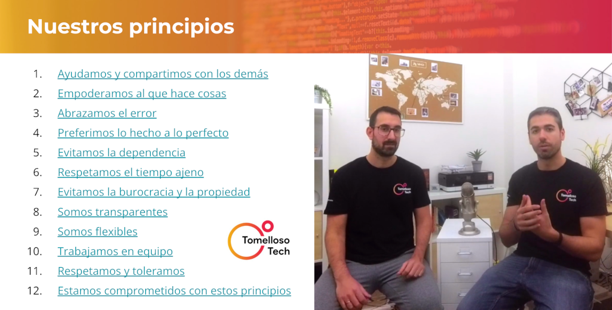
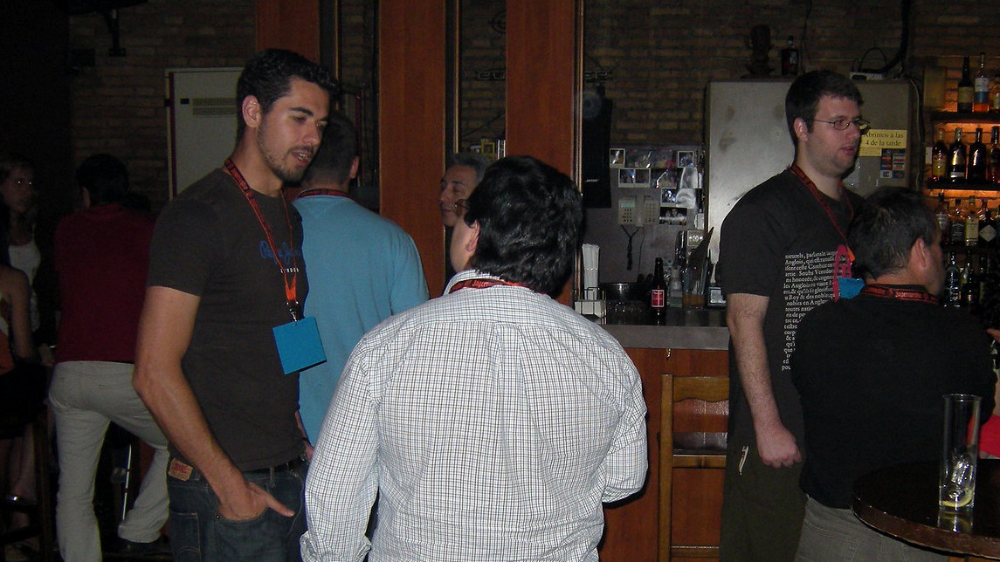

# Ideas para dinamizar comunidades tecnológicas

## Introducción

Tras hablar con muchas personas, y en distintos foros, como **el Open Space **sobre "_Comunidades locales fuera de grandes ciudades_" **que se celebró durante** [CommitConf 2023](https://2023.commit-conf.com/), mi percepción es que existe una sensación generalizada sobre la caída de la **actividad en muchas de las comunidades tecnológicas** (tanto en España como fuera) **en los últimos años**, especialmente desde la pandemia.

<figure>

<figcaption>Fotografía del Open Space "Comunidades locales fuera de grandes ciudades" de CommitConf 2023</figcaption>
</figure>

Esta situación es preocupante y triste para los que dinamizamos comunidades porque nos toca de primera mano 🙁.

Una de las preocupaciones que se han puesto de manifiesto es **que la edad media de las personas que forman parte de estas comunidades no para de crecer, **o lo que es lo mismo, cuesta enganchar a las nuevas generaciones. 

Personalmente, me resisto a creer que se debe a que la experiencia que ofrecen las comunidades (entendidas [como explico luego](#qué-es-una-comunidad-tecnológica)) ya no aportan tanto valor a las nuevas generaciones como otros nuevos formatos, canales o "foros". En mi opinión se trata más de que la atención se está diversificando con el aumento de comunidades canales/medios (Discords, Slacks, ...), etc y el auge de los influencers. 

Aunque personalmente también pienso que el contacto digital está comiéndole más terreno al físico, no hay más que ver que ya casi todo se hace a través de apps: pedir comida, un taxi, hablar/chatear, trámites con la administración, ... ¡hasta ligar!. Por eso creo, que no es que las comunidades no aporten valor, si no que simplemente **tienen que tener en cuenta este cambio de contexto y reinventarse/modernizarse**.

> Un libro que me gusta mucho y que habla sobre adaptarse al cambio: [¿Quién se ha llevado mi queso?](https://www.amazon.es/%C2%BFQui%C3%A9n-llevado-queso-Narrativa-empresarial/dp/8495787091) 🧀🐁 . Como decía Albert Einstein, "_Locura es hacer lo mismo una y otra vez y esperar resultados diferentes_".

En resumen, este planteamiento me ha llevado a publicar este artículo, con la esperanza de que compartiendo algunos de los **consejos** que escuché, y otros míos propios, pueda **ayudar a reflotar algunas comunidades y surjan otras nuevas. **

> **Nota**: Si te interesa [mi experiencia, la he dejado al final del artículo](#sobre-mi-experiencia-con-comunidades).

A continuación encontrarás ideas que espero te ayuden a hacer tu comunidad más sostenible en el tiempo, como:

* [¿Cómo atraer a personas nuevas a nuestra comunidad?](#cómo-atraer-a-personas-nuevas-a-nuestra-comunidad)
* [¿Cómo mantener el interés de las personas?](#cómo-mantener-el-interés-de-las-personas)
* [¿Cómo animar a personas nuevas a dar charlas?](#cómo-animar-a-personas-nuevas-a-dar-charlas)

La mayoría de estos consejos se aplican tanto a comunidades locales/presenciales como online, en pequeñas y en grandes ciudades, independientemente de que cada una tenga sus peculiaridades.

Pero antes de entrar en materia quiero agradecer a [Dani Rey](https://www.linkedin.com/in/daniel-rey-rey-9022702a/) ([@kdarrey](https://twitter.com/kdarrey)) de [XantarDev](https://www.meetup.com/es-ES/XantarDev) y [al equipo de Commit](https://2023.commit-conf.com/es/team/) que hicieron posible que nos reuniésemos para compartir experiencias y reflexiones acerca de este gran tema. 

Comentar también que [al final del artículo](#asistentes-al-open-space) **he añadido un listado con todos los nombres** que pude recopilar **de las personas hicisteis aportaciones durante el open space a modo de agradecimiento**, porque como he dicho, he intentado que vuestras aportaciones estén reflejadas aquí. 

¡Comenzamos! 😃

## ¿Qué es una comunidad tecnológica?

O más bien, ¿**a qué me refiero con comunidad tecnológica**?

Quizás sea bueno empezar por esta pregunta, ya que durante el encuentro, en mi opinión, hubo momentos en los que la conversación giró en torno a diferentes conceptos. Si buscamos el término [comunidad en el diccionario de la RAE](https://dle.rae.es/comunidad?m=form) veremos varias acepciones. Aunque creo que la que más se acerca es la acepción 4. "_Conjunto de personas vinculadas por características o intereses comunes_", voy a extenderla un poco, porque [existen otros muchos matices](https://twitter.com/DevRelPuzzle/status/1653365948072484865) que, de no tenerse en cuenta, pueden llevar a malentendidos.

En el caso concreto de este artículo, estos consejos aplican principalmente a comunidades entendidas como **grupo de personas **(grupos de usuarios, asociaciones, meetups...) que:

* **organizan encuentros periódicos** (presenciales y/u online).
* **comparten la pasión / profesión / inquietudes, ... por la tecnología** (software,  hardware, metodologías o buenas prácticas, ...).
* principalmente, **buscan colaborar entre ellas, de manera voluntaria y altruista**.
* **buscan el beneficio común** por encima del particular (incluido el interés particular de las organizaciones que puedan apoyar/patrocinar).
* están **siempre abiertas a nuevas personas**.
* se sienten parte del grupo e identifican con él. 

Dicho esto, ¿qué significa formar parte formar parte de la comunidad o grupo?, es una buena y difícil pregunta, aunque me temo que es algo subjetivo. Al final funciona igual que una relación de amistad, cuantas más interacciones y con mayor frecuencia, más oportunidades de conocer a otras personas, y mayor es el sentimiento de pertenencia al grupo. Aunque no depende únicamente del nivel de implicación o compromiso, que además este suele variar con el paso del tiempo, si que está relacionado. 

Yo explicaba así los grados de implicación a mis compañeros de Esri hace varios años (antes de que [Jorge](https://www.linkedin.com/in/jorgebarrachina/) me descubriese la [teoría del 90-9-1](https://es.wikipedia.org/wiki/Teor%C3%ADa_90-9-1) y del *[Orbit Model](https://orbit.love/model)*; lo que me hizo evolucionarla): 

<figure>

<figcaption>Anatomía de una comunidad.</figcaption>
</figure>

Como curiosidad dejo aquí otra taxonomía publicada por _[The Community RoundTable](https://communityroundtable.com/what-we-do/research/community-maturity-model/#:~:text=First%20published%20in%202009%2C%20the,required%20for%20successful%20community%20development)_, en este caso para categorizar las comunidades en función de madurez:

<figure>

<figcaption>Anatomía de una comunidad.</figcaption>
</figure>

Dicho todo lo anterior, no quita que algunos de **estos consejos también se puedan aplicar a personas que se dediquen a divulgar contenido online o personas que organicen grandes conferencias**. Pero bueno, solo quería aclarar que esta es en mi experiencia y está basada principalmente en el tipo de comunidades que acabo de describir.

## ¿Cómo atraer a personas nuevas a nuestra comunidad?

Como ya hemos comentado, el grado de implicación/participación de las personas en una comunidad cambia a lo largo del tiempo. Por tanto, **para mantener la actividad de la comunidad es importante** captar la atención y **conseguir que nuevas personas se acerquen y **sobre todo**, quieran volver.**

**Los principales consejos** para atraer nuevas personas a la comunidad los resumiría en:

1. [Reducid la barrera de entrada](#1-reducid-la-barrera-de-entrada).
2. [Cread contenido y dadle difusión](#2-cread-contenido-y-dadle-difusión).
3. [Moveos, sed nómadas](#3-moveos-sed-nómadas).
4. [Fomentad la diversidad](#4-fomentad-la-diversidad).
5. [Plantead enfoques disruptivos](#5-plantead-enfoques-disruptivos).

### 1. Reducid la barrera de entrada

Cuanto más fácil sea tener una primera toma de contacto con las personas que ya formáis parte, mejor.  Por tanto, el primer consejo es que (si aún no lo tenéis) deberíais crear un **canal bidireccional donde poder interactuar **de manera más "privada" (Discord, Telegram, Slack, ...). 

Incluye un canal específico donde todo el mundo tenga la oportunidad de presentarse:

<figure>

<figcaption>La comunidad de Open Source Weekends que llegó a tener +1200 miembros en Slack.</figcaption>
</figure>

**Dar la posibilidad de empezar la primera toma de contacto detrás del teclado puede ayudar a las personas más tímidas**, primero observando 👀 antes de animarse a dar el primer paso. 

Nosotros, con la comunidad de [GeoVoluntarios](https://web.archive.org/web/20220116222822/https://geovoluntarios.org/), desde la que estuvimos conectando a voluntarios digitales con organizaciones durante el inicio de la pandemia, incluso **[llegamos a organizar unas "office hours" o AMA diario](https://youtube.com/playlist?list=PLwq5dz_FjCx4Y3AQKr4q0EAlKbtGpXQ3V)** donde cualquiera se podía conectar y presentarse, para después orientarles y conectarles con otras personas de la comunidad con intereses afines para que pudiesen ayudar. Obviamente, no hay que llegar a ese extremo, pero se pueden organizar encuentros periódicos online (con cámara opcional) para romper el hielo.

Si queréis ser más originales, podéis probar con herramientas tipo [Gather Town](https://app.gather.town/app): 

<figure>

</figure>

Por enfoques más "disruptivos", en GeoDevelopers por ejemplo, estuvimos un tiempo haciendo coworking online/virtual a través de Discord y [promoviéndolo a través de Twitch](https://www.twitch.tv/videos/853855361?collection=JxxICOsuVRbGfA) para hacernos aún más accesibles, de manera parecida a los [#studywithme](https://www.twitch.tv/directory/all/tags/studywithme), [#focus](https://www.twitch.tv/directory/all/tags/FOCUS), [#pomodoro](https://www.twitch.tv/directory/all/tags/pomodoro), [#coworkingstream](https://www.twitch.tv/directory/all/tags/coworkingstream).  

### 2. Cread contenido y dadle difusión

Supongo que esto es bastante obvio, pero por si acaso lo digo.

Si tenéis la oportunidad yo os recomiendo **grabar o retransmitir los eventos que podáis**, que echéis fotos, y que lo compartáis posteriormente **para que las personas puedan acercarse, mirar desde fuera, **y con suerte generar suficiente interés para que den el paso de participar.

Compartidlo todos **a través de un canal público **(Instagram, LinkedIn, X, Meetup, TikTok, Facebook, ...)**. **Usad herramientas como [StreamYard](https://streamyard.com/) o [Restream](https://restream.io) para retransmitir en múltiples plataformas de vídeo simultáneamente, Ivoox para publicar vuestros podcasts, etc. Y recordad siempre indicar cómo unirse al canal bidireccional. Aprovechad todos los canales posibles para anunciar los eventos, y deseablemente que cualquiera pueda inscribirse a los eventos y compartirlos.

En cuanto a qué canales/redes sociales funcionan mejor... no me atrevo a decir ninguno, suele depender del público, edad, la ubicación, etc. Yo empezaría por preguntar a las personas de la comunidad** cuál es el canal por el que prefieren recibir las notificaciones** de los nuevos encuentros y recursos publicados (email, redes sociales, calendario compartido, mensajería instantánea, RSS, web/meetup, notificaciones push, ...), y habilitaría tantos como fueran posibles.

Una opción es configurar una herramienta tipo [Zapier](https://zapier.com/)/[IFTTT](https://ifttt.com/)/[Make](https://www.make.com/en) que automatice la republicación entre redes, al menos hasta que veáis cuál os funciona mejor, aunque lo ideal sería encontrar a algún usuario de esta(s) y que se responsabilice de ella(s). No hace falta compartir a diario, pero al menos el "pre" y el "post" evento sí sería recomendable. 

En su defecto, intentad crear un hashtag único, lista de X, lista de correo, o similar que las personas interesadas puedan seguir para estar al tanto de lo que pasa, y **usad una herramienta tipo "[Share link creator](https://www.websiteplanet.com/webtools/sharelink/)"** cuando publiquéis una convocatoria para pedir a toda la comunidad y seguidores que os ayuden a difundir.

### 3. Moveos, sed nómadas

"_Si la montaña no va a Mahoma, Mahoma irá a la montaña_".

**No os quedéis siempre en el mismo sitio**. Como organizador, sé que encontrar una "sede" y hacer siempre los eventos allí es lo más cómodo para quien organiza. Sin embargo, una de las mejores formas de atraer nuevas personas a una comunidad, tanto si empieza desde cero, como si es antigua pero está estancada y sólo buscas "revitalizarla", es contactando con centros formativos o profesionales en tu entorno (ej: academias, institutos, ciclos superiores, universidades, centros educativos para adultos, etc.). 

Contactad con ellos, buscad qué podríais ofrecerles que les pudiese interesar y valorad la posibilidad de hacer un futuro encuentro allí. Ejemplos de cosas que podríais ofrecer: compartir experiencias sobre vuestra realidad profesional, de vuestras trayectorias profesionales, nuevas tecnologías que domináis, repaso al panorama de comunidades, conferencias y [otros canales educativos](https://www.rauljimenez.info/docs/developers/educational-developers-channels), etc. 

Esto también aplica a comunidades online. Conectad con otras comunidades online, buscad intereses afines y proponed hacer eventos conjuntos. Y si fuera yo, aquellas colaboraciones que hiciese las transmitiría en los canales de ambas comunidades usando las plataformas que comentábamos anteriormente.

### 4. Fomentad la diversidad

Organizad eventos en **otros** **idiomas**, y repito, contactad con otras comunidades, buscad intereses que tengáis en común para ver si merece la pena organizar un evento o una agenda de eventos conjuntos. 

Si vuestra comunidad es presencial, buscad **otras comunidades locales,** grupos de usuarios (puedes buscar en [meetup.com](https://www.meetup.com), facebook, etc.), **asociaciones** (puedes pedir un listado de las asociaciones registradas en tu ayuntamiento), contacta con **AMAs/AMPAs** de colegios (si tenéis familias en la comunidad o a través de sus webs), **grupos de empresarios** (Asociación de Jóvenes Empresarios, Cámara de Comercio, [incubadoras, aceleradoras, centros de emprendimiento](https://startupxplore.com/en/map), [Centros Tecnológicos](https://aplicaciones.ciencia.gob.es/inforct/), [CEEIs](https://www.ceei.es/), ...), etc. 

Y más adelante hablaremos también de [crear ambientes seguros](#4-cread-un-ambiente-seguro). No he comprobado personalmente el repositorio de [Awesome Diversity](https://github.com/folkswhocode/awesome-diversity#readme), pero si necesitas más ideas... creo que merece la pena ojearlo.

### 5. Plantead enfoques disruptivos

Si habéis probado todo lo anterior y aún os sigue sin funcionar... algo que podría suceder, ya que por ejemplo hay tecnologías que "pasan de moda" (e.j. [meetup de PhoneGap](https://www.meetup.com/es-ES/PhoneGap-SF/)), y otras podrían ser de temas muy de nicho (ej: [Lambda World](https://www.meetup.com/es-ES/lambda-world-programming-meetup/)), creo que solo quedan enfoques disruptivos. 

En ese caso, si verdad creéis que necesitáis atraer a más personas, plantearos:

* **Fusionar la comunidad con otra comunidad intereses afines **(local u online).
* **Hacer más encuentros virtuales** (si no lo estáis haciendo aún).
* **Ampliar el abanico de temas a tratar**.

La realidad es que el tiempo de las personas es limitado,** y si nuestra propuesta no es suficientemente atractiva** o no cubre necesidades e intereses de las personas a las que queremos llegar ... por más que lo deseemos, **no conseguiremos atraerla***.

> **Nota**: lo siento por los fans de "[El Secreto](https://es.wikipedia.org/wiki/El_secreto_(libro))" 😜.

## ¿Cómo mantener el interés de las personas?

¿Cómo cumplir expectativas, y crear una comunidad donde la gente quiera repetir, participe activamente, proponga temas y lidere eventos?:

1. [Fomentad la relación entre los miembros](#1-fomentad-la-relación-entre-los-miembros).
2. [Comunicad claramente quiénes sois y qué hacéis](#2-comunicad-claramente-quiénes-sois-y-qué-hacéis).
3. [Preguntad, pero sobre todo escuchad](#3-preguntad-pero-sobre-todo-escuchad).
4. [Probad diferentes formatos de evento](#4-probad-diferentes-formatos-de-evento).

### 1. Fomentad la relación entre los miembros

En mi opinión, **cuanto mejor sea la experiencia y más fuertes las relaciones entre las personas, mayor será el vínculo que se cree con la comunidad, el sentimiento de pertenencia al grupo y las ganas de aportar**, o como dice el cliché ... "_de devolver a la comunidad lo que la comunidad le ha dado_↩️", que a pesar de haberse abusado de él, el sentimiento tras la frase sigue siendo válido. 

Y es que las comunidades reúnen todas las condiciones para que se creen buenas relaciones profesionales y/o de amistad. Pero** ir a un evento donde no conoces a nadie intimida, incluso para la persona más extrovertida**, hasta en una comunidad online solemos comportarnos con cierta timidez por miedo a parecer un elefante en una cacharrería 🐘😅. 

Por tanto, os recomiendo que os pongáis en la piel de las personas que se acercan por primera vez y trabajéis para que se sientan lo más cómodas posible, ponédselo fácil para crear vínculos, tener una experiencia agradable y que así quieran volver en el futuro sintiéndose una persona un poco menos ajena al grupo ("outsider").

Yo en comunidades online también recomiendo probar a organizar eventos puramente sociales, incluso considerar invitar a personas nuevas/interesantes del ecosistema que os gustaría conocer (e.j. [GeoBirras de GeoDevelopers con Daniel Primo](https://www.meetup.com/geodevelopers/photos/31276916/494812504/), del [podcast Web Reactiva](https://www.webreactiva.com/)).

Para los eventos presenciales yo recomiendo:

* 📛 Ofrecer **pegatinas** para donde todo el mundo pueda poner su nombre, y/o empresa. Incluso podríais valorar colores para clasificar antigüedad en la comunidad, perfiles, intereses, necesidades, ...

* **🤝** Que al menos las personas más extrovertidas y familiarizadas con la comunidad se encarguen de **facilitar el networking, tanto antes de que comience el evento como en las bebidas del final**. O sea, que se acerquen solas con una sonrisa a las personas que estén solas, se presenten, les pregunten por sus intereses y les presenten a otras personas dentro del evento con quien crean que mejor pueden congeniar. Empezad especialmente con aquellas que parezcan especialmente introvertidas; e incluso podéis reunir a varias de una vez. Y si ya habéis empezado a presentaros y posteriormente detectáis a alguna persona sola, invitala a que se una al grupo. 

* 📽️ Durante la espera previa al evento y durante el propio networking, deja reproduciendo en bucle **una presentación con información de las personas que participan en la comunidad, **pidiendo permiso previo claro (ej. [Miembros GeoDevelopers](https://docs.google.com/presentation/d/e/2PACX-1vTpBEwY20fWC-v1XbMIduDxboGoPcVXmExDg6PyOfmJhiikgqTvVCPzrKD5gkG8EafQIOR4PDTMMttx/pub?start=true&loop=false&delayms=6000)). Y no sería mala idea dejar una URL por si alguien quiere revisarlos tranquilamente a su ritmo...

* 👥 Y animad a las personas más tímidas a que vaya al evento acompañadas con otra persona de su confianza.

Como ya hemos dicho, habrá personas con diferentes expectativas, personas que se acercan a la comunidad por fines meramente profesionales, que solo vayan a aprender, preguntar, y luego desaparezca en la parte social. Y no pasa nada porque alguien se vaya, aunque o ideal es _intentar asegurarse que no  que no se vayan **por sentirse incómodas**_.

Es probable que haya personas vayan con la única intención de generar contactos pensando en buscar oportunidades profesionales, y seguramente habrá otras que además esperen encontrar personas afines con las que crear amistad.

Pero no hay que obsesionarse ni forzar situaciones, por ejemplo, a mí se me ha dado la situación donde teníamos mucha diversidad generacional, por ejemplo he tenido en [un taller de varios días](https://www.youtube.com/playlist?list=PLwB9KstFgABt9sFwnt_2FEdFvmB1a2i9U) a personas de 10 y de 55 años, y conseguimos que hubiese un ambiente era muy positivo y agradable simplemente rescatando (prestando más atención) a las personas que parecían más "perdidas".

En cualquier caso, lo importante es crear ambientes propicios para crear vínculos, donde poder compartir y disfrutar, para que quien participe se quede con ganas de volver (pronto) a por más.

### 2. Comunicad claramente quiénes sois y qué hacéis.

Otro aspecto importante que ayuda a que una persona se sienta más segura de que encajará en la comunidad, es conocer claramente los **objetivos/fines, actividades y principios** de la misma. 

<figure>

<figcaption>Principios de Tomelloso Tech</figcaption>
</figure>

Por eso, creo que hacer el esfuerzo de poner esto por escrito generará una conversación que ayudará a **conocer y alinear los intereses** de todas las personas que formáis parte de la comunidad, y también a **formar/ajustar las expectativas** de las personas que se acerquen en el futuro. 

> **📙 Recurso**: Como ejemplo, os comparto el [documento de Fines, actividades y principios de TomellosoTech](https://docs.google.com/document/d/1MrXJkyb6lJgzInWWGi8rJj0mZfHIoMO19zMR93juXes/edit?usp=sharing), y el [manifiesto en formato PPT](https://docs.google.com/presentation/d/1tYPZmqF9fXFYVJrbgajEc7qwbOcq6_cPV4Kw06AruL8/edit?usp=sharing).

Tener un código de conducta también es útil, especialmente cuando la comunidad empieza a crecer.

> **📙 Recursos**: [Código de conducta de Madrid JS](https://github.com/madridjs/madridjs.talks/blob/master/codigo-conducta.md), [de Commit Conf](https://2023.commit-conf.com/es/code-of-conduct/), [GDG](https://www.google.com/events/policy/anti-harassmentpolicy.html), [JSConf](https://jsconf.com/codeofconduct.html), [Python S.F.](https://policies.python.org/python.org/code-of-conduct/) [OLF](https://wiki.ohiolinux.org/index.php/HarassmentPolicy), etc. (📖 [Code of Conduct book](https://frameshiftconsulting.com/resources/code-of-conduct-book/)).

En este aspecto, mi consejo es que tengáis preparadas una o dos *slides* resumiendo lo que hayáis definido, y en cada encuentro, tanto si estáis grabando como si hay personas nuevas, dediques dos o tres minutos a contarlas. En los eventos presenciales yo suelo empezar los encuentros pidiendo que las personas que asisten por primera vez levanten la mano, para dirigirme especialmente a ellas en esta parte.

Y por último, aunque la comunidad tenga ya mucho recorrido, tanto si ha habido renovación generacional como si no, es recomendable revisar y modificar si fuera necesario los objetivos/fines, actividades y principios de la comunidad, por si las expectativas e intereses han cambiado.

### 3. Preguntad, pero sobre todo escuchad

Tanto si una comunidad es nueva como si no, si tiene ya unos fines definidos como si no, **interesaros en conocer la motivación de las nuevas personas al unirse al grupo**. 

Además, no solo hay que **preguntar a las personas nuevas**, sino que **también es necesario sondear cada cierto tiempo a las personas que llevan tiempo**, porque la vida cambia, y como decíamos anteriormente, los intereses también. 

<figure>

<figcaption>Networking de la Asociación de Webmasters de Granada.</figcaption>
</figure>

Pero **hay personas que, por no ofender o "molestar"** a quienes tanto se lo curran (ya sea a la organización o a los ponentes), **puede que no den su feedback negativo (críticas) si no se les da un mecanismo anónimo**. Por eso yo propongo tener disponibles *formularios anónimos* a modo de "buzón de sugerencias", tanto para eventos como para la organziación general, donde cualquiera puede dejar feedback en cualquier momento. 

Dad la opción que sea anónimo y/o que sólo la organización lo pueda ver evitará la sensación de "linchamiento" público que nadie desea. 

Y como a veces el sentido común es el menos común de los sentidos... yo soy de los que piensa que **no está de más recordar a las personas que asistan, que a la hora de hacer las críticas las hagan de manera constructiva**, proponiendo ideas de cómo mejorar/solucionar lo que no haya gustado o ido bien.

Dicho esto, siempre bueno recibir el feedback cara a cara, y habrá muchas personas que harán así. Como es fácil que se olvide o se pierda el mensaje, mi consejo es que como mínimo enviéis notas de audio a la herramienta de mensajería instantánea que useis la organización, y a ser posible luego lo paséis por escrito al formulario (y si la vagueza os puede... siempre podéis usar [whisper](https://github.com/openai/whisper) para transcribirlo 😜). 

> **📙 Libro recomendado**:  [Just Listen: Discover the Secret to Getting Through to Absolutely Anyone](https://www.amazon.es/dp/0814436471/?coliid=ITMMC889EJEPP&colid=3R2H62HULQXP5&psc=1&ref_=list_c_wl_lv_ov_lig_dp_it)

### 4. Probad diferentes formatos de evento

Lo monótono corre el riesgo de convertirse en aburrido, y lo que es peor, haciendo siempre lo mismo, podríais no estar cubriendo los intereses de todas las personas que forman o podrían formar parte de la comunidad. Como dijo Albert Einstein: "_Si buscas resultados distintos no hagas siempre lo mismo_".

Aquí voy a dejar un listado de diferentes formatos que he probado o conozco, e incluso algunas "excusas" que he usado para organizar eventos por si queréis proponer/plantear ideas nuevas (incluso cuando habléis con otras comunidades):  

* **⏳🗣️ Charla técnica: **probablemente sea el formato más habitual (también porque es de los más sencillos de organizar). Una ponencia donde uno o varios ponentes explican algún tema técnico (desarrollo web, móvil, videojuegos, IoT, lenguajes, inteligencia artificial, bases de datos, automatización, devops, metodologías, accesibilidad, rendimiento, herramientas, infraestructura, seguridad, big data, blockchain, UX/UI, ... ). La duración suele variar entre 30 min y 1 h.

* ⚡**🗣️ [Lightning talks](https://es.wikipedia.org/wiki/Lightning_talk)** (charlas relámpago): eventos con una agenda de entre 30 y 90 minutos en la que se presentan varias charlas de entre 5 y 10 minutos ([como hace por ejemplo Databeers](https://datos.gob.es/es/noticia/databeers-como-combinar-charlas-y-cerveza-para-impulsar-las-comunidades-de-datos)). En estos eventos se busca que muchos presentadores traten un tema desde varios ángulos para una posterior discusión colectiva. Una opción es seguir el formato de presentación [PechaKucha](https://es.wikipedia.org/wiki/PechaKucha) (20 diapositivas mostradas en 20 segundos cada una). En cierto modo, se podrían asimilar a los típicos "Demo Days" o [DEMO conferences](https://en.wikipedia.org/wiki/DEMO_conference) de las aceleradoras, bootcamps, etc.

* **🍕🥤PizzaNight o [pizza party](https://en.wikipedia.org/wiki/Pizza_party)** son eventos tipo "[Lunch and Learn](https://blog.hubspot.com/service/lunch-and-learn)" que suelen seguir cualquiera de los anteriores, pero con la diferencia de que las personas que asisten disfrutan de la comida mientras escuchan la(s) presentación(es).
* 🔔🏃  **[Speed geeking](https://en.wikipedia.org/wiki/Speed_geeking)**. Parecido a las lightning talks, pero en este caso se forman grupos de 6-7 personas (máximo), y cada ponente se encuentra en una mesa/stand. Cada vez que el facilitador hace sonar "la campana", cada grupo se tiene que cambiar a otra mesa/stand y comienza la ponencia, hasta que a los 5 minutos aproximadamente vuelve a sonar la campana y vuelta a empezar. 

* **💻🗣️ Taller/ Workshop**: es un evento en el que se busca aprender mediante la práctica (programación, robótica, ...) . Normalmente, son eventos guiados por una o varias personas con conocimientos en la materia en las que todo el grupo va al mismo ritmo. La duración puede variar entre pocas horas y varios días (ejemplo: [Taller de programación, control y robótica](https://www.youtube.com/playlist?list=PLwB9KstFgABt9sFwnt_2FEdFvmB1a2i9U)).

* **💻💁 Codelab asistido**: parecido a un taller, pero en este caso las personas se reúnen para hacer tutoriales guiados, normalmente disponibles de manera online. Los tutoriales se pueden hacer solos o en pareja, y cada persona/grupo sigue el tutorial a su propio ritmo, contando con la ayuda y orientación de expertos que estarán en el evento para asistir. Una de las ventajas de este formato es que se pueden cubrir más de una única temática. Los ejercicios pueden ser creados por miembros de la comunidad, o reutilizados de recursos online: [en GitHub](https://github.com/search?q=codelab&type=repositories), "[30 Days Of](https://www.google.com/search?q=%2230+Days+Of%22+site%3Agithub.com)..." etc.

* **⛩️🥷 Coding Dojo**: un evento entre 12/15 personas, con diferentes roles, donde está el guía, dos personas que harán "[pair programming](https://en.wikipedia.org/wiki/Pair_programming)" y el resto que están apoyando como "advisors" o asesores.Os dejos aquí una [explicación](https://es.wikipedia.org/wiki/CoderDojo). 

* **💻**🏆 **[Hackathon](http://en.wikipedia.org/wiki/Hackathon), hack day, o codefest**: evento en el que se forman equipos para crear tecnología desde cero. Suele ser en modo competición, aunque también los hay con un enfoque más "solidarios" (conocidos como "Hack for Good"). Duran entre 1 y 3 días normalmente y podéis organizarlo desde cero, usando [guías como la de MLH](https://guide.mlh.io/), o desplazaros en grupo para participar en uno existente, o reuniros para participar en uno online (podéis encontrarlos en plataformas como: el [meetup de Hackathon lovers](https://www.meetup.com/es-ES/Hackathon-Lovers/), [devpost](https://devpost.com/hackathons), [MLH](https://mlh.io/seasons/2023/events), ...). Incluso podríais participar en competiciones como las de [Kaggle](https://www.kaggle.com/), [Advent of Code](https://adventofcode.com/), etc. Y si no lo conocéis, el libro "[The hackathon survival guide](https://www.hackathonsurvivalguide.com/)" puede ser muy interesante para los participantes.

* **💻**[🫴](https://emojiguide.com/people-body/palm-up-hand/) **Hackathon de contribución u hackathon open source**. A diferencia de los tradicionales, estos se centran en colaborar en proyectos de código abierto existentes, mientras que los hackathones tradicionales suelen centrarse en la creación rápida de nuevos productos o prototipos. El evento online más conocido mundialmente es el [Hacktoberfest](https://hacktoberfest.com/) y se celebra en octubre todos los años, pero también podéis plantear algo equivalente en local (e.j [Open source jam](https://www.opensourcejam.com/en)).
* **🗓❓ Desconferencia ([unconference](https://en.wikipedia.org/wiki/Unconference))**: dependiendo del estilo de facilitación se clasifican en diferentes tipos [Open space](https://en.wikipedia.org/wiki/Open_Space_Technology), [Barcamp](https://en.wikipedia.org/wiki/BarCamp), [lean coffee](https://leancoffee.org/)... son principalmente eventos que comienzan sin una agenda definida y los propios participantes son quienes crean y gestionan la agenda basándose en sus intereses / inquietudes. 

* **🔎👀 Peer reviews**: no sé si este es el nombre real (o si tiene un nombre oficial...), pero otro tipo de evento muy enriquecedor consiste en reunir a varias personas especializadas en un tema para hacer análisis (constructivo) de proyectos de terceros en público, a ser posible con su consentimiento previo (o bajo petición), tipo: "[Clínica SEO](https://www.youtube.com/watch?v=M7b6_EUVsA0)", "[performance reviews](https://www.youtube.com/playlist?list=PLMAMtpNjNL7rOh8CIhbacDOW_YQ2Yk01t)", "[outage analysis](https://www.youtube.com/playlist?list=PLQnljOFTspQXdkZLiYCCh_5RBP1-T-Rnx)", etc.

* **📺👀Social viewing o watch party**: son eventos los que os reunís para ver un evento que os interese, normalmente en directo (ej. para ver las keynotes de: [Google I/O](https://io.google/), [WWDC](https://en.wikipedia.org/wiki/Worldwide_Developers_Conference), [GTC](https://www.nvidia.com/gtc/), [Flutter Forward](https://flutter.dev/events/flutter-forward), [F8](https://en.wikipedia.org/wiki/Facebook_F8), [AWS re:Invent](https://reinvent.awsevents.com/), [Microsoft Build](https://en.wikipedia.org/wiki/Microsoft_Build), ...), o algo en diferido y posteriormente quedarse para comentar novedades, compartir ideas, aclarar dudas, etc. Esto es bastante habitual en algunos grupos de usuarios como por ejemplo, los [Google I/O extended de los GDGs](https://gdg.community.dev/ioextended/). Para los eventos online puede ser algo similar a eventos a lo que hacen [Carlos Azaustre con Google I/O](https://www.youtube.com/watch?v=vcZtmhZLBm0) o [DotCSV con OpenAI DevDay](https://www.youtube.com/watch?v=poRq8sDqzMg)  pero [en modo grupal](https://www.youtube.com/live/jnB6tnxsxaA?si=922hP0yGfXr1XAyv&t=1791) o en [modo sólo chat](https://www.youtube.com/live/gtu0qiBGGmA?si=xClLDiGqWjOSNuc-&t=3885).

* **🙋❓ Office Hours / Ask Me Anything**: un encuentro en el que varias personas con conocimientos en un tema se ofrecen voluntarias a responder cualquier pregunta de la comunidad. La verdad es que este formato lo he visto más online que presencial ([ejemplo online de la comunidad de Flutter](https://www.youtube.com/live/RhnYO-XMSJw?feature=share&t=277), o las de [The Spatial Community](https://thespatialcommunity.org/)), pero bueno... ¡Que por ideas no sea!

* 👥**🤝 Networking o speed [networking](https://es.wikipedia.org/wiki/Networking): **esto se puede hacer como un evento propio o como forma de iniciar la parte social que suele ir a final de los eventos. Puede ser [más estructurado](https://blog.soultrap.com.au/how-to-host-a-speed-networking-event-the-ultimate-guide/#Types_of_Speed_Networking_Events) o menos. Es especialmente útil cuando hay muchas personas que no se conocen entre sí, y el objetivo principal es romper el hielo entre los asistentes al encuentro. Se puede hacer de manera presencial e incluso, y como enseño en el siguiente vídeo, esto [se puede hacer incluso con comunidades online](https://youtu.be/8Giv5rgG1e0)*

> **Nota:** La herramienta para emparejar miembros aleatoriamente para videoconferencias rápidas uno a uno y por tiempo limitado (tipo chatroulette) que uso se llamaba Icebreaker, ahora llamada Gatheround, y parece que [es gratuita para comunidades](https://gatheround.com/community) durante un año.

Como explicaré a continuación, este último punto para que las personas conecten entre sí **considero que es vital**, yo recomiendo encarecidamente dejar tiempo para ello, a ser posible con unas bebidas y/o aperitivos. Incluso a veces podéis plantear organizar un evento meramente social.

## ¿Cómo animar a personas nuevas a dar charlas? 

O más bien diría... animarlas a liderar eventos (talleres, dojos, ...).

Quiero empezar diciendo que coincido con lo que dijo [Soraya](https://www.linkedin.com/in/soraya-mu%C3%B1oz/) sobre que **hablar en público no es para todo el mundo**. Si no nos damos cuenta de esto, puede que por insistir demasiado a alguien, le hagamos sentir mal (por no aportar de ese modo) y termine generando un poco de rechazo.

Dicho esto, **también hay personas que sí que les gustaría**, pero se sienten intimidadas por ser nuevas, por ser júniors, o por cualquier otro motivo. 

A continuación comento algunas de las propuestas que surgieron durante el Open Space, enriquecidas con aportaciones propias:

1. [Balancead ponentes](#1-balancead-ponentes).
2. [Ofreced acompañamiento](#2-ofreced-acompañamiento).
3. [Organizad un evento de debutantes](#3-organizad-un-evento-de-debutantes).
4. [Cread un ambiente seguro](#4-cread-un-ambiente-seguro).

<figure>

)

<figcaption>Foto de Santiago B. / @Santyx_Error del Open Space</figcaption>
</figure>

### 1. Balancead ponentes

No siempre** invitar a personas "senior" **o veteranas de la comunidad, **y alternar también con "juniors"**/"entry-level" y con gente nueva

### 2. Ofreced acompañamiento

O [mentoría](https://es.wikipedia.org/wiki/Mentor%C3%ADa) a personas que empiezan, o se sientan intimidadas o vulnerables. Por ejemplo, se le puede ofrecer **ayuda para preparar la charla, para revisarla, ensayar y/o co-presentar conjuntamente**.

A veces incluso se puede **empezar por animar a esta persona a escribir un blog o tutorial y revisarlo conjuntamente**, y quizás el siguiente paso sea organizar un evento sobre ese tema.

Puede ser sobre algo nuevo que esta persona haya aprendido o descubierto recientemente, sobre algo de lo que se sienta orgullosa, un "side project" etc.

Un ejemplo de este apoyo, es por ejemplo el programa "[New presenters](https://blog.commit-conf.com/programa-new-presenters/)" que en este caso se puso en marcha desde CommitConf con el apoyo de [@kinisoftware](https://twitter.com/kinisoftware) y personas voluntarias de las diferentes comunidades tecnologicas españolas, a través de la que se creó un servidor Discord para conectar a mentores y mentees, compartir recursos, etc.

Hay inclusos comunidades específicas como [Aspiring & Emerging Speakers](https://www.meetup.com/es-ES/aspiring-speakers/), [Aspiring Women Speakers](https://www.linkedin.com/company/aspiring-women-speakers/), etc.

### 3. Organizad un evento de debutantes

Plantear un evento donde todas las personas debuten por primera vez, yo incluso propondría un formato lightning talk, o un formato speed geeking si hay suficiente gente y espacio, ya que hablar a grupos más reducidos de personas intimidará menos.

### 4. Cread un ambiente seguro

Yo diría que lo más importante es crear un ambiente que haga sentir a los asistentes estar "entre amigos", de confianza, seguro, humano, sin discriminación de ningún tipo, de buen rollo, de humildad. Dentro de lo posible libre de egos, "[10x Engineers](https://www.xataka.com/otros/que-10x-engineer-donde-surge-polemica-que-mitifica-figura-genio-programador)", "ninjas" & "rockstar", y también libre de [trolls](https://es.wikipedia.org/wiki/Trol_(Internet)), donde estas personas no se vayan a sentir juzgadas sino arropadas.. 

Para ello:

* Empezaría por **[desendiosar](https://dle.rae.es/desendiosar) la figura del speaker, **normalizando la imperfección o no tener todas las respuestas cuando se habla en público.
* Anima a las **personas experimentadas que prediquen con el ejemplo y** **compartan**:
    * **Sus fracasos, errores, inicios**, etc. para demostrar que todos somos humanos (algo tipo las [fuckup nights](https://www.fuckupnights.com/)).
    * **Pero también lo que les ha aportado compartir conocimientos**, para mostrar el lado positivo de enfrentarse a los miedos.
* Reconoce y **celebra los progresos de cada persona**, por pequeña que sea, para ayudarla a convertirse en una comunicadora segura y eficaz.
* Abrazar el concepto de "aprender en público" (altamente recomendado leer este artículo; [Learn in public](https://www.swyx.io/learn-in-public) y/o ver esta [entrevista al gran orador Kelsey Hightower](https://youtu.be/wCwLOHMtkpo?t=110) donde habla sobre su experiencia sobre hablar en público).

Si aún así alguien quiere hablar en público pero se resiste a hacerlo en vuestra comunidad, ayúdale a buscar otro entorno que le intimide menos y que proponga esa misma actividad.

## Temas para otro artículo...

Voy a nombrar otros temas que creo que podría ser interesante discutir, aunque fuese de manera online, y si tenéis interés por alguno podéis dejarlo en los comentarios y podemos intentar organizar un debate online algún día.

### ¿Cómo financiar comunidades?

Otro tema que surgió fue el de **cómo financiar las comunidades**, ya que como bien se dijo en el evento, las "cervezas" no se pagan solas ... 😂. 

Pero voy a saltarme este tema por lo complejo que es, ya que en este caso... La respuesta puede variar enormemente dependiendo del tipo de comunidad y de las necesidades financieras que tengan. No es lo mismo una comunidad online que quizás solo necesite pagar por una cuenta de meetup, un servidor web, ... que otra que necesita pagar por un espacio físico, porque quiere traer gente de fuera y cubrir los gastos, que necesita pagar la parte social/networking, etc. 

### ¿Cómo animar a otras personas a que dinamicen?

Este tema concretamente que no se discutió en el Open Space, pero es uno de los que me hubiese gustado sacar porque **en mi experiencia**, **esta es la principal razón por lo que tarde o temprano termina decayendo la actividad en una comunidad**, pasando a estar "zombies" o en estado latente, es porque estas dependen de un reducido grupo de personas que dinamizan, en cuando estas desaparecen, la comunidad "muere". 

**Porque aunque haya personas de la organización que aguanten años**, **todo tiene un límite,** la vida cambia, las situaciones personales y profesionales cambian, y las personas vamos pasando por diferentes etapas en la vida donde tarde o temprano **las prioridades cambian, **así que si todo el peso de la dinamización recae sobre unas pocas personas y no se hace un buen relevo a tiempo, **en algún momento la actividad cesará**.

Por eso me gustaría hablar con otras personas sobre este asunto, especialmente con personas que tengan experiencia con comunidades que hayan mantenido la actividad constante durante diez o quince años, personas que hayan dinamizado organizaciones que no sigan una organización jerárquica, con una cultura de liderazgo compartido, etc.

Si te interesa el tema, déjalo en los comentarios.

### ¿Herramientas para gestionar una comunidad?

Herramientas que sirvan para gestionar y dinamizar una comunidad, como por ejemplo:

* Para que las personas de la comunidad se sigan/conozcan: Meetup, ...
* [Para recibir C4P](https://sessionize.com/playbook/user-groups)
* Google Groups
* Google Drive
* IM tools: Discord, Slack, Telegram, Comunidades de Whatsapp
* etc.

## Asistentes al Open Space

Como os prometí, aquí os dejo un listado de los nombres que pude captar durante el encuentro:

* Asistentes en representación de comunidades y eventos locales:
    * [Dani Rey](https://www.linkedin.com/in/daniel-rey-rey-9022702a/) / [@kdarrey](https://twitter.com/kdarrey),  de [XantarDev](https://www.meetup.com/es-ES/XantarDev) (Santiago)
    * [Óscar Calvo](https://www.linkedin.com/in/oskarcalvo/), representando a [Asociación Española de Drupal y DrupalCamp](https://asociaciondrupal.es/) (Madrid)
    * [Pablo Castro](https://www.linkedin.com/in/pablocastrovalino/), del [Grupo de Programadores y Usuarios de Linux](https://twitter.com/gpul_?lang=en) (Coruña)
    * [Juanma Ruiz](https://www.linkedin.com/in/juanmanuelruizfernandez/), [Roberto García Romero](https://www.linkedin.com/in/roberto-garc%C3%ADa-romero-47649912a/), [Javier Pulido](https://www.linkedin.com/in/jjpulidov/), [Álvaro Barahona Sánchez](https://www.linkedin.com/in/alvarobarahonasanchez/), [Francisco José Hermoso Baños](https://www.linkedin.com/in/fcohermoso/), de [DevopsDays Cáceres](https://devopsdays.cc/) (Cáceres), [CáceresTech](https://www.linkedin.com/company/cacerestech/) y [CáceresDevOps](https://www.meetup.com/caceres-devops/)
    * [Javier Gutiérrez Fernández](https://www.linkedin.com/in/javier-guti%C3%A9rrez-fern%C3%A1ndez-a7429a153/), de [Pamplona Software Crafters](https://www.meetup.com/es-ES/pamplona-software-crafters/members/?op=leaders)
    * [Luis Mesa](https://www.linkedin.com/in/mesa/), de [Databeers Sevilla](https://www.meetup.com/es-ES/databeersvq/)
    * [Soraya Muñoz](https://www.linkedin.com/in/soraya-mu%C3%B1oz/), de La Asociación de Usuarios Españoles de GNU/Linux [Hispalinux](https://hispalinux.es/Confe) y [Machine Learning Spain](https://www.meetup.com/es-ES/machinelearningspain/).
    * Jesús, de Comunidad Python Coruña
    * Pablo, del Aula de Software Libre de Córdoba (Córdoba)
* Generadores de contenido:
    * [Noe Donato](https://www.linkedin.com/in/noeliadonato/) @vamoacodear
    * [Carmen Ansio](https://www.linkedin.com/in/carmenansio/) 
    * Martín (Divulgador desde 2011)
* Otros asistentes en representación de público de estas comunidades:
    * [Tomás Giménez](https://www.linkedin.com/in/tomasgimenezguillen/) de coches.com
    * [Marta Rey](https://www.linkedin.com/in/martareyrodriguez/), [Inés Huertas](https://www.linkedin.com/in/ineshuertas/), [Gustavo Vargas](https://www.linkedin.com/in/gustavovargas2/), y más de Kairós
    * [Kini Software](https://www.linkedin.com/in/kinisoftware/) de Criteo
    * Reinalia
    * Fabiola
    * Jordi
    * Santiago B. [@santyx_error](https://twitter.com/santyx_error)

¡Perdón por aquellas personas a las que me he dejado!, si leéis el artículo podéis dejadme un mensaje en los comentarios que os añada... para que quede para la posteridad 😜😂.

## Otras contribuciones

Quiero agradecer también explícitamente a: [Soraya Muñoz](https://www.linkedin.com/in/soraya-mu%C3%B1oz/), [Juanma Ruiz](https://www.linkedin.com/in/juanmanuelruizfernandez/), y [Mariano Pérez Caro](https://www.linkedin.com/in/marianoperez/) las contribuciones y revisiones a este documento .

## Sobre mi experiencia con comunidades 

En mi caso particular ... se podría decir que empecé en la universidad en 2009, desde entonces he participado en decenas de comunidades (técnicas y no técnicas), he organizado... diría que cerca 500 eventos (presenciales + online), y fundado o coorganizado las siguientes comunidades: 

* [Asociación de Webmasters de Granada](https://web.archive.org/web/20220629094235/http://www.rauljimenez.info/proyectos/awgr/) y la [Asociación de Webmasters de Málaga](https://www.youtube.com/watch?v=3Wum7zkXYfM) (2009-2011)
* [Iniciador Granada y Málaga](https://web.archive.org/web/20220809235955/http://rauljimenez.info/proyectos/iniciador/) (2009-2011)
* [GDG Granada](https://web.archive.org/web/20220809225321/http://rauljimenez.info/proyectos/gdg/) y [GDG Spain](https://gdg.es/) (2010-2013)
* [GeoDevelopers](https://www.geodevelopers.org/) (2014-2023)
* Asociación [Tomelloso Tech](https://www.youtube.com/@TomellosoTech) (2018-2021)
* [GeoVoluntarios](https://web.archive.org/web/20220116222822/https://geovoluntarios.org/) ó Asociación Española de GeoVoluntariado Digital (2020-2023)

Y me gustaría destacar una comunidad un tanto especial, que ojalá algún día encuentre gente con ganas de dinamizarla porque creo que podría hacer mucho bien, la [meta comunidad de organizadores de comunidades](https://www.meetup.com/es-ES/Comunidades-Tecnologicas-Madrid/?_locale=es-ES) ([ver en GitHub](https://github.com/comunidad-tecnologica)).

## ¿Y tú, qué opinas?

¡Gracias por leer hasta el final!, espero tus comentarios

