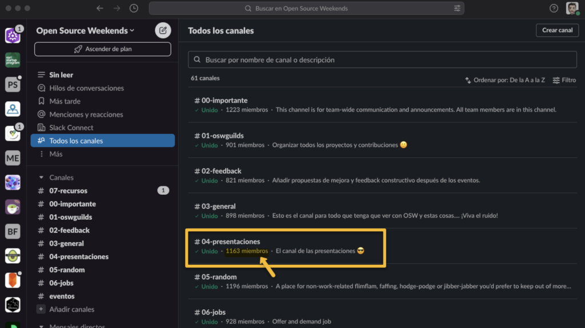

# Cómo atraer a nuevas personas a nuestra comunidad 🧲

El grado de implicación/participación de las personas en una comunidad cambia a lo largo del tiempo. Por tanto, **para mantener la actividad de la comunidad es importante** captar la atención y **conseguir que nuevas personas se acerquen, pero sobre todo, quieran volver.**

**Los principales consejos** para atraer nuevas personas a la comunidad los resumiría en:

* [Reducid la barrera de entrada](#reducid-la-barrera-de-entrada).
* [Cread contenido y dadle difusión](#cread-contenido-y-dadle-difusión).
* [Moveos, sed nómadas](#moveos-sed-nómadas).
* [Fomentad la diversidad](#fomentad-la-diversidad).
* [Plantead enfoques disruptivos](#plantead-enfoques-disruptivos).

### Reducid la barrera de entrada

Cuanto más fácil sea tener una primera toma de contacto con las personas que ya formáis parte, mejor.  Por tanto, el primer consejo es que (si aún no lo tenéis) deberíais crear un **canal bidireccional donde poder interactuar **de manera más "privada". Me refiero un Discord, Telegram, Slack, ... 

Incluye un canal específico donde todo el mundo tenga la oportunidad de presentarse:

<figure>

<figcaption>La comunidad de Open Source Weekends que llegó a tener +1200 miembros en Slack.</figcaption>
</figure>

**Dar la posibilidad de empezar la primera toma de contacto detrás del teclado puede ayudar a las personas más tímidas**, primero observando 👀 antes de animarse a dar el primer paso. 

Nosotros, con la comunidad de [GeoVoluntarios](https://web.archive.org/web/20220116222822/https://geovoluntarios.org/), desde la que estuvimos conectando a voluntarios digitales con organizaciones durante el inicio de la pandemia, incluso **[llegamos a organizar unas "office hours" o AMA diario](https://youtube.com/playlist?list=PLwq5dz_FjCx4Y3AQKr4q0EAlKbtGpXQ3V)** donde cualquiera se podía conectar y presentarse, para después orientarles y conectarles con otras personas de la comunidad con intereses afines para que pudiesen ayudar. Obviamente, no hay que llegar a ese extremo, pero se pueden organizar encuentros periódicos online (con cámara opcional) para romper el hielo.

Si queréis ser más originales, podéis probar con herramientas tipo [Gather Town](https://app.gather.town/app): 

<figure>

</figure>

Por enfoques más "disruptivos", en GeoDevelopers por ejemplo, estuvimos un tiempo haciendo coworking online/virtual a través de Discord y [promoviéndolo a través de Twitch](https://www.twitch.tv/videos/853855361?collection=JxxICOsuVRbGfA) para hacernos aún más accesibles, de manera parecida a los [#studywithme](https://www.twitch.tv/directory/all/tags/studywithme), [#focus](https://www.twitch.tv/directory/all/tags/FOCUS), [#pomodoro](https://www.twitch.tv/directory/all/tags/pomodoro), [#coworkingstream](https://www.twitch.tv/directory/all/tags/coworkingstream).  

### Cread contenido y dadle difusión

Supongo que esto es bastante obvio, pero por si acaso lo digo.

Si tenéis la oportunidad yo os recomiendo **grabar o retransmitir los eventos que podáis**, que echéis fotos, y que lo compartáis posteriormente **para que las personas puedan acercarse, mirar desde fuera, **y con suerte generar suficiente interés para que den el paso de participar.

Compartidlo todos **a través de un canal público **(Instagram, LinkedIn, X, Meetup, TikTok, Facebook, ...)**. **Usad herramientas como [StreamYard](https://streamyard.com/) o [Restream](https://restream.io) para retransmitir en múltiples plataformas de vídeo simultáneamente, Ivoox para publicar vuestros podcasts, etc. Y recordad siempre indicar cómo unirse al canal bidireccional. Aprovechad todos los canales posibles para anunciar los eventos, y deseablemente que cualquiera pueda inscribirse a los eventos y compartirlos.

<figure>

</figure>

En cuanto a qué canales/redes sociales funcionan mejor... no me atrevo a decir ninguno, suele depender del público, edad, la ubicación, etc. Yo empezaría por preguntar a las personas de la comunidad** cuál es el canal por el que prefieren recibir las notificaciones** de los nuevos encuentros y recursos publicados (email, redes sociales, calendario compartido, mensajería instantánea, RSS, web/meetup, notificaciones push, ...), y habilitaría tantos como fueran posibles.

Una opción es configurar una herramienta tipo [Zapier](https://zapier.com/)/[IFTTT](https://ifttt.com/)/[Make](https://www.make.com/en) que automatice la republicación entre redes, al menos hasta que veáis cuál os funciona mejor, aunque lo ideal sería encontrar a algún usuario de esta(s) y que se responsabilice de ella(s). No hace falta compartir a diario, pero al menos el "pre" y el "post" evento sí sería recomendable. 

En su defecto, intentad crear un hashtag único, lista de X, lista de correo, o similar que las personas interesadas puedan seguir para estar al tanto de lo que pasa, y **usad una herramienta tipo "[Share link creator](https://www.websiteplanet.com/webtools/sharelink/)"** cuando publiquéis una convocatoria para pedir a toda la comunidad y seguidores que os ayuden a difundir.

### Moveos, sed nómadas

"_Si la montaña no va a Mahoma, Mahoma irá a la montaña_".

**No os quedéis siempre en el mismo sitio**. Como organizador, sé que encontrar una "sede" y hacer siempre los eventos allí es lo más cómodo para vosotros. Sin embargo, una de las mejores formas de atraer nuevas personas a una comunidad, tanto si empieza desde cero, como si es antigua pero está estancada y sólo buscas "revitalizarla", es contactando con centros formativos o profesionales en tu entorno (ej: academias, institutos, ciclos superiores, universidades, centros educativos para adultos, etc.) celebrando los eventos allí. 

<figure>

</figure>

Contactad con ellos, buscad qué podríais ofrecerles que les pudiese interesar y valorad la posibilidad de hacer un futuro encuentro allí. Ejemplos de cosas que podríais ofrecer: compartir experiencias sobre vuestra realidad profesional, de vuestras trayectorias profesionales, nuevas tecnologías que domináis, repaso al panorama de comunidades, conferencias y [otros canales educativos](https://www.rauljimenez.info/docs/developers/educational-developers-channels), etc. 

Esto también aplica a comunidades online. Conectad con otras comunidades online, buscad intereses afines y proponed hacer eventos conjuntos. Y si fuera yo, aquellas colaboraciones que hiciese las transmitiría en los canales de ambas comunidades usando las plataformas que comentábamos anteriormente.

### Fomentad la diversidad

Organizad eventos en **otros idiomas**, y repito, contactad con otras comunidades, buscad intereses que tengáis en común para ver si merece la pena organizar un evento o una agenda de eventos conjuntos. 

Si vuestra comunidad es presencial, buscad **otras comunidades locales,** grupos de usuarios (puedes buscar en [meetup.com](https://www.meetup.com), facebook, etc.), **asociaciones** (puedes pedir un listado de las asociaciones registradas en tu ayuntamiento), contacta con **AMAs/AMPAs** de colegios (si tenéis familias en la comunidad o a través de sus webs), **grupos de empresarios** (Asociación de Jóvenes Empresarios, Cámara de Comercio, [incubadoras, aceleradoras, centros de emprendimiento](https://startupxplore.com/en/map), [Centros Tecnológicos](https://aplicaciones.ciencia.gob.es/inforct/), [CEEIs](https://www.ceei.es/), ...), etc. 

En el documento sobre "Cómo animar a nuevas personas a dar charlas" hablaremos también de [crear ambientes seguros](/es/docs/communities/how-to-encourage-people-to-participate#cread-un-ambiente-seguro). 

No he comprobado personalmente el repositorio de [Awesome Diversity](https://github.com/folkswhocode/awesome-diversity#readme), pero si necesitas más ideas... creo que merece la pena ojearlo.

### Plantead enfoques disruptivos

Si habéis probado todo lo anterior y aún os sigue sin funcionar... algo que podría suceder, ya que por ejemplo hay tecnologías que "pasan de moda" (e.j. [meetup de PhoneGap](https://www.meetup.com/es-ES/PhoneGap-SF/)), y otras podrían ser de temas muy de nicho (ej: [Lambda World](https://www.meetup.com/es-ES/lambda-world-programming-meetup/)), creo que solo quedan enfoques disruptivos. 

En ese caso, si verdad creéis que necesitáis atraer a más personas, plantearos:

* **Fusionar la comunidad con otra comunidad intereses afines **(local u online).
* **Aumentad la frecuencia de las reuniones virtuales**.
* **Ampliar el abanico de temas a tratar**.
* **Replantead si es este el tipo y formato de comunidad que queréis/necesitáis**

La realidad es que el tiempo de las personas es limitado,** y si nuestra propuesta no es suficientemente atractiva** o no cubre necesidades e intereses de las personas a las que queremos llegar ... por más que lo deseemos, **no conseguiremos atraerla***.

> **(*)** *Lo siento por los fans de "[El Secreto](https://es.wikipedia.org/wiki/El_secreto_(libro))"* 😜.

## Contribuciones y agradecimientos

Este documento no sería posible sin las contribuciones recibidas. ¡Gracias!

## Comentarios

Y tú, ¿qué opinas?, ¿has probado estas u otras cosas?, por favor comparte tu experiencia para que otras personas se puedan enriquecer de ellas 😊

import GiscusComponent from '@site/src/components/GiscusComponent';

<GiscusComponent></GiscusComponent>