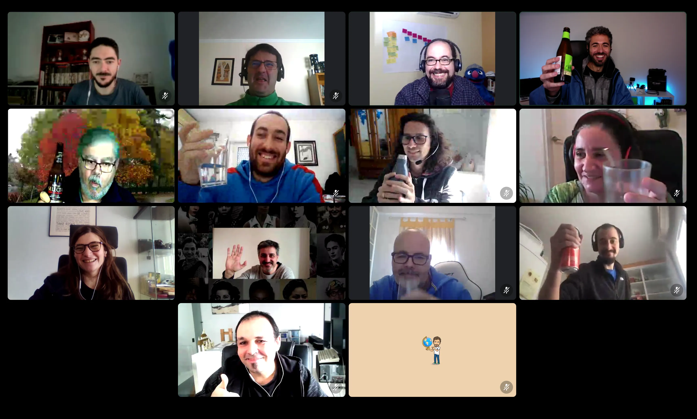

# Cómo mantener el interés de las personas 👀👂 

¿Cómo cumplir expectativas, y crear una comunidad donde la gente quiera invertir tiempo, participar activamente, proponer temas y liderar eventos?:

* [Fomentad la relación entre los miembros](#fomentad-la-relación-entre-los-miembros).
* [Comunicad claramente quiénes sois y qué hacéis](#comunicad-claramente-quiénes-sois-y-qué-hacéis).
* [Preguntad, pero sobre todo escuchad](#preguntad-pero-sobre-todo-escuchad).
* [Probad diferentes formatos de evento](#probad-diferentes-formatos-de-evento).

### Fomentad la relación entre los miembros

En mi opinión, **cuanto mejor sea la experiencia y más fuertes las relaciones entre las personas, mayor será el vínculo que se cree con la comunidad, el sentimiento de pertenencia al grupo y las ganas de aportar**, o como dice el cliché ... "_de devolver a la comunidad lo que la comunidad te ha dado_↩️", que a pesar de estar algo manido... el sentimiento que representa sigue siendo válido. 

Y es que las comunidades reúnen todas las condiciones para que se creen buenas relaciones profesionales y/o de amistad. 

A pesar de esto, **ir a un evento donde no conoces a nadie... intimida, incluso para la persona más extrovertida**. Esto aplica aunque el encuentro sea _online_, la mayoría de personas son precavidas, para evitar entrar como un elefante en una cacharrería 🐘😅. 

Por tanto, **os recomiendo que os pongáis en la piel de las personas que se acercan por primera vez** y trabajéis para que se sientan bien recibidas y lo más cómodas posible, ponédselo fácil para crear vínculos. **Haced todo lo posible para que tengan una experiencia agradable y que así quieran volver en el futuro**, y así cada vez se sentirán una persona un poco menos ajena al grupo ("outsider").

Yo en comunidades online también recomiendo probar a organizar eventos puramente sociales, incluso considerar invitar a personas que os gustaría conocer del ecosistema.

<figure>

<figcaption> <a href="https://www.meetup.com/geodevelopers/photos/31276916/494812504/">GeoBirras de GeoDevelopers con Daniel Primo de invitado</a>, del <a href="https://www.webreactiva.com/">podcast Web Reactiva</a></figcaption>
</figure>

Para los eventos presenciales yo recomiendo:

* 📛 Ofrecer **pegatinas** para donde todo el mundo pueda poner su nombre, y/o empresa. Incluso podríais valorar colores para clasificar antigüedad en la comunidad, perfiles, intereses, necesidades, ...

* **🤝** Que al menos las personas más extrovertidas y familiarizadas con la comunidad se encarguen de **facilitar el networking, tanto antes de que comience el evento como en las bebidas del final**. O sea, que se acerquen solas con una sonrisa a las personas que estén solas, se presenten, les pregunten por sus intereses y les presenten a otras personas dentro del evento con quien crean que mejor pueden congeniar. Empezad especialmente con aquellas que parezcan especialmente introvertidas; e incluso podéis reunir a varias de una vez. Y si ya habéis empezado a presentaros y posteriormente detectáis a alguna persona sola, invitala a que se una al grupo. 

* 📽️ Durante la espera previa al evento y durante el propio networking, deja reproduciendo en bucle **una presentación con información de las personas que participan en la comunidad, **pidiendo permiso previo claro (ej. [Miembros GeoDevelopers](https://docs.google.com/presentation/d/e/2PACX-1vTpBEwY20fWC-v1XbMIduDxboGoPcVXmExDg6PyOfmJhiikgqTvVCPzrKD5gkG8EafQIOR4PDTMMttx/pub?start=true&loop=false&delayms=6000)). Y no sería mala idea dejar una URL por si alguien quiere revisarlos tranquilamente a su ritmo...

* 👥 Y animad a las personas más tímidas a que vaya al evento acompañadas con otra persona de su confianza.

Como ya hemos dicho, habrá personas con diferentes expectativas:

* Personas que se acerquen para absorver conocimientos.
* Personas que esperen encontrar personas afines con las que crear amistad.
* Personas que vayan con la única intención de generar contactos (oportunidades profesionales, encontrar socios, ...)
* Personas que desaparezcan de la parte social.
* Etc

En cualquier caso, lo más importante es que intentéis conocer las expectativas de cada persona e _intentar aseguraros de que no se vayan **por sentirse incómodas**_.

Pero no hay que obsesionarse ni forzar situaciones, por ejemplo, a mí se me ha dado la situación donde teníamos mucha diversidad generacional, por ejemplo he tenido en [un taller de varios días](https://www.youtube.com/playlist?list=PLwB9KstFgABt9sFwnt_2FEdFvmB1a2i9U) a personas de 10 y de 55 años, y conseguimos que hubiese un ambiente era muy positivo y agradable simplemente rescatando (prestando más atención) a las personas que parecían más "perdidas".

En cualquier caso, lo importante es crear ambientes propicios para crear vínculos, donde poder compartir y disfrutar, para que quien participe se quede con ganas de volver (pronto) a por más.

### Comunicad claramente quiénes sois y qué hacéis.

Otro aspecto importante que ayuda a que una persona se sienta más segura de que encajará en la comunidad, es conocer claramente los **objetivos/fines, actividades y principios** de la misma. 

<figure>

<figcaption>Principios de Tomelloso Tech</figcaption>
</figure>

Por eso, creo que hacer el esfuerzo de poner esto por escrito generará una conversación que ayudará a **conocer y alinear los intereses** de todas las personas que formáis parte de la comunidad, y también a **formar/ajustar las expectativas** de las personas que se acerquen en el futuro. 

> **📙 Recurso**: Como ejemplo, os comparto el [documento de Fines, actividades y principios de TomellosoTech](https://docs.google.com/document/d/1MrXJkyb6lJgzInWWGi8rJj0mZfHIoMO19zMR93juXes/edit?usp=sharing), y el [manifiesto en formato PPT](https://docs.google.com/presentation/d/1tYPZmqF9fXFYVJrbgajEc7qwbOcq6_cPV4Kw06AruL8/edit?usp=sharing).

Tener un código de conducta también es útil, especialmente cuando la comunidad empieza a crecer.

> **📙 Recursos**: [Código de conducta de Madrid JS](https://github.com/madridjs/madridjs.talks/blob/master/codigo-conducta.md), [de Commit Conf](https://2023.commit-conf.com/es/code-of-conduct/), [GDG](https://www.google.com/events/policy/anti-harassmentpolicy.html), [JSConf](https://jsconf.com/codeofconduct.html), [Python S.F.](https://policies.python.org/python.org/code-of-conduct/) [OLF](https://wiki.ohiolinux.org/index.php/HarassmentPolicy), etc. (📖 [Code of Conduct book](https://frameshiftconsulting.com/resources/code-of-conduct-book/)).

En este aspecto, mi consejo es que tengáis preparadas una o dos *slides* resumiendo lo que hayáis definido, y en cada encuentro, tanto si estáis grabando como si hay personas nuevas, dediques dos o tres minutos a contarlas. En los eventos presenciales yo suelo empezar los encuentros pidiendo que las personas que asisten por primera vez levanten la mano, para dirigirme especialmente a ellas en esta parte.

Y por último, aunque la comunidad tenga ya mucho recorrido, tanto si ha habido renovación generacional como si no, es recomendable revisar y modificar si fuera necesario los objetivos/fines, actividades y principios de la comunidad, por si las expectativas e intereses han cambiado.

### Preguntad, pero sobre todo escuchad

Tanto si una comunidad es nueva como si no, si tiene ya unos fines definidos como si no, **interesaros en conocer la motivación de las nuevas personas al unirse al grupo**. 

Además, no solo hay que **preguntar a las personas nuevas**, sino que **también es necesario sondear cada cierto tiempo a las personas que llevan tiempo**, porque la vida cambia, y como decíamos anteriormente, los intereses también. 

<figure>

<figcaption>Networking de la Asociación de Webmasters de Granada.</figcaption>
</figure>

Pero **hay personas que, por no ofender o "molestar"** a quienes tanto se lo curran (ya sea a la organización o a los ponentes), **puede que no den su feedback negativo (críticas) si no se les da un mecanismo anónimo**. Por eso yo propongo tener disponibles *formularios anónimos* a modo de "buzón de sugerencias", tanto para eventos como para la organziación general, donde cualquiera puede dejar feedback en cualquier momento. 

Dad la opción que sea anónimo y/o que sólo la organización lo pueda ver evitará la sensación de "linchamiento" público que nadie desea. 

Y como a veces el sentido común es el menos común de los sentidos... yo soy de los que piensa que **no está de más recordar a las personas que asistan, que a la hora de hacer las críticas las hagan de manera constructiva**, proponiendo ideas de cómo mejorar/solucionar lo que no haya gustado o ido bien.

Dicho esto, siempre bueno recibir el feedback cara a cara, y habrá muchas personas que harán así. Como es fácil que se olvide o se pierda el mensaje, mi consejo es que como mínimo enviéis notas de audio a la herramienta de mensajería instantánea que useis la organización, y a ser posible luego lo paséis por escrito al formulario (y si la vagueza os puede... siempre podéis usar [whisper](https://github.com/openai/whisper) para transcribirlo 😜). 

> **📙 Libro recomendado**:  [Just Listen: Discover the Secret to Getting Through to Absolutely Anyone](https://www.amazon.es/dp/0814436471/?coliid=ITMMC889EJEPP&colid=3R2H62HULQXP5&psc=1&ref_=list_c_wl_lv_ov_lig_dp_it)

### Probad diferentes formatos de evento

Lo monótono corre el riesgo de convertirse en aburrido, y lo que es peor, haciendo siempre lo mismo, podríais no estar cubriendo los intereses de todas las personas que forman o podrían formar parte de la comunidad. Como dijo Albert Einstein: "_Si buscas resultados distintos no hagas siempre lo mismo_".

Aquí voy a dejar un listado de diferentes formatos que he probado o conozco, e incluso algunas "excusas" que he usado para organizar eventos por si queréis proponer/plantear ideas nuevas (incluso cuando habléis con otras comunidades):  

* **⏳🗣️ Charla técnica: **probablemente sea el formato más habitual (también porque es de los más sencillos de organizar). Una ponencia donde uno o varios ponentes explican algún tema técnico (desarrollo web, móvil, videojuegos, IoT, lenguajes, inteligencia artificial, bases de datos, automatización, devops, metodologías, accesibilidad, rendimiento, herramientas, infraestructura, seguridad, big data, blockchain, UX/UI, ... ). La duración suele variar entre 30 min y 1 h.

* ⚡**🗣️ [Lightning talks](https://es.wikipedia.org/wiki/Lightning_talk)** (charlas relámpago): eventos con una agenda de entre 30 y 90 minutos en la que se presentan varias charlas de entre 5 y 10 minutos ([como hace por ejemplo Databeers](https://datos.gob.es/es/noticia/databeers-como-combinar-charlas-y-cerveza-para-impulsar-las-comunidades-de-datos)). En estos eventos se busca que muchos presentadores traten un tema desde varios ángulos para una posterior discusión colectiva. Una opción es seguir el formato de presentación [PechaKucha](https://es.wikipedia.org/wiki/PechaKucha) (20 diapositivas mostradas en 20 segundos cada una). En cierto modo, se podrían asimilar a los típicos "Demo Days" o [DEMO conferences](https://en.wikipedia.org/wiki/DEMO_conference) de las aceleradoras, bootcamps, etc.

* **🍕🥤PizzaNight o [pizza party](https://en.wikipedia.org/wiki/Pizza_party)** son eventos tipo "[Lunch and Learn](https://blog.hubspot.com/service/lunch-and-learn)" que suelen seguir cualquiera de los anteriores, pero con la diferencia de que las personas que asisten disfrutan de la comida mientras escuchan la(s) presentación(es).
* 🔔🏃  **[Speed geeking](https://en.wikipedia.org/wiki/Speed_geeking)**. Parecido a las lightning talks, pero en este caso se forman grupos de 6-7 personas (máximo), y cada ponente se encuentra en una mesa/stand. Cada vez que el facilitador hace sonar "la campana", cada grupo se tiene que cambiar a otra mesa/stand y comienza la ponencia, hasta que a los 5 minutos aproximadamente vuelve a sonar la campana y vuelta a empezar. 

* **💻🗣️ Taller/ Workshop**: es un evento en el que se busca aprender mediante la práctica (programación, robótica, ...) . Normalmente, son eventos guiados por una o varias personas con conocimientos en la materia en las que todo el grupo va al mismo ritmo. La duración puede variar entre pocas horas y varios días (ejemplo: [Taller de programación, control y robótica](https://www.youtube.com/playlist?list=PLwB9KstFgABt9sFwnt_2FEdFvmB1a2i9U)).

* **💻💁 Codelab asistido**: parecido a un taller, pero en este caso las personas se reúnen para hacer tutoriales guiados, normalmente disponibles de manera online. Los tutoriales se pueden hacer solos o en pareja, y cada persona/grupo sigue el tutorial a su propio ritmo, contando con la ayuda y orientación de expertos que estarán en el evento para asistir. Una de las ventajas de este formato es que se pueden cubrir más de una única temática. Los ejercicios pueden ser creados por miembros de la comunidad, o reutilizados de recursos online: [en GitHub](https://github.com/search?q=codelab&type=repositories), "[30 Days Of](https://www.google.com/search?q=%2230+Days+Of%22+site%3Agithub.com)..." etc.

* **⛩️🥷 Coding Dojo**: un evento entre 12/15 personas, con diferentes roles, donde está el guía, dos personas que harán "[pair programming](https://en.wikipedia.org/wiki/Pair_programming)" y el resto que están apoyando como "advisors" o asesores.Os dejos aquí una [explicación](https://es.wikipedia.org/wiki/CoderDojo). 

* **💻**🏆 **[Hackathon](http://en.wikipedia.org/wiki/Hackathon), hack day, o codefest**: evento en el que se forman equipos para crear tecnología desde cero. Suele ser en modo competición, aunque también los hay con un enfoque más "solidarios" (conocidos como "Hack for Good"). Duran entre 1 y 3 días normalmente y podéis organizarlo desde cero, usando [guías como la de MLH](https://guide.mlh.io/), o desplazaros en grupo para participar en uno existente, o reuniros para participar en uno online (podéis encontrarlos en plataformas como: el [meetup de Hackathon lovers](https://www.meetup.com/es-ES/Hackathon-Lovers/), [devpost](https://devpost.com/hackathons), [MLH](https://mlh.io/seasons/2023/events), ...). Incluso podríais participar en competiciones como las de [Kaggle](https://www.kaggle.com/), [Advent of Code](https://adventofcode.com/), etc. Y si no lo conocéis, el libro "[The hackathon survival guide](https://www.hackathonsurvivalguide.com/)" puede ser muy interesante para los participantes.

* **💻**[🫴](https://emojiguide.com/people-body/palm-up-hand/) **Hackathon de contribución u hackathon open source**. A diferencia de los tradicionales, estos se centran en colaborar en proyectos de código abierto existentes, mientras que los hackathones tradicionales suelen centrarse en la creación rápida de nuevos productos o prototipos. El evento online más conocido mundialmente es el [Hacktoberfest](https://hacktoberfest.com/) y se celebra en octubre todos los años, pero también podéis plantear algo equivalente en local (e.j [Open source jam](https://www.opensourcejam.com/en)).
* **🗓❓ Desconferencia ([unconference](https://en.wikipedia.org/wiki/Unconference))**: dependiendo del estilo de facilitación se clasifican en diferentes tipos [Open space](https://en.wikipedia.org/wiki/Open_Space_Technology), [Barcamp](https://en.wikipedia.org/wiki/BarCamp), [lean coffee](https://leancoffee.org/)... son principalmente eventos que comienzan sin una agenda definida y los propios participantes son quienes crean y gestionan la agenda basándose en sus intereses / inquietudes. 

* **🔎👀 Peer reviews**: no sé si este es el nombre real (o si tiene un nombre oficial...), pero otro tipo de evento muy enriquecedor consiste en reunir a varias personas especializadas en un tema para hacer análisis (constructivo) de proyectos de terceros en público, a ser posible con su consentimiento previo (o bajo petición), tipo: "[Clínica SEO](https://www.youtube.com/watch?v=M7b6_EUVsA0)", "[performance reviews](https://www.youtube.com/playlist?list=PLMAMtpNjNL7rOh8CIhbacDOW_YQ2Yk01t)", "[outage analysis](https://www.youtube.com/playlist?list=PLQnljOFTspQXdkZLiYCCh_5RBP1-T-Rnx)", etc.

* **📺👀Social viewing o watch party**: son eventos los que os reunís para ver un evento que os interese, normalmente en directo (ej. para ver las keynotes de: [Google I/O](https://io.google/), [WWDC](https://en.wikipedia.org/wiki/Worldwide_Developers_Conference), [GTC](https://www.nvidia.com/gtc/), [Flutter Forward](https://flutter.dev/events/flutter-forward), [F8](https://en.wikipedia.org/wiki/Facebook_F8), [AWS re:Invent](https://reinvent.awsevents.com/), [Microsoft Build](https://en.wikipedia.org/wiki/Microsoft_Build), ...), o algo en diferido y posteriormente quedarse para comentar novedades, compartir ideas, aclarar dudas, etc. Esto es bastante habitual en algunos grupos de usuarios como por ejemplo, los [Google I/O extended de los GDGs](https://gdg.community.dev/ioextended/). Para los eventos online puede ser algo similar a eventos a lo que hacen [Carlos Azaustre con Google I/O](https://www.youtube.com/watch?v=vcZtmhZLBm0) o [DotCSV con OpenAI DevDay](https://www.youtube.com/watch?v=poRq8sDqzMg)  pero [en modo grupal](https://www.youtube.com/live/jnB6tnxsxaA?si=922hP0yGfXr1XAyv&t=1791) o en [modo sólo chat](https://www.youtube.com/live/gtu0qiBGGmA?si=xClLDiGqWjOSNuc-&t=3885).

* **🙋❓ Office Hours / Ask Me Anything**: un encuentro en el que varias personas con conocimientos en un tema se ofrecen voluntarias a responder cualquier pregunta de la comunidad. La verdad es que este formato lo he visto más online que presencial ([ejemplo online de la comunidad de Flutter](https://www.youtube.com/live/RhnYO-XMSJw?feature=share&t=277), o las de [The Spatial Community](https://thespatialcommunity.org/)), pero bueno... ¡Que por ideas no sea!

* 👥**🤝 Networking o speed [networking](https://es.wikipedia.org/wiki/Networking): **esto se puede hacer como un evento propio o como forma de iniciar la parte social que suele ir a final de los eventos. Puede ser [más estructurado](https://blog.soultrap.com.au/how-to-host-a-speed-networking-event-the-ultimate-guide/#Types_of_Speed_Networking_Events) o menos. Es especialmente útil cuando hay muchas personas que no se conocen entre sí, y el objetivo principal es romper el hielo entre los asistentes al encuentro. Se puede hacer de manera presencial e incluso, y como enseño en el siguiente vídeo, esto [se puede hacer incluso con comunidades online](https://youtu.be/8Giv5rgG1e0)*

> **Nota:** La herramienta para emparejar miembros aleatoriamente para videoconferencias rápidas uno a uno y por tiempo limitado (tipo chatroulette) que uso se llamaba Icebreaker, ahora llamada Gatheround, y parece que [es gratuita para comunidades](https://gatheround.com/community) durante un año.

Como explicaré a continuación, este último punto para que las personas conecten entre sí **considero que es vital**, yo recomiendo encarecidamente dejar tiempo para ello, a ser posible con unas bebidas y/o aperitivos. Incluso a veces podéis plantear organizar un evento meramente social.

## Contribuciones y agradecimientos

Este documento no sería posible sin las [contribuciones recibidas](/es/blog/recursos-para-comunidades-tecnologicas#contribuciones). ¡Gracias!

## Comentarios

import GiscusComponent from '@site/src/components/GiscusComponent';

<GiscusComponent></GiscusComponent>