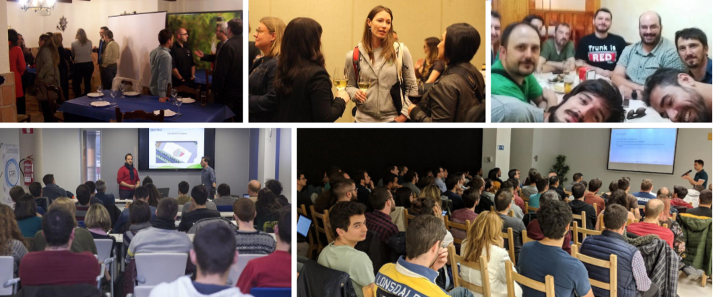
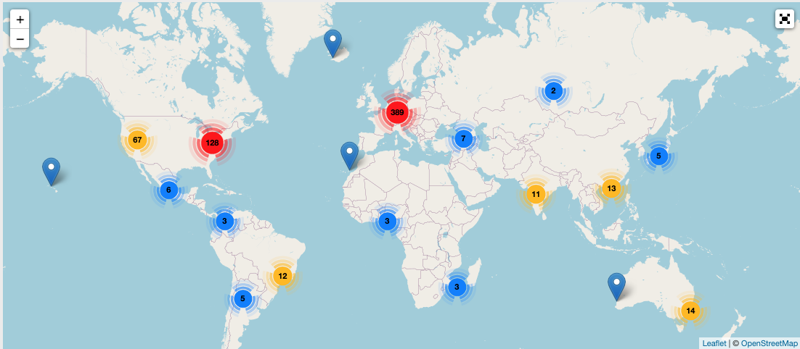

# Tipos de comunidades técnicas

Todas las comunidades técnicas, entendidas como [comunidades de práctica](https://es.wikipedia.org/wiki/Comunidad_de_pr%C3%A1ctica), son aquellas que reúnen a entusiastas por la **tecnología**, software y/o hardware, para colaborar de algún modo.

Alrededor de estas comunidades de **personas apasionadas por el conocimiento**, se busca y encuentra apoyo, se comparten experiencias, se encuentra inspiración y se generan lazos de amistad.

Estas comunidades **existen tanto en formato presencial como en online**. A diferencia de las comunidades online, las presenciales tienen el foco en encuentros locales y por tanto reúnen principalmente a personas próximas geográficamente. Aunque la mayoría de las presenciales, disponen a su vez de canales de comunicación online. 

Dependiendo de las necesidades, **algunas son simplemente colectivos** o grupos de personas **que se reúnen informalmente**, y **otras son entidades formalmente constituidas**, como organizaciones sin ánimo de lucro. 

Estas últimas normalmente se crean para facilitar algunas gestiones como patrocinios, cuotas, gastos de alquiler, material, desplazamiento, ...

## Meetups de tecnología

Los "_meetups_", [grupos de usuarios](https://en.wikipedia.org/wiki/Users%27_group), suele referirse a grupos que **se reúnen en persona periódicamente, en un formato que consiste en una primera parte divulgativa** (charla o un taller técnico), **y una segunda más social** (networking).

<figure>

</figure>

Dicho esto, aunque la mayoría de estos _meetups_ o grupos de usuarios suelen ser presenciales, también los hay puramente online.

A continuación te dejo algunas comunidades que tienen, o han tenido, **presencia local en múltiples ubicaciones en España**, por si te quieres poner en contacto con alguna de ellas: 

* [Betabeers](https://betabeers.com/)
* [Comunidades locales de Python](https://es.python.org/comunidades/)
* [Databeers](https://www.google.com/search?q=Databeers)
* [Geoinquietos](https://geoinquietos.org/)
* [Google Developer Groups](https://gdg.community.dev/)
* [Google Developer Student Club](https://gdsc.community.dev/)
* [Grupos de usuarios de Linux](https://es.wikipedia.org/wiki/Grupo_de_usuarios_de_Linux)
* [Java User Groups](https://dev.java/community/jugs/)
* [PyLadies](https://pyladies.com/locations/)

Puedes encontrar más en [Meetup.com](https://www.meetup.com/es-ES/topics/technology/) y en este [amago de directorio que hicimos](https://comunidades-tecnologicas.github.io/directorio.html).

## HackSpace / HackLab / MakerSpace / Fab Lab 

Este tipo de comunidades **se caracterizan por contar con un espacio físico** (o "laboratorio"). 

Al igual que hay quienes practican deporte en su tiempo libre, incluso alquilan una pista para practicarlo con los amigos, **también hay aficionados a la tecnología que alquilan y crean estos espacios para disfrutar de su hobbie en compañía**. 

Estos espacios sirven como lugar en el que concentrar recursos (hardware y software), desde el que **poder desarrollar proyectos, prototipar, experimentar, investigar, ...** a veces de manera individual, y otras de manera conjunta. 

<figure>

<figcaption><a href="https://wiki.hackerspaces.org/Omega_Verksted">Omega Verksted</a>, foto de HackerSpaces.org</figcaption>
</figure>

Dependiendo del foco (hardware/software) y tipo de espacio nos encontraremos diferentes tipos de recursos. 

Algunos ejemplos:
* **Herramientas**: soldadores, destornilladores, alicates, limas, o pistolas de calor.
* **Piezas y materiales de fabricación**: resistencias, estaño, filamentos, microcontroladores, o piezas antiguas ("retro") de ordenador.
* **Equipos**: de impresión 3D, fresadoras, PLAs, u osciroscopios, servidores, Arduinos, o Rapberry Pis.
* **Mobiliario**: mesas de trabajo, armarios de almacenamiento, o carritos de herramientas.
* **Kits**: educativos, de electrónica, robótica, ...
* **Libros y revistas técnicas**: programación, seguridad, electrónica, o robótica.
* Etc.

Estos espacios están a disposición de los miembros de la comunidad, y la forma de acceder a estos espacios puede variar:
* **Algunos tienen horarios fijos**.
* **En otros las personas vinculadas pueden acceder libremente**.
* Otros tienen horarios flexibles (ya que dependen de voluntarios).
* Etc.

En cualquier caso, te animo a buscar si ya existe alguna comunidad de este tipo cerca tuya y te pongas en contacto. 

Por ejemplo, en la web [hackerspaces.org](https://wiki.hackerspaces.org/List_of_Hacker_Spaces) hay cientos de ellas:

<figure>

</figure>

Algunas comunidades en España de este tipo:

* [AKASHA Hub](https://wiki.hackerspaces.org/AKASHA_Hub_Barcelona), Barcelona
* [Area UR-Maker](https://www.unirioja.es/urmaker/), Logrono
* [BricoLabs](https://wiki.hackerspaces.org/BricoLabs), Coruña
* [Cyberhippietotalism](http://totalism.org/), Fuerteventura
* [Danaus](https://www.danaus.io/), Barcelona
* [Gamaker](http://gamaker.org), Vitoria-Gasteiz
* [HackCS](https://wiki.hackerspaces.org/HackCS), Castellón de la Plana
* [Ingobernable](https://ingobernable.net), Madrid
* [La Jaquería](https://lajaqueria.org/sesiones/), Almería
* [Pica Pica HackLab](http://www.picahack.org), Oviedo
* [MADE Makerspace](http://made-bcn.org/), Barcelona
* [Makers of murcia](http://makersofmurcia.org/), Murcia
* [Makespace Madrid](https://makespacemadrid.org/), Madrid

Más info en Wikipedia: [Hackerspace](https://en.wikipedia.org/wiki/Hackerspace) | [Fab lab](https://en.wikipedia.org/wiki/Fab_lab)

## Otras

A continuación dejo otros tipos de comunidades, que me gustaría evaluar y desarrollar más adelante:

* Foros online
* Comunidades FOSS
* Comunidades conferencias
* Comunidades internas de empresas
* Comunidades en torno a infuencers
* ...

## Comentarios

import GiscusComponent from '@site/src/components/GiscusComponent';

<GiscusComponent></GiscusComponent>