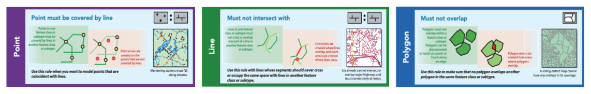
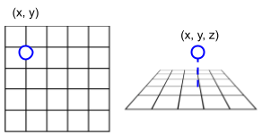
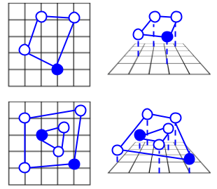
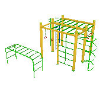
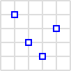
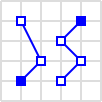
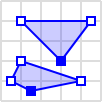
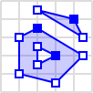
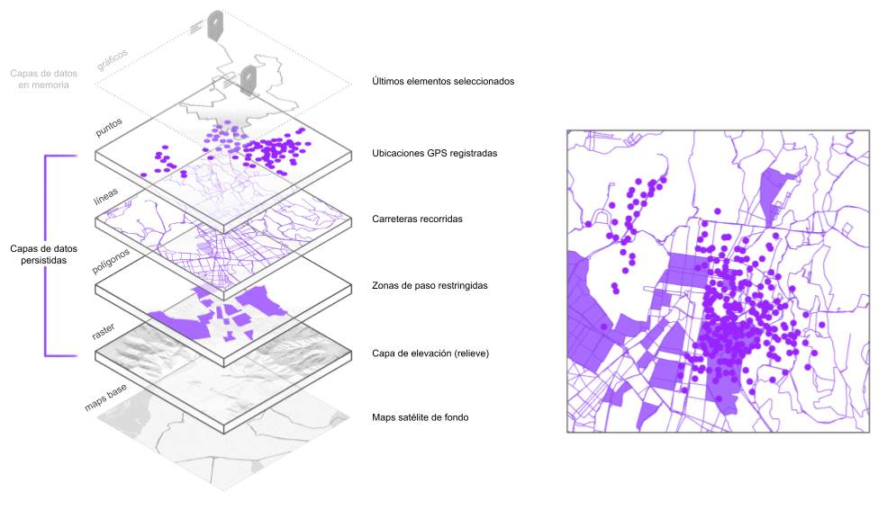
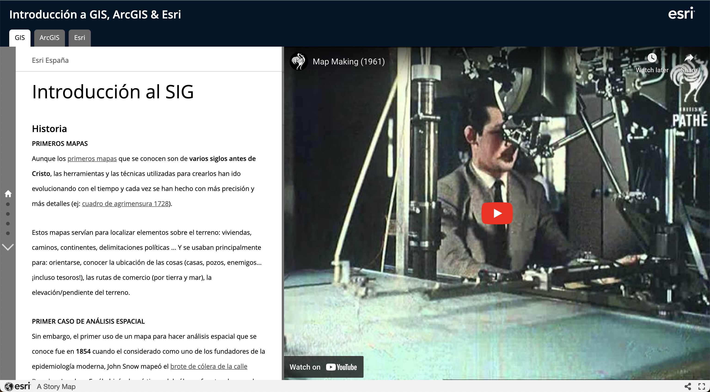

# Intro a los SIG para informáticos

<!-- > **📄 Note**: The interactive version of this article is available at [Dev.to 🇺🇸🇬🇧](https://dev.to/hhkaos/why-attend-developer-conferences-59b3) & [Medium.com 🇪🇸](https://medium.com/@hhkaos/por-qu%C3%A9-asistir-a-conferencias-para-desarrolladores-4c22cbe132cf). -->

---

**Es probable que hayas escuchado** a otros informáticos (o percibido) **que es difícil aprender a usar los sistemas de información geográfica** (SIG, or *GIS* por sus siglas en inglés), **y no me extraña**. Yo llevo desde 2014 en este sector, y la verdad es que **nunca he encontrado un único recurso que sea capaz de recomendar a alguien que quiere empezar**, por eso he creado yo este.

Aquí explicaré los conceptos básicos, usando el vocabulario más sencillo que pueda y similitudes/comparativas con el mundo de la informática tradicional, para que entiendas cómo **los SIG están contruídos sobre muchos conceptos que ya conoces**.

## Para qué sirven

Si no tienes claro para qué te pueden servir los SIG, aquí te dejo un breve vídeo que muestra algunas de las cosas que puedes llegar a hacer con ellos, en este caso concretamente con [ArcGIS](https://developers.arcgis.com/).

<iframe class="content" src="https://www.youtube.com/embed/rd2izZ1LiFc?si=B2VqMPAdXP_0HraM?version=3&autoplay=1&loop=1" title="YouTube video player" frameborder="0" allow="accelerometer; autoplay; clipboard-write; encrypted-media; gyroscope; picture-in-picture; web-share" allowfullscreen></iframe>

Y si quieres, en [Geo Developer superpowers 🦸](https://www.rauljimenez.info/es/docs/geospatial/geo-developer-superpowers), he hecho una recopilación problemas que puedes resolver con ellos.

Y si te preguntas... **¿y esto no lo puedo hacer yo a mano?.** A lo mejor sí... aunque es** fácil infravalorar la complejidad de crear algunas estas tecnologías** (por desconocimiento), por lo que yo lo desaconsejo, por lo menos hasta haberlas probado y haberte familiarizado con las complejidades que oculta.

Dicho esto, reinventar la rueda es siempre una opción, y no soy yo de ponerle puertas al campo... además, hay que reconocer que algunas de las tecnologías que hoy forman parte del ecosistema han surgido de personas inconformistas, valientes y comprometidas como Volodymyr Agafonkin ([el creador de Leaflet.js](https://www.youtube.com/watch?v=NLbyHffKQuU)).

## Definición de SIG

¿Qué se entiende por un SIG/GIS?, yo te diría que:

> Un sistema que **combina múltiples tecnologías optimizadas para tratar con datos geolocalizados**, y con tratar me refiero: almacenarlos, manipularlos, visualizarlos y analizarlos.

Estas tecnologías son: bases de datos (espaciales), servidores (espaciales), librerías/SDKs (espaciales) e incluso aplicaciones de escritorio para trabajar con estos datos.

En los siguientes apartados iremos repasando estas tecnologías y destacando algunas de la familia de productos ArcGIS, pero también otras alternativas populares relevantes.

## Datos geolocalizados

**Todo en un SIG gira en torno a los datos geolocalizados**, por eso, para entender todo lo demás, lo primero que necesitamos saber es cuáles son los diferentes tipos de datos geolocalizados que existen.

Estos se suelen clasificar **en función de *CÓMO* se almacena la información que contiene su ubicación** (también conocida como "la componente espacial" de los datos). 

Hay principalmente dos tipos: **datos vectoriales** y **datos *ráster***, estos son persistidos en disco como **[gráficos vectoriales](https://en.wikipedia.org/wiki/Vector_graphics)** y **[mapas de bits](https://es.wikipedia.org/wiki/Imagen_de_mapa_de_bits)** respectivamente. 

import VectorvsRaster from './intro-sig-arcgis/vector-vs-vector-rasterized.png';

  

Si te interesa, al final del documento hay un apartado "[Captura / Generación](#captura--generación)" explicaremos que:
* A veces el dato se crea originalmente como dato vectorial, y otras veces en ráster.
* Otras se transforma de vectoriales a ráster, mediante un proceso de *[rasterización](https://es.wikipedia.org/wiki/Rasterizaci%C3%B3n)*, como el mostrado en la imagen anterior.
* En ocasiones se extraen datos vectoriales a partir de los datos ráster.

> <strong>💡 ¿Sabías que...?</strong> Hay un campo conocido como GeoAI donde se usan <a href="https://livingatlas.arcgis.com/es/browse/?q=deep%20learning%20package#d=2&type=tool&q=deep+learning+package">modelos de <i>deep learning</i></a>, para extraer datos vectoriales a partir de datos ráster (<strong>entre otras muchas cosas</strong><a href="#0-geospatial-deep-learning-with-arcgis">[0]</a>), y se cree<a href="#0-the-birth-and-evolution-of-geoai">[0]</a> que surgió a mediados de los años 60.

En este documento repasaremos las ventajas y limitaciones de cada uno, junto a herramientas y técnicas para manipularlos.

### Calidad de datos

Antes de entrar en el detalle de los datos vectoriales y ráster, necesitamos conocer algunos **conceptos cruciales** que nos acompañarán siempre que trabajemos con datos geolocalizados, y a que a su vez nos permitirán entender cómo crear aplicaciones de visualización, análisis, ... e implementar procesos (ej: ETL) con **garantías de calidad**.

> <strong>💡 ¿Sabías que...?</strong>: Si no conoces estos conceptos podrías... A) Malinterpretar una ubicación y enviar a una persona o vehículo a decenas o kilómetros de distancia de la ubicación deseada, B) Medir erróneamente la superficie de una parcela, piscina, edificio y calcular incorretamente tasas o ayudas, C) Registrar incorrectamente la delimitación de fincas (<a href="https://es.wikipedia.org/wiki/Deslinde">deslindes</a>) con posibles consecuencias legales, ¿y muchas cosas más?.

Por tanto, no importa si accedemos a los datos vía API de un tercero, si los descargamos de fuentes abiertas, si los compramos a un proveedor, o si nos los proporciona *ingeniero de datos* especializado en [geoinformática](https://es.wikipedia.org/wiki/Geoinform%C3%A1tica) (conocido como técnico o analista/SIG). 

En cualquier caso necesitamos conocer estos conceptos poder manipularlos con garantías, **pero también para evitar posibles quebraderos de cabeza**.

Vamos a ver tres conceptos principales: 

1. [Sistemas de coordenadas](#sistemas-de-coordenadas).
2. [Proyecciones](#proyecciones).
3. [Topologías geospaciales](#topologías-geoespaciales).

---

#### SISTEMAS DE COORDENADAS

Vamos a empezar por cómo se asignan unas coordenadas a una ubicación.

import Tabs from '@theme/Tabs';
import TabItem from '@theme/TabItem';

import BasemapProjected from './intro-sig-arcgis/web-mercator-vs-wgs84.png';
import GeoideYDeformaciones from './intro-sig-arcgis/geoide-sistema-de-referencia-proyeccion-mercator.png';
import PrecisionVsExactitud from './intro-sig-arcgis/precision-vs-exactitud-sig.png';
import Ed50VsWgs84 from './intro-sig-arcgis/ed50-vs-wgs84.png';

<Tabs>
  <TabItem value="apple" label="🌎 Forma de la tierra" default>
    
Calcular las coordenadas de una ubicación en la tierra no es trivial, principalmente porque la tierra no es una esfera o elipsoide perfecto, si no un <a href="https://es.wikipedia.org/wiki/Geoide">geoide</a> (una roca gigante): 

    <blockquote><strong>💡 ¿Sabías que...?</strong>: existen asignaturas completas en grados universitarios donde se estudia la forma de la tierra. Por ejemplo, en Ingeniería Geodesia o Geomática. </blockquote>
    
    
Sin embargo, comprender completamente todos los conceptos teóricos matemáticos que se esconden detrás de este tema va más allá del objetivo de esta introdución. Por lo que me conformo con que sepas que <strong>para poder medir con precisión y exactitud las ubicaciones en la superficie de la tierra existen diferentes <a href="https://en.wikipedia.org/wiki/Spatial_reference_system">sistemas de referencia de coordenadas</a> (CRS por sus siglas en inglés)</strong>.

    
Ahora, antes de seguir, vuelve arriba y pulsa la pestaña: <strong>📍 Sistema de referencia</strong>.

    
  </TabItem>
  <TabItem value="coordenadas" label="📍 Sistema de referencia" default>
    
Esto nos lleva a la conclusión de que, aunque habitualmente pensemos que unas <a href="https://es.wikipedia.org/wiki/Coordenadas_geogr%C3%A1ficas">coordenadas geográficas</a> (por ejemplo: [latitud, longitud]) corresponden siempre a una única ubicación en la tierra, esto no tiene por qué ser así, ya que dependen del sistema de coordenadas al que estén asociadas. 

    
En la siguiente imagen se ven representadas el mismo par de coordenadas ([-3.684217, 40.415779]), pero cada una de ellas asociadas a un sistema de de referencia diferente, a la izquierda en <a href="https://epsg.io/map#srs=4326&x=-3.684217&y=40.415779&z=16&layer=satellite">EPSG 4230 / ED50</a> y a la derecha en <a href="https://epsg.io/map#srs=4230&x=-3.684308&y=40.415769&z=16&layer=satellite">EPSG 4326 / WGS84</a> (ambas en un sistema de coordenadas geográficas <a href="#1-coordinate-systems-whats-the-difference-datum-referencia-espacial-y-sistema-de-coordenadas">[1]</a>).

    

      
    

    
A continuación, vuelve arriba y pulsa la pestaña: <strong>🎯 Precisión y exactitud de la ubicación</strong>.

  </TabItem>
  <TabItem value="orange" label="🎯 Precisión y exactitud de la ubicación">
  
Me parece relevante entender la diferencia entre estos dos conceptos:

  <ul>
  <li><strong>Exactitud de los datos (figuras A y C)</strong>: Se refiere a la proximidad entre un valor medido y el valor real. Los datos pueden ser exáctos pero no precisos (C). Las técnicas para garantizar la exactitud incluyen la verificación sobre el terreno, el uso de equipos GPS de alta calidad, etc.</li>
  <li><strong>Precisión de los datos (figuras A y B)</strong>: La precisión se refiere al nivel de detalle o granularidad de los datos. Los datos pueden ser precisos pero no exáctos (B). Es importante definir los requisitos de precisión del proyecto y asegurarse de que los métodos de recopilación de datos cumplen esas normas.</li>
  </ul>
  

    
  

  
Se puede ver más en el apartado: <a href="#captura--generación">Captura / generación</a>.

  </TabItem>
  
</Tabs>

---

#### PROYECCIONES

<Tabs>
  <TabItem value="proyectados" label="🗺️ Proyecciones" default>
    

    Una <a href="https://es.wikipedia.org/wiki/Proyecci%C3%B3n_cartogr%C3%A1fica">proyección cartográfica</a> es un método matemático que se utiliza para representar la superficie tridimensional de la Tierra en un plano bidimensional (como un mapa o una pantalla), y <strong>no se puede hacer sin introducir algún tipo de distorsión en algún aspecto, ya sea en la forma, el área, la distancia o la dirección</strong><a href="#2-tutorial-elegir-la-proyección-adecuada">[2]</a>. Estos dos vídeos los explican de manera muy visual: <a href="https://www.youtube.com/watch?v=kIID5FDi2JQ">Why all maps are wrong</a> y <a href="https://www.youtube.com/watch?v=wkK_HsY7S_4">The Impossible Map</a>.
    

    

    A la hora de combinar datos de diferentes fuentes, o al representarlos en el mapa de referencia, que es el que da contexto para superponer los datos geolocalizados (también conocido como "mapa de fondo", mapa base o <a href="https://wiki.openstreetmap.org/wiki/Basemap">basemap</a>), es importante asegurar que estén todos los datos y el mapa base en el mismo sistema de referencia <a href="#3-sistemas-de-referencia-en-la-arcgis-maps-sdk-for-javascript">[3]</a>.
    

    

    En la siguiente imagen se puede ver:
    

    <ul>
    <li>A la izquierda (A), un <a href="https://www.arcgis.com/apps/mapviewer/index.html?layers=10df2279f9684e4a9f6a7f08febac2a9">mapa base satelital proyectado en Web Mercator</a>, la proyección popularizada por Google Maps y más habitual de ver en internet. Para crearla, habría que poner una luz en el centro de la Tierra y colocar un cilindro alrededor del globo terrestre de manera que su eje sea paralelo al eje de rotación de la Tierra. El resultado sería la imagen proyectada en el cilindro al encender la luz.</li>
    <li>Y a la derecha (B), otro <a href="https://www.arcgis.com/apps/mapviewer/index.html?layers=898f58f2ee824b3c97bae0698563a4b3">mapa base satelital, pero esta vez proyectado en WGS84</a>, más preciso para <a href="https://jsbin.com/jubuhid/edit?output">representaciones en 3D</a>.</li>
    </ul>
    
    <blockquote>
    <strong>¿Cómo se refleja todo esto en una biblioteca de mapas/SIG?</strong> por ejemplo, en la <a href="https://developers.arcgis.com/javascript/latest/">ArcGIS Maps SDK for JavaScript</a>, multitud de clases tienen una propiedad "spatialReference" que es donde se define el sistema de referencia, por ejemplo las que se usan para representar la vista del mapa (<a href="https://developers.arcgis.com/javascript/latest/api-reference/esri-views-MapView.html#spatialReference">MapView</a> para mapas 2D, y <a href="https://developers.arcgis.com/javascript/latest/api-reference/esri-views-SceneView.html#spatialReference">SceneView</a> para mapas 3D), las clases utilizadas para pintar los datos (<a href="https://developers.arcgis.com/javascript/latest/api-reference/esri-geometry-Point.html#properties-summary">Point</a>, <a href="https://developers.arcgis.com/javascript/latest/api-reference/esri-geometry-Polyline.html#spatialReference">Polyline</a>, etc)
    </blockquote>
    

   
Ahora, antes de seguir, vuelve arriba y pulsa la pestaña: <strong>🌀 Distorsiones</strong>.

   
  </TabItem>
  <TabItem value="deformaciones" label="🌀 Distorsiones">
  
Para demostrar las distorsiones que provocan algunas proyecciones os dejo un vídeo de <a href="https://developers.arcgis.com/documentation/mapping-apis-and-services/spatial-analysis/geometry-analysis/projection/">una aplicación que hice</a> que te permite seleccionar la proyección en la que quieres que se pinten los datos de un fichero que contiene las fronteras de todos los países, y luego muestra un área de 1000km alrededor de la ubicación del cursor (la misma posición tanto en el mapa en 2D, como en el mapa en 3D).

   

   <iframe width="507" height="315" src="https://www.youtube.com/embed/MGARty5xrMU?si=PaK21-mnalFUbFm2" title="YouTube video player" frameborder="0" allow="accelerometer; autoplay; clipboard-write; encrypted-media; gyroscope; picture-in-picture; web-share" allowfullscreen></iframe>
   

   <blockquote><strong>👀 Fíjate en el desplegable</strong>: las proyecciones están agrupadas por <a href="https://es.wikipedia.org/wiki/Proyecci%C3%B3n_acimutal_equidistante">equidistantes</a>, <a href="https://en.wikipedia.org/wiki/Conformal_map_projection">conformal</a>, ... y está indicado qué distorniones provoca cada proyección.</blockquote>
  </TabItem>
</Tabs>

----

#### TOPOLOGÍAS GEOESPACIALES

Las [topologías geospaciales](https://es.wikipedia.org/wiki/Topolog%C3%ADa_geoespacial) permiten definir reglas para asegurar la integridad de los datos<a href="#5-topology-basics">[5]</a>. 

Esto se puede usar para garantizar que una calle no atraviese un edificio, que el número de portal de un bloque esté ubicado en una arista del edificio, que la superficie de dos fincas no se solapen, etc.

Por ejemplo, estas son 3 de las [32 reglas tológicas soportadas en ArcGIS](https://pro.arcgis.com/en/pro-app/latest/help/editing/pdf/topology_rules_poster.pdf):

Las restricciones, limitaciones o *constraints* topológicas se pueden definir a nivel de base de datos, pero como veremos en el apartado "[Análisis](#análisis)", también se pueden usar vía SDK para detectar errores o arregar los datos antes de intentar persistirlos.

### Datos vectoriales

Usaremos [datos vectoriales](#datos-vectoriales) para geolocalizar son [entidades geográficas](https://en.wikipedia.org/wiki/Geographical_feature) que tienen una identidad y localización cláramente diferenciada a otras entidades geográficas (a veces se les llama entidades discretas), por ejemplo: objetos, edificios, posiciones, perímetros, ... 

La ubicación de estos datos se pueden representar con diferentes tipos de geometrías, y el **tipo de geometría soportado** para cada tecnología, **la forma de representarlo**, el incluso **el nombre que se les da**, varía entre unas tecnologías y otras<a href="#6-tipos-de-geometría-geojsongeometrías-en-arcgis-formas-de-google">[6]</a> (bases de datos, SDKs, formatos de archivo, etc). 

#### GEOMETRIAS (*PRIMITIVAS*)

<!-- import GiscusComponent from '@site/src/components/GiscusComponent';

<GiscusComponent></GiscusComponent> -->

|Tipo|Representación|Ejemplo de uso|
|---|---|---|
|Punto||Paradas de taxi, árboles, semáforos ... aunque a veces, lo que podría ser un polígono (por ej: el perímetro de un local, negocio, o tienda), se reduce a un punto (la entrada principal, o el [centroide](https://es.wikipedia.org/wiki/Centroide#:~:text=El%20centroide%20de%20un%20tri%C3%A1ngulo,de%20la%20superficie%20del%20tri%C3%A1ngulo.)).
|Polilínea o linestring||Calles, tendidos eléctricos, redes de tuberías, carreteras, líneas de autobús, metro, rutas comerciales, senderos de montaña, líneas de costa, diques, ríos, cordilleras, fallas geológicas, ...
|Polígono||Superficie/huellas de edificios, barrios, municipios, [perímetros](https://www.arcgis.com/home/item.html?id=d957997ccee7408287a963600a77f61f#visualize), parques, zonas industriales, parques naturales, bosques, países, zonas de tráfico restringidas,  ...
|Malla de triángulos (Mesh)||Para representar [objetos](https://developers.arcgis.com/javascript/latest/visualization/symbols-color-ramps/esri-web-style-symbols-3d/#low-poly-vegetation) en [escenarios 3D](https://developers.arcgis.com/javascript/latest/sample-code/?tagged=Mesh) como estructuras o moviliarios hurbano, edificios, vegetación, vehículos, personas, señales de tráfico, iconos 3D, cajeros, fuentes, farolas, antenas de telefonía,  etc..

#### GEOMETRÍAS *COMPUESTAS* ("multipart geometries" en inglés)

|Tipo|Representación|Ejemplo de uso|
|---|---|---|
|Multipuntos||Tracks de GPS, paradas de bus por ciudad, postes de servicios públicos, inventarios de árboles, lugares de pesca, aparcamientos, bocas de incendios, baños públicos, fuentes de agua, etc. 
|Multilíneas||Redes de carreteras, sistemas de ferrocarril, redes de ríos, redes de *utilities*, senderos y caminos, cables subacuáticos, líneas de alta tensión, rutas de avión, etc.
|Multipolígonos| | Islas, territorio soberado de países (e.g. [España](https://services.arcgis.com/P3ePLMYs2RVChkJx/ArcGIS/rest/services/World_Countries_(Generalized)/FeatureServer/0/query?where=ISO+%3D+%27ES%27&objectIds=&time=&geometry=&geometryType=esriGeometryEnvelope&inSR=&spatialRel=esriSpatialRelIntersects&resultType=none&distance=0.0&units=esriSRUnit_Meter&relationParam=&returnGeodetic=false&outFields=*&returnGeometry=true&returnCentroid=false&returnEnvelope=false&featureEncoding=esriDefault&multipatchOption=xyFootprint&maxAllowableOffset=&geometryPrecision=&outSR=&defaultSR=&datumTransformation=&applyVCSProjection=false&returnIdsOnly=false&returnUniqueIdsOnly=false&returnCountOnly=false&returnExtentOnly=false&returnQueryGeometry=false&returnDistinctValues=false&cacheHint=false&orderByFields=&groupByFieldsForStatistics=&outStatistics=&having=&resultOffset=&resultRecordCount=&returnZ=false&returnM=false&returnExceededLimitFeatures=true&quantizationParameters=&sqlFormat=none&f=pgeojson&token=)), municipios, comunidades autónomas, parque naturales y reservas, zonas costeras y marítimas, 
|Colección de geometrías o GeometryCollection||Es un tipo de geometría se puede usar para geometrías complejas, esbozar o guardar dibujos o indicaciones a suponer en un mapa, agregaciones de datos, etc.

Por hacer: **Ventajas y limitaciones**

### Datos raster

** ⚠️ Pendiente de hacer**

<!-- Los [datos ráster](#datos-raster-bitmaps) para [variables contínuos](https://es.wikipedia.org/wiki/Variable_discreta_y_variable_continua) (e.j. temperatura, elevación, [usos de suelo](https://en.wikipedia.org/wiki/Land_use), ...).

Datos "raster" (bitmaps): https://esri-es.github.io/awesome-arcgis/arcgis/content/data-types/raster/

(ej: datos de elevación, datos de temperatura, o una una fotografía aérea).
Multidimensionales

[¿Qué son los datos ráster?](https://desktop.arcgis.com/es/arcmap/latest/manage-data/raster-and-images/what-is-raster-data.htm)

voxel

[Conceptos básicos del tratamiento de imágenes y la teledetección en la Plataforma ArcGIS](https://geogeeks.maps.arcgis.com/apps/Cascade/index.html?appid=5072b8d56cef4f7bb5d24e5d840461da)

Aunque los datos vectoriales son frecuentes en todos los campos y sectores económicos, hay algunos donde trabajar con datos *raster* muy habitual (ej: defensa y seguridad, climatología, medio ambiente y conservación, gestión de recursos naturales, energía, agricultura, ...). -->

## Capas de datos

Otro concepto importante son las capas.

Tanto a nivel de almacenamiento como a nivel de visualización, se suele trabajar en capas
Cuando una aplicación es sencilla se pueden cargar los datos geolocalizdos recuperados pintando manualmente en una capa gráfica... entonces

De manera análoga a como se trabaja con herramientas de diseño gráfico como Photoshop, los datos en un SIG se suelen organizar y persistir por capas:

Si te fijas en la imagen, verás que en cada capa de datos vectoriales, el tipo de geometría es homogénea1 (puntos, líneas, ...), salvo en la capa gráfica que aparece encima de todas. 

Las capas gráficas se usan normalmente para mejorar la usabilidad de las aplicaciones, y sirven para representar elementos mientras se interactúa con la aplicación (por ejemplo mostrar un pin tras hacer la búsqueda de una dirección, mostrar la traza de una geometría mientras se está creando, etc).

Del mismo modo, en [portales de datos abiertos](#datos-abiertos) lo normal es encontrar ficheros donde cada uno representa una capa de datos.

Es habitual que cuando estos datos se alojen en un SGBD relacional, cada capa se almacene en con una tabla de la base de datos. 

  
¿¿Eso significa que las bases de datos espaciales no se normalizan?? 🤔

  En bases de datos geográficas, la normalización completa de los datos puede no ser práctica debido a la complejidad y la naturaleza espacial de los datos debido a:

  * La **jerarquía espacial**: Los datos geográficos suelen estar organizados en una jerarquía espacial (por ejemplo, país -> estado -> ciudad), y la normalización puede crear esquemas complejos que dificulten la consulta eficiente de datos.

  * El **rendimiento**: La normalización extrema puede afectar al rendimiento, especialmente en consultas espaciales usando *joins*.

  * La **integridad referencial**: Las relaciones espaciales y la necesidad de mantener la consistencia de los datos de ubicación hacen que sea más difícil garantizar la integridad referencial de las bases de datos geográficas.

  En muchos casos, se busca un equilibrio entre la normalización para garantizar la integridad de los datos y la desnormalización para mejorar el rendimiento de las consultas espaciales. 

## Formatos de datos

Antes de pasar a las bases de datos, vamos a repasar los formatos en los que solemos encontrar datos en internet, ya sea en archivos o en APIs y que sirven para mejorar la interoperabilidad entre sistemas, pero sin entrar en cómo se representan.

### Para datos vectoriales

** ⚠️ Pendiente de hacer**

<!-- * Extensiones a formatos de texto plano que definen esquemas:
  * JSON -> [GeoJSON](https://en.wikipedia.org/wiki/GeoJSON) y [TopoJSON](https://en.wikipedia.org/wiki/GeoJSON#TopoJSON)
  * XML -> [KML](https://en.wikipedia.org/wiki/Keyhole_Markup_Language), [GPX](https://en.wikipedia.org/wiki/GPS_Exchange_Format), [GML](https://es.wikipedia.org/wiki/Geography_Markup_Language), ...
  * CSV -> GeoCSV
* Comprimidos:
  * ZIP: 
    * Shapefile
    * [GTFS](https://en.wikipedia.org/wiki/GTFS), ...
    * KMZ
  * Protobuf
  * Otros
  * Geoparquet
  * Protomaps

Aún es frecuente INTERCAMBIO DE FICHEROS
y si se exportan como ficheros se usan (, GDBs, , protomaps, ... )
en diferentes formatos en texto plano y binario  (, ... hay algunos formatos de propósito general y otros más...

> (1) Aunque en ocasiones hay capas (como las gráficas, feature collection), que permiten mezclar tipos de geometrías

En ciertas disciplinas se trabaja con otros tipos de software y formatos de fichero que pueden ser importados o vinculados para enriquecer la información del SIG. Por ejemplo:

* **Arquitectura y diseño industrial**: diseño asistidar por computador (CAD), para diseñar edificios  es relativamente habitual que que a veces se usa para crear planos de pueblos/ciudades: DWG, DXF, DGN, ...). 
* **Ingeniería Civil**: Lidar
* **Movilidad**: GTFS
* ...

Si quieres explorar más, aquí tienes un [listado de formatos de ficheros para datos geoespaciales](https://esri-es.github.io/awesome-arcgis/arcgis/content/data-storage/file-formats/)) que creé hace tiempo. -->

### Para datos ráster

** ⚠️ Pendiente de hacer**

<!-- GeoTIFF, COG, ... -->

## Bases de datos

** ⚠️ Pendiente de hacer**

<!-- Aunque hay ficheros de datos geoespaciales avanzados, como FBG que usar una base de datos Access. "Enterprise database"..
ventajas de usar bases de datos editar ficheros directamente vs 

Al igual que en cualquier otro sistema, cuando neLo acceso multi usuario, etc

para gestionar eficientemente estos datos, se han creado extensiones, módulos, plugins, ... que se añaden a los SGBDs que conocemos para dotarles de funcionalidades para poder trabajar con datos geolocalizados (por ej: hacer [operaciones geometricas](https://developers.arcgis.com/documentation/mapping-apis-and-services/spatial-analysis/geometry-analysis/introduction/#types-of-geometry-operations) como  calcular distancias entre puntos, buscar puntos dentro de un polígono, ...).

* ¿Habilitar una base de datos relacional como espacial?:
      * Viejo: [Understanding ArcSDE](https://downloads.esri.com/support/documentation/sde_/706understanding_arcsde.pdf) (Database schema)
      * Crear una "Enterprise Geodatabase" de Esri (\== añadir ArcSDE a un SGBD) en PostgreSQL: https://pro.arcgis.com/en/pro-app/3.1/help/data/geodatabases/manage-postgresql/setup-geodatabase-postgresql-windows.htm (mediante la herramienta de escritorio) también se soportan (MS SQL Server, Oracale, SAP HANA, ... [más](https://pro.arcgis.com/en/pro-app/3.1/help/data/geodatabases/introduction/geodatabase-administration.htm)); existen otros tipos de Geodatabases (file geodatabase, mobile geodatabase, ...)
      * Igual extensiones para dotar de capacidades para trabajar con datos geolocalizados a la BD: ArcSDE (de Esri) existen PostGIS (para PostgreSQL), SpatiaLite (para SQLite), Oracle Spatial (para Orace) etc. <- cada una con unas capacidades
* ¿Cuál es la UI para diseñar/modificar una Esri Enterprise Geodatabases? (del SGDB):
      * Normalmente se hace a través de herramientas y "Wizards" de escritorio (ArcGIS Pro) ([ejemplo](https://youtu.be/L2hmTvSEK0c?si=GZ2qiy-mF0TBDxjj&t=286))
      * Los usuarios avanzados pueden abrir la UI por defecto el SGBD y ver (aunque se recomienda encareciadamente no tocar directamente)
      * Una vez publicado un servicio, se ofrece una interfaz&API para poder modificar el servicio e incluso modificar esquema (aunque no existe documentación para casos avanzados). Un ejemplo: https://youtu.be/D9PMC2yGJbA?si=vx6ugoQtSDmj18DA&t=647
      * Esta es la misma inte

https://en.wikipedia.org/wiki/Spatial_database#List -->

## Servidores y APIs

** ⚠️ Pendiente de hacer**

<!-- nginx Apache pero para servir

o share, process and edit geospatial data. Designed for interoperability, it publishes data from any major spatial data source using open standards.

Cuando los datos se ofrecen vía API, se suelen servir en formatos de texto plano, GeoJSON ubitualmente, aunque puede ser KML, JSON, TopoJSON, CSV/GeoCSV, KML, ... 

Cuando los datos son más complejos, la APIs suelen utilizan múltiples endpoints

https://www.postman.com/esridevs/workspace/arcgis-location-services/request/23458780-6701bf15-a46d-4de8-9843-2fe897a3b9b1

Geoprocesos

Un mapa base con 23 niveles de zoom puede pesar ~20.480 GB (en raster con teselas de 256x256px) 13GBs en vector
[Desktop Mapping: Creating Vector Tiles](https://youtu.be/dqKsEos1iSw?si=JTsb9KtbGRyETyDP&t=732)
[Cómo se crean y almacenan los mapas base](https://www.youtube.com/live/b182O1Yscnc?si=LmaA1Wa5318GpZbT&t=239)

* Hoy en día se publican servicios/APIs con especificaciones públicas, ya sean estándares (OGC, función equivalente al W3C pero en el ámbito espacial) o no: https://esri-es.github.io/awesome-arcgis/arcgis/content/data-storage/service-types/

Open api espect of ocg apis? -->

## Datos abiertos

** ⚠️ Pendiente de hacer**

<!-- Una vez comprendidos los diferentes [tipos de datos geolocalizados](#datos-geolocalizados), en qué [formatos](#formatos-de-archivo) en los que se pueden almacenar/exportar y compartir, 
Con todo lo que hemos visto ya estamos preparados para entender

IDEs, etcportales open data, ..

como [datos.gob.es](https://datos.gob.es) o [hub.arcgis.com](https://hub.arcgis.com/)

https://github.com/esri-es/open-data-search
https://medium.com/@ochwada/navigating-the-world-of-free-geospatial-data-a-comprehensive-guide-114ded8b0196
https://docs.google.com/spreadsheets/d/1bF4YYH7bXPSLI___zMfh3tDfSxDlWWZLkkuT5vD4zHQ/edit#gid=746167425 -->

## Visualización

** ⚠️ Pendiente de hacer**

<!-- Stiching... en WebGL, canvas, ... sopo
https://docs.google.com/presentation/d/16wNWpNhnzxVxQ1TXPccERxBfi_q2T8sKBMHHbi6rcOg/edit#slide=id.g6c1957d15_1161

[Thematic Mapping: 101 Inspiring Ways to Visualise Empirical Data](https://amzn.eu/d/68PvGRm)
[Cartography](https://amzn.eu/d/7WcAz4p)

Visualización de datos raster

https://developers.arcgis.com/javascript/latest/sample-code/layers-imagery-pixelvalues/
https://developers.arcgis.com/javascript/latest/sample-code/layers-imagery-clientside/ -->

import PixelFilterLow from './intro-sig-arcgis/pixel-filter-low.gif';
import PixelFilterAnalysis from './intro-sig-arcgis/pixel-filter-analysis-low.gif';

## Análisis

** ⚠️ Pendiente de hacer**

<!-- Herramientas de escritorio

SDKs + arcpy

Para asegurar calidad de datos, comprobar topologías, generar nuevos datos -->

<iframe width="560" height="315" src="https://www.youtube.com/embed/y3e5LzMgF1w?si=VRafuHLn9P1u3c4Y" title="YouTube video player" frameborder="0" allow="accelerometer; autoplay; clipboard-write; encrypted-media; gyroscope; picture-in-picture; web-share" allowfullscreen></iframe>

<!-- ### Geoestadística

https://es.wikipedia.org/wiki/Geoestad%C3%ADstica

https://pro.arcgis.com/es/pro-app/latest/help/analysis/geostatistical-analyst/what-is-geostatistics-.htm
reparto de datos Geostadística

https://developers.arcgis.com/rest/geoenrichment/api-reference/data-apportionment.htm

Extracción (semi) automática de entidad, Detección de cambios, predicciones, indentificar patrones
#1-the-birth-and-evolution-of-geoai

[Spatial Statistics Illustrated](https://amzn.eu/d/b2Cj8kI) -->

## Gestión

** ⚠️ Pendiente de hacer**

<!-- Desktop, transformación, interoperability, portal / GDAL, etc -->

## Captura / generación

** ⚠️ Pendiente de hacer**

<!-- A veces se captura directamente en ráster, a veces se transforma el dato vectorial a ráster
¿Cómo se crean? topografos, manualmnete, satélites. drones, ground truth
Teledetección
https://es.wikipedia.org/wiki/Verdad_fundamental

https://es.wikipedia.org/wiki/Hito_fronterizo

Agrimensura (surveying o land surveying)
https://es.wikipedia.org/wiki/Agrimensura

Go to history para formas históricas

https://aws.amazon.com/es/ground-station/

Gps, drone (ground truth for GPS) . Precisión y exactitud

A continuación repasaremos algunos de los conceptos, técnicas y métodos relacionados . 

* Proyecciones
* Sistemas de referencia

Posiciones GPS 

https://en.wikipedia.org/wiki/Ground_truth#Geographical_information_systems -->

## Historia del GIS
 
A veces, que sin conocer la historia y su evolución, cuesta entender en el presente. Por eso, en ~2018 creé la web [Introducción al GIS, ArcGIS y Esri](https://geogeeks.maps.arcgis.com/apps/MapSeries/index.html?appid=5a6400a6d9bb45d4a6c389b11de39b45) con el objetivo de ayudar a entender por qué los sistemas de información geográfica son hoy como son:

<!-- ## ELIMINAR

Si no te interesa tanto la historia, aquí tienes una charla titulada "[Introducción al GIS para desarrolladores](https://www.youtube.com/live/6YCBgJqJ7Hs?si=7cWRG7bn1NE5bH0U)" que toca varias cosas a modo introductorio:

* [Qué es un GIS y para que se usan](https://www.youtube.com/live/6YCBgJqJ7Hs?si=hS_3Kk5r0A1-_Hpd&t=134)
* [Qué hace un GIS que no pueda hacer yo](https://www.youtube.com/live/6YCBgJqJ7Hs?si=PVWVs4D1hipRa0cc&t=500) (por mi cuenta)
* [Por qué son necesarios](https://www.youtube.com/live/6YCBgJqJ7Hs?si=zFf91J88LzmluyXt&t=577)
* [Sistemas de referencia](https://www.youtube.com/live/6YCBgJqJ7Hs?si=tmOyepORsH2oRriT&t=628)
* [Sistemas de proyección](https://www.youtube.com/live/6YCBgJqJ7Hs?si=5oGNEYkrpuvvIWre&t=890)
* [Qué hace un GIS](https://www.youtube.com/live/6YCBgJqJ7Hs?si=A9HmHdDmHTS9v6TO&t=1018)
* [¿Puedo hacer esto sin un GIS?](https://www.youtube.com/live/6YCBgJqJ7Hs?si=OpmNswzmZp2I__zr&t=1116)
* [Flujo de trabajo habitual](https://www.youtube.com/live/6YCBgJqJ7Hs?si=wwuIcdW4Vu4YOQZR&t=1187)
* [Servicios de mapas de fondo (mapas base)](https://www.youtube.com/live/6YCBgJqJ7Hs?si=SRk9sMLTqEStZO9A&t=1283)
* [Factores a valorar en un servicio de mapas](https://www.youtube.com/live/6YCBgJqJ7Hs?si=Q-Lm0KQtj4zMkPJK&t=1430)
* [Fuentes de datos](https://www.youtube.com/live/6YCBgJqJ7Hs?si=3ZayJb8xokEXug_h&t=1601)
* [Formatos de ficheros de datos geográficos](https://www.youtube.com/live/6YCBgJqJ7Hs?si=5V517M8Tb1wgv0lm&t=1759)
* [Cómo se almacenan los datos en un GIS](https://www.youtube.com/live/6YCBgJqJ7Hs?si=oHQbGv_voCLp40sJ&t=2221)
* [Diferencias en BBDD alfanuméricas y geográficas](https://www.youtube.com/live/6YCBgJqJ7Hs?si=rtmYGbl96K-EaBbh&t=2266)
* [La complejidad de pintar mapas](https://www.youtube.com/live/6YCBgJqJ7Hs?si=9GIdJQ4MZOvN0eM9&t=2323)
* [Funcionalidades de un GIS](https://www.youtube.com/live/6YCBgJqJ7Hs?si=RyM1jmjODhwJIy0-&t=2460)

> **Nota** Aunque creo que la información sigue siendo válida, hay cosas que contaría de otra manera, y otras cosas que añadiría. -->

## Conclusión

(diagrama de productos ArcGIS)

## Otros recursos

#### \[0\] [The Birth and Evolution of GeoAI](https://resources.esri.ca/education-and-research/geoai-series-2-the-birth-and-evolution-of-geoai) 
#### \[0\] [Geospatial Deep Learning with ArcGIS](https://mediaspace.esri.com/media/t/1_fzvuc2b3/292702072)
#### \[1\] [Coordinate Systems: What's the Difference?](https://www.esri.com/arcgis-blog/products/arcgis-pro/mapping/coordinate-systems-difference/) (datum, referencia espacial y sistema de coordenadas)
#### \[2\] [Tutorial: Elegir la proyección adecuada](https://learn.arcgis.com/es/projects/choose-the-right-projection/)
#### \[3\] [Sistemas de referencia en la ArcGIS Maps SDK for JavaScript](https://developers.arcgis.com/javascript/latest/api-reference/esri-views-View.html#spatialReference)
#### \[5\] [Topology basics](https://pro.arcgis.com/es/pro-app/latest/help/data/topologies/topology-basics.htm)
#### \[6\] Tipos de geometría en diferentes technologías: [GeoJSON](https://en.wikipedia.org/wiki/GeoJSON), [geometrías en ArcGIS](https://developers.arcgis.com/documentation/common-data-types/geometry-objects.htm), [tipos de datos en PostGIS](https://postgis.net/workshops/postgis-intro/geometries.html), [formas en la API JS de Google Maps](https://developers.google.com/maps/documentation/javascript/shapes).

## Comentarios

import GiscusComponent from '@site/src/components/GiscusComponent';

<GiscusComponent></GiscusComponent>