<iframe src="https://giphy.com/embed/IPbS5R4fSUl5S" width="200" height="115" frameBorder="0" class="float-right" allowFullScreen></iframe>

<!-- 
Introducción al SIG para desarrolladores: Guía para entenderlos de manera sencilla
+ ideas: https://chatgpt.com/share/67c9a193-118c-8013-a121-48700828f080

Prólogo

Si eres desarrollador y alguna vez has tenido que lidiar con mapas, coordenadas o cualquier tipo de dato con coordenadas, probablemente te hayas terminado encontrado con documentación compleja, llena de términos técnicos y jerga que parecen escritos para expertos en geografía o especialistas, y no para programadores. Es posible que hayas sentido que ese mundo está diseñado para ellos y que aprenderlo requiere años de estudio.

Déjame confesarte algo: yo también, y este libro nace precisamente para resolver ese problema. 

Pero no te voy a engañar, es un campo muy extenso, con muchas ramificaciones y posibilidades, y tan extenso como el propio planeta. Aquí no te encontrarás con explicaciones que asumen que ya tienes este tipo de conocimientos previos. En cambio, empezaré desde cero, y usaré analogías con conceptos que ya dominas como desarrollador: bases de datos, estructuras de datos, APIs, SDKs, formatos de datos, etc. Aprenderás qué son los datos espaciales y cómo puedes usarlos en tus propios proyectos sin perderte por el camino.

Vamos a introducirnos en el mundo de los datos espaciales y los sistemas de información geográfica, que no son más que herramientas optimizadas para gestionar información geolocalizada. Al igual que con cualquier otra tecnología, lo importante es primero aprender los fundamentos para luego entender cómo sacarle el máximo provecho a las herramientas específicas. 

Mi objetivo es desmitificar todo sobre los datos espaciales y que terminar, no solo entiendas los fundamentos de los SIG, sino que sepas cómo aplicar lo aprendido en tus propios proyectos, profesionales o personales, te ganes seguridad a la hora de tomar decisiones, y que descubras como los datos espaciales pueden ayudarte a innovar, resolver problemas con una nueva persperctiva y en definitiva agregar valor real.

Te doy la bienvenida al mundo de los datos espaciales para desarrolladores. ¡Vamos a lío! 🚀

-->

**¿Es difícil aprender qué son y cómo funcionan los sistemas de información geográfica (SIG, or *GIS* por sus siglas en inglés)?**

Como informático que lleva desde 2014 en este mundo, **sé que al principio es difícil entender la mayoría de recursos disponibles**, porque a mi también me ha costado, es más... ¡a veces me sigue costando! 😅. 

Esto se debe a muchas razones:
1. La mayoría de los recursos **dan por sentado que conoces el vocabulario/jerga de los SIG** como: mapa base, capas, geometrías, entidades, datos ráster, extensión, geocodificar, geodésico, geoprocesamiento, teselas, datum, ... 🤨.
2. También que **dominas todos conceptos fundamentales y relativamente complejos** como: sistemas de coordenadas o de referencia, proyección, topología, ... 😮.
3. En ocasiones, **los términos en el contexto de los SIG tienen significados totalmente distintos a la informática tradicional**, por ej: [**buffer** informático != **buffer** geográfico](https://es.wikipedia.org/wiki/Buffer) 😱.
4. **Falta de consenso y un vocabulario universal** en conceptos básicos. Diferentes tecnologías terminan dando diferentes nombres al mismo concepto. Por ejemplo: Google y Esri llamamos `Polyline` a los que en GeoJSON se llama `Linestring`, o lo que en Google Maps es un `InfoWindow`, en Esri es un `PopupTemplate`, y en Leaflet un `Popup` 😭.
5. **No razonan el por qué** se hacen algunas cosas de manera distinta a como estamos acostumbrados 🤔.
6. Los SIG **abarcan una amplia gama de tecnologías**, desde servidores a aplicaciones de escritorio, SDKs, ... **que puede abrumar al principio** 🤯.

Si a esto le sumamos que **casi nunca se le deja claro a alguien con un perfil informático los beneficios potenciales y los problemas que podrán resolver con ellos**, no es de extrañar que muchas personas terminen frustándose, abandonando y dedicando su tiempo a aprender otras tecnologías.

Por eso he creado yo este recurso, porque **nunca he encontrado un único recurso empiece desde los beneficios, pasando por los conceptos básicos y profundizando lo suficiente** como para ser capaz de recomendarlo a alguien (como yo) que quiera empezar.

:::info

Por ejemplo, para reducir esa fricción, desde el equipo de Developer Experience de Esri hemos creado un [glosario de términos](https://developers.arcgis.com/documentation/glossary/) que nos permite que al pasar el ratón por encima de estos, podamos ofrecer un modal con una aclaración:

:::

En esta página explicaré los conceptos básicos, usando el vocabulario más sencillo que pueda y similitudes/comparativas con el mundo de la informática tradicional, para que entiendas cómo **los SIG están contruídos sobre muchos conceptos que ya conoces**.

## Para qué sirven

<!-- 

Visualización 2D y 3D (comunicación, medios) 

* Outdoor (3D): wikilok, 
* Ver ruta y compartirlas
* Mapas estáticos, recibos, 
* Exportar vídeo Relieve
* pokemon go
* Grandes cantidades de datos, GB): Resultados electorales
* https://www.dotgiscorp.com/es/clientes/patios-cordoba/
* https://www.dotgiscorp.com/es/clientes/vodafone/
* Mis picaderos, canchas de basket, 

Geocodificar & Encontrar puntos de interés:
* Ecommerce (datos postales): Amazon, etc
* Tinder places
* AirBnb

Filtrar espacialmente y calcular distancias a elementos cercanos (economía circular)
* Booking (calcular distancia a POIs)
* Hoteles (Airbnb)
* Franquicias (tiendas, cajeros, productos, más cercanos) -> Ikea, Leroy, Wallapop, Bancos (BBVA), Glovo, Pizzerías, Parkings
* Taxis (Uber, Cabify...)
* Ocio (Fever = actividades, El Tenedor)
* Turismo (, MiNube, tripadvisor
* Google Photos
* Localizador de tiendas, rider, taxi, patinetes, etc
* GeoGuessr & GeoNight
* Snap to roads (GPS)
* Waze alerts

Personalizar mapa:
- Uber
- Cabify
...

Buscar en ruta
* Gasolineras y Diesel España: https://play.google.com/store/apps/details?id=com.quadbits.smartrefueling&hl=es
* Blablacar (pasajeros en ruta)

IoT, sensorización, gestión de activos (recursos, espacios):
* Eventos https://www.dotgiscorp.com/es/clientes/vodafone/
* DAM Gestión eficiente de residuos de Estaciones Depuradoras de Aguas.https://www.dotgiscorp.com/es/clientes/dam/

Business intelligence, Location analytics (GeoEstadísticas):
* https://www.dotgiscorp.com/es/clientes/ing/
* Goiko Site planning https://www.dotgiscorp.com/es/clientes/goiko-grill/
* Geoporra (resultados de las elecciones)
* https://www.dotgiscorp.com/es/clientes/correos/
* EDP Energía: Smart Grids, la transformación digital de redes eléctricas: https://www.dotgiscorp.com/es/clientes/edpenergia/

Rutas personalizadas
- Ayuntamiento de Madrid (Taxi APP): https://www.dotgiscorp.com/es/clientes/ayuntamiento-madrid-taxi/

Crear mapas personalizados (indoor)
* centros comerciales, festival zoo (planos), costa cruceros, ifema (https://www.dotgiscorp.com/es/clientes/grupolar/)
* Cálculo de potencial solar: https://eficiencia-energetica.ign.es/solar/
* Mapas de inundaciones

Mapas históricos:
- Wayback

 -->

Si no tienes claro para qué te pueden servir los SIG, y si **merece la pena invertir tiempo en ellos**, aquí te dejo un breve vídeo que muestra algunas de las cosas que puedes llegar a hacer. En este caso, concretamente con [ArcGIS](https://developers.arcgis.com/):

  <iframe class="content" src="https://www.youtube.com/embed/rd2izZ1LiFc?si=B2VqMPAdXP_0HraM?version=3&autoplay=1&loop=1" title="YouTube video player" frameborder="0" allow="accelerometer; autoplay; clipboard-write; encrypted-media; gyroscope; picture-in-picture; web-share" allowfullscreen></iframe>

Y si quieres, en [Geo Developer superpowers 🦸](https://www.rauljimenez.info/es/docs/geospatial/geo-developer-superpowers), he hecho una recopilación de problemas que puedes resolver con ellos.

Si te preguntas... **¿y esto no lo puedo hacer yo a mano?.** A lo mejor sí... aunque es** fácil infravalorar la complejidad de crear algunas estas tecnologías** (por desconocimiento), por lo que yo lo desaconsejo, por lo menos hasta haberlas probado y haberte familiarizado con las complejidades que ocultan.

Dicho esto, reinventar la rueda es siempre una opción, y no soy yo de ponerle puertas al campo... además, hay que reconocer que algunas de las tecnologías que hoy forman parte del ecosistema han surgido de personas inconformistas, valientes y comprometidas, como Volodymyr Agafonkin, [el creador de Leaflet.js](https://www.youtube.com/watch?v=NLbyHffKQuU).

## Definición de SIG

¿Qué se entiende por un SIG/GIS?, yo te diría que:

> Un sistema que **combina múltiples tecnologías optimizadas para tratar con datos geolocalizados**, y con tratar me refiero: almacenarlos, manipularlos, visualizarlos y analizarlos.

Estas tecnologías son: bases de datos (espaciales), servidores (espaciales), librerías/SDKs (espaciales) e incluso aplicaciones de escritorio para trabajar con estos datos.

En los siguientes apartados iremos repasando estas tecnologías y destacando algunas de la familia de productos ArcGIS, pero también otras alternativas populares relevantes.

## Datos geolocalizados

**Todo en un SIG gira en torno a los datos geolocalizados**, por eso, para entender todo lo demás, lo primero que necesitamos saber es cuáles son los diferentes tipos de datos geolocalizados que existen.

Estos se suelen clasificar **en función de *CÓMO* se almacena la información que contiene su ubicación** (también conocida como "la componente espacial" de los datos). 

Hay principalmente dos tipos: **datos vectoriales** y **datos *ráster***, estos son persistidos en disco como **[gráficos vectoriales](https://en.wikipedia.org/wiki/Vector_graphics)** y **[mapas de bits](https://es.wikipedia.org/wiki/Imagen_de_mapa_de_bits)** respectivamente. 

import VectorvsRaster from './intro-sig-arcgis/vector-vs-vector-rasterized.png';

  

Si te interesa, al final del documento hay un apartado "[Captura](#captura)" donde se explica que:
* El dato se puede crear originalmente tanto como dato vectorial, como en ráster.
* A veces se transforman los datos vectoriales a ráster mediante un proceso llamado *[rasterización](https://es.wikipedia.org/wiki/Rasterizaci%C3%B3n)*.
* Otras veces se extraen datos vectoriales a partir de los datos ráster mediante un proceso llamado *[extracción de entidades](https://support.esri.com/en-us/gis-dictionary/feature-extraction#:~:text=%5Bdigital%20image%20processing%5D%20In%20image,features%20based%20on%20those%20measurements.)*.

> <strong>💡 ¿Sabías que...?</strong> Hay un campo conocido como GeoAI donde se usan <a href="https://livingatlas.arcgis.com/es/browse/?q=deep%20learning%20package#d=2&type=tool&q=deep+learning+package">modelos de <i>deep learning</i></a>, para extraer datos vectoriales a partir de datos ráster (<strong>entre otras muchas cosas</strong><a href="#0-geospatial-deep-learning-with-arcgis">[0]</a>), y que se cree<a href="#0-the-birth-and-evolution-of-geoai">[0]</a> que surgió a mediados de los años 60.

En este documento repasaremos las ventajas y limitaciones de cada tipo de dato, junto a herramientas y técnicas para manipularlos.

### Calidad de datos

Antes de entrar en el detalle de los datos vectoriales y ráster, necesitamos conocer algunos **conceptos cruciales** que nos acompañarán siempre que trabajemos con datos geolocalizados, y a que a su vez nos permitirán entender cómo crear aplicaciones de visualización, análisis, ... además de implementar procesos (ej: ETL) con **garantías de calidad**.

> <strong>💡 ¿Sabías que...?</strong>: Si no conoces estos conceptos podrías... A) Malinterpretar una ubicación y enviar a una persona o vehículo a decenas o kilómetros de distancia de la ubicación deseada, B) Medir erróneamente la superficie de una parcela, piscina, edificio y calcular incorretamente tasas o ayudas, C) Registrar incorrectamente la delimitación de fincas (<a href="https://es.wikipedia.org/wiki/Deslinde">deslindes</a>) con posibles consecuencias legales, ¿y muchas cosas más?.

Por tanto, no importa si accedemos a los datos vía API de un tercero, si los descargamos de fuentes abiertas, si los compramos a un proveedor, o si nos los proporciona *ingeniero de datos* especializado en [geoinformática](https://es.wikipedia.org/wiki/Geoinform%C3%A1tica) (conocido como técnico o analista/SIG).  En cualquier caso necesitamos conocer estos conceptos poder manipularlos con garantías, **pero también para evitar posibles quebraderos de cabeza**.

Vamos a ver tres conceptos principales: 

1. [Sistemas de coordenadas](#sistemas-de-coordenadas).
2. [Proyecciones](#proyecciones).
3. [Topologías geospaciales](#topologías-geoespaciales).

---

#### SISTEMAS DE COORDENADAS

Vamos a empezar por cómo se asignan unas coordenadas a una ubicación.

import Tabs from '@theme/Tabs';
import TabItem from '@theme/TabItem';

import BasemapProjected from './intro-sig-arcgis/web-mercator-vs-wgs84.png';
import GeoideYDeformaciones from './intro-sig-arcgis/geoide-sistema-de-referencia-proyeccion-mercator.png';
import PrecisionVsExactitud from './intro-sig-arcgis/precision-vs-exactitud-sig.png';
import Ed50VsWgs84 from './intro-sig-arcgis/ed50-vs-wgs84.png';

<Tabs>
  <TabItem value="apple" label="🌎 Forma de la tierra" default>
    
    
Calcular las coordenadas de una ubicación en la tierra no es trivial, principalmente porque la tierra no es una esfera o elipsoide perfecto, si no un <a href="https://es.wikipedia.org/wiki/Geoide">geoide</a> (una roca gigante): 

    <blockquote><strong>💡 ¿Sabías que...?</strong>: existen asignaturas completas en grados universitarios donde se estudia la forma de la tierra. Por ejemplo, en Ingeniería en Geodesia o Geomática. </blockquote>
    
    
Sin embargo, comprender completamente todos los conceptos teóricos matemáticos que se esconden detrás de este tema va más allá del objetivo de esta introdución. Por lo que me conformo con que sepas que <strong>para poder medir con precisión y exactitud las ubicaciones en la superficie de la tierra existen diferentes <a href="https://en.wikipedia.org/wiki/Spatial_reference_system">sistemas de referencia de coordenadas</a> (CRS por sus siglas en inglés)</strong>.

    
Ahora, antes de seguir, vuelve arriba y pulsa la pestaña: <strong>📍 Sistema de referencia</strong>.

    
  </TabItem>
  <TabItem value="coordenadas" label="📍 Sistema de referencia" default>
    
Habitualmente pensamos que unas <a href="https://es.wikipedia.org/wiki/Coordenadas_geogr%C3%A1ficas">coordenadas geográficas</a> (por ejemplo: [latitud, longitud]) corresponden siempre a una única ubicación en la tierra, pero esto no tiene por qué ser así, ya que dependen del sistema de coordenadas al que estén asociadas. 

    
En la siguiente imagen se ven representadas el mismo par de coordenadas ([-3.684217, 40.415779]), pero cada una de ellas asociadas a un sistema de referencia diferente, a la izquierda en <a href="https://epsg.io/map#srs=4326&x=-3.684308&y=40.415769&z=16&layer=satellite">EPSG 4326 / WGS84</a> y a la derecha en <a href="https://epsg.io/map#srs=4230&x=-3.684217&y=40.415779&z=16&layer=satellite">EPSG 4230 / ED50</a>. En la parte inferior se muestran dos ejemplos de cómo se representan esas coordenadas en formato JSON usando dos esquemas distintos (GeoJSON y Esri JSON) y cómo se espefica el sistema de referencia.

    

      
    

    
El sistema ED50 fue el sistema oficial del gobierno de España hasta su cambio por el <a href="https://epsg.io/4258">EPSG:4258 / ETRS89</a> anunciado en el <a href="https://www.boe.es/buscar/doc.php?id=BOE-A-2007-15822#:~:text=Se%20adopta%20el%20sistema%20ETRS89,se%20adopta%20el%20sistema%20REGCAN95.">BOE-A-2007-15822</a>, de ahí que los datos abiertos oficiales del gobierno suelan estar en alguno de estos sistemas de referencia. Pero lo que es peor...hay casos en los que nos encontramos ficheros que no indican en qué sistema de referencia están! 😅. Si ese es tu caso, intenta contactar con la fuente que generó el dato.

    
 Si quieres profundizar en este tema te recomiendo el vídeo "<a href="https://www.youtube.com/watch?v=PICwxT0fTHQ">Introducing Coordinate Systems and Map Projections</a>" y/o "<a href="https://www.youtube.com/watch?v=Fh0EeB8rjys">What You Should Know About Geographic (Datum) and Vertical Transformations</a>".

    
A continuación, vuelve arriba y pulsa la pestaña: <strong>🎯 Precisión y exactitud de la ubicación</strong>.

  </TabItem>

  <TabItem value="orange" label="🎯 Precisión y exactitud de la ubicación">
  
Recuerda que <strong>la exactitud de los datos puede verse afectada por el sistema de referencia</strong> en el que se registraron los datos.

  
Aprovecho para aclarar la diferencia entre los conceptos exactitud (<i>accuracy</i>) y precision (<i>precision</i>):

  <ul>
  <li><strong>Exactitud de los datos (figuras A y C)</strong>: Se refiere a la proximidad entre un valor medido y el valor real (<a href="https://es.wikipedia.org/wiki/Verdad_fundamental">verdad fundamental</a> o <i>ground truth</i>). Los datos pueden ser exáctos pero no precisos (C). Las técnicas para garantizar la exactitud incluyen la verificación sobre el terreno, el uso de equipos GPS de alta calidad, etc.</li>
  <li><strong>Precisión de los datos (figuras A y B)</strong>: La precisión se refiere al nivel de detalle o granularidad de los datos (por ej: un mayor número de  dígitos en las coordenadas indica mayor precisión). Los datos pueden ser precisos pero no exáctos (B).</li>
  </ul>
  

    
  

  
Por tanto, es importante tener claros los requisitos de exactitud y precisión del proyecto, y asegurarse de que los métodos de recopilación de datos sean los adecuados. Veremos más en el apartado: <a href="#captura--generación">Captura / generación</a>.

  

  
👀 <strong>Curiosidad</strong>: Precisión del WGS84 y vehículos autónomos

Como curiosidad, comentar que el primer sistema de coordenadas usado en los GPS ([WGS84 (G730)](https://en.wikipedia.org/wiki/World_Geodetic_System#Updates_and_new_standards)) podía introducir hasta uno o dos metros de error. A lo largo del tiempo el modelo matemático fue refinado hasta reducirlo a diez centrímetros aproximadamente.

Te dejo esta interesante [entrevista a Brian McClendon](https://youtu.be/gC1x0pVu-YI?si=b7-CpR3ovj3mxaAG&t=3558), quien fue VP de Ingeniería en Keyhole y posteriormente Google, hablando de cómo el sistema GPS (WGS84) es totalmente insuficiente para casos de us como los sistemas de navegación de vehículos autónomos.

👀 <strong>Curiosidad</strong>: El impacto del movimiento de las placas tectónicas en la precisión

En los proyectos que se requiere una precisión centimétrica, hasta el movimiento de las [placas tectónicas](https://en.wikipedia.org/wiki/Plate_tectonics), que es de un par de centímetros al año de media (aprox. la velocidad a la que crecen las uñas), puede ser un factor importante. En algunos casos hasta el punto de tener que supervisar periódicamente e incluso que actualizar los sistemas de referencia, y recalibrar para mantener la precisión y fiabilidad de los ubicación. Ejemplos de estos proyectos pueden ser sistemas de navegación para vehículos autónomos, instalación y **mantenimiento** de tuberías, vías de tren, construcción de puentes, etc.

  

    <iframe class="content" width="507" height="315" src="https://www.youtube.com/embed/q-ng6YpxHxU?si=znw1saQKvPd3FA1H" title="YouTube video player" frameborder="0" allow="accelerometer; autoplay; clipboard-write; encrypted-media; gyroscope; picture-in-picture; web-share" allowfullscreen></iframe>
  

Más en: "[How Tectonic Motion is affecting your Map Accuracy](https://www.exprodat.com/blog/how-tectonic-motion-is-affecting-your-map-accuracy/)".

👀 <strong>Curiosidad</strong>: Relación entre precisión y decimales en un GeoJSON

En ocasiones no encontramos ficheros GeoJSON donde las coordenadas tienen una precisión extrema, con hasta 15-17 decimales, lo que da una precisión a escala atómica (de átomos). Para la mayoría de las aplicaciones prácticas, se puede reducir la precisión de las coordenadas a unos 6 decimales, lo que equivale aproximadamente a una escala de 1-10 cm. Esto reduce el tamaño del archivo sin comprometer la usabilidad.

Algo que traté en mi charla <a href="https://www.youtube.com/watch?v=7oTNGJDg238&t=802s">DataViz: Técnicas de optimización para visualización en mapas</a>.

  </TabItem>

</Tabs>

---

#### PROYECCIONES

Este es uno de los conceptos más desconocidos y confusos para la mayoría de los desarrolladores, quizás porque **muchas tecnologías realizan este proceso automáGicamente** ocultando la complejidad al desarrollador.

<Tabs>
  <TabItem value="proyectados" label="🗺️ Proyecciones" default>
    

    Hasta ahora hemos visto los <a href="https://en.wikipedia.org/wiki/Geographic_coordinate_system">sistemas de referencia/coordenadas <b>geográficas</b></a>. Estos suelen expresar las coordenadas en grados, normalmente especificados como: latitud y longitud. Los valores en WGS84 oscilan entre [-180, 180] para la longitud, y entre [-90, 90] para la latitud.
    

    

    Sin embargo, cuando queremos representar la superficie tridimensional de la Tierra en un plano bidimensional, como un mapa o una pantalla, tenemos que transformar la forma usando una <a href="https://es.wikipedia.org/wiki/Proyecci%C3%B3n_cartogr%C3%A1fica">proyección cartográfica</a>[1]. En este caso las coordenadas se expresan en metros, normalmente especificados como: "x" e "y". En Web Mercator los valores oscilan entre [-103676511,103676511] para "y", y entre [-20037508, 20037508] para  "x".
    

    

    Un error bastante común es que cuando no se cargan correctamente las coordenadas geográficas en un mapa proyectado, por ejemplo si asignamos a "y" el valor de latitud, y al "x" el valor de longitud, los datos acaben en la <a href="https://en.wikipedia.org/wiki/Null_Island">Null island</a> 🏝️🤣 (dado que si se le asignan valores pequeñitos de longitud y latitud a "x" e "y" que oscilan entre valores tan grandes, aparezcan en el centro del mapa). 
    

    

    Los métodos matemáticos que se utilizan para proyectar <strong>SIEMPRE introducen algún tipo de distorsión en algún aspecto, ya sea en la forma 🔻🔷🛑⭕, el área ▨, la distancia 📏, o la dirección 📐</strong><a href="#2-tutorial-elegir-la-proyección-adecuada">[2]</a>. Estos dos vídeos los explican de manera muy visual: <a href="https://www.youtube.com/watch?v=kIID5FDi2JQ">Why all maps are wrong</a> y <a href="https://www.youtube.com/watch?v=wkK_HsY7S_4">The Impossible Map</a>.
    

    

    En la siguiente imagen se puede ver:
    

    <ul>
    <li>A la izquierda (A), un <a href="https://www.arcgis.com/apps/mapviewer/index.html?layers=10df2279f9684e4a9f6a7f08febac2a9">mapa base satelital proyectado en Web Mercator</a>, la proyección popularizada por Google Maps y más habitual de ver en internet. Para crearla, habría que poner una luz en el centro de la Tierra y colocar un cilindro alrededor del globo terrestre de manera que su eje sea paralelo al eje de rotación de la Tierra. El resultado sería la imagen proyectada en el cilindro al encender la luz.</li>
    <li>Y a la derecha (B), otro <a href="https://www.arcgis.com/apps/mapviewer/index.html?layers=898f58f2ee824b3c97bae0698563a4b3">mapa base satelital, pero esta vez proyectado en WGS84</a>, más preciso para <a href="https://jsbin.com/jubuhid/edit?output">representaciones en 3D</a>.</li>
    </ul>
    
    
Es habitual encontrarse las coordenadas en WGS84 (coordenadas geográficas) y querer cambiarlas a Web Mercator (coordenadas proyectadas) y vicebersa. De hecho, yo me creé un conversor de un sistema a otro: <a href="https://www.rauljimenez.info/mercator-geographic-converter/">Mercator to Geographic converter</a>.

    

    Por eso, para evitar errores, a la hora de combinar datos de diferentes fuentes, o al representarlos en un <b>mapa base</b> (conocido comúnmente como <a href="https://wiki.openstreetmap.org/wiki/Basemap">basemap</a>, <i>mapa de referencia</i>, o <i>mapa de fondo</i>), que es el que da contexto para superponer los datos geolocalizados, es importante tener en cuenta que todos estén en el mismo sistema de referencia <a href="#3-sistemas-de-referencia-en-la-arcgis-maps-sdk-for-javascript">[3]</a>.
    

    <blockquote>
    <strong>¿Qué implicaciones tiene todo esto en una biblioteca de mapas/SIG?</strong> por ejemplo, en la <a href="https://developers.arcgis.com/javascript/latest/">ArcGIS Maps SDK for JavaScript</a>, multitud de clases tienen una propiedad "spatialReference" que es donde se define el sistema de referencia, por ejemplo las que se usan para representar la vista del mapa (<a href="https://developers.arcgis.com/javascript/latest/api-reference/esri-views-MapView.html#spatialReference">MapView</a> para mapas 2D, y <a href="https://developers.arcgis.com/javascript/latest/api-reference/esri-views-SceneView.html#spatialReference">SceneView</a> para mapas/escenas 3D), las clases utilizadas para pintar los datos (<a href="https://developers.arcgis.com/javascript/latest/api-reference/esri-geometry-Point.html#spatialReference">Point</a>, <a href="https://developers.arcgis.com/javascript/latest/api-reference/esri-geometry-Polyline.html#spatialReference">Polyline</a>, etc)
    </blockquote>

   
Ahora, antes de seguir, vuelve arriba y pulsa la pestaña: <strong>🌀 Distorsiones</strong>.

   
  </TabItem>
  <TabItem value="deformaciones" label="🌀 Distorsiones">
  
Para demostrar las distorsiones que provocan algunas proyecciones os dejo un vídeo de <a href="https://developers.arcgis.com/documentation/mapping-apis-and-services/spatial-analysis/geometry-analysis/projection/">una aplicación que hice</a> que te permite seleccionar la proyección en la que quieres que se pinten los datos de un fichero que contiene las fronteras de todos los países, y luego muestra un área de 1000km alrededor de la ubicación del cursor (la misma posición tanto en el mapa en 2D, como en el mapa en 3D).

   

    

      <iframe class="content" width="507" height="315" src="https://www.youtube.com/embed/MGARty5xrMU?si=PaK21-mnalFUbFm2" title="YouTube video player" frameborder="0" allow="accelerometer; autoplay; clipboard-write; encrypted-media; gyroscope; picture-in-picture; web-share" allowfullscreen></iframe>
    

   

   <blockquote><strong>👀 Fíjate en el desplegable</strong>: las proyecciones están agrupadas por <a href="https://es.wikipedia.org/wiki/Proyecci%C3%B3n_acimutal_equidistante">equidistantes</a>, <a href="https://en.wikipedia.org/wiki/Conformal_map_projection">conformal</a>, ... y está indicado qué distorniones provoca cada proyección.</blockquote>
  </TabItem>
</Tabs>

:::info
Aunque para los casos más básicos esto no sea muy relevante, es importante saber que tecnologías populares como Google Maps o Leaflet tienen un soporte limitado para trabajar con datos en diferentes proyecciones ([1](https://developers.google.com/maps/documentation/javascript/examples/map-projection-simple), [2](https://gis.stackexchange.com/questions/198695/leaflet-changing-base-map-crs))
:::

#### TOPOLOGÍAS GEOESPACIALES

Las [topologías geospaciales](https://es.wikipedia.org/wiki/Topolog%C3%ADa_geoespacial) permiten definir reglas para asegurar la integridad de los datos<a href="#5-topology-basics">[5]</a>. 

Esto se puede usar para garantizar que una calle no atraviese un edificio, que el número de portal de un bloque esté ubicado en una arista del edificio, que la superficie de dos fincas no se solapen, etc.

Por ejemplo, estas son 3 de las [32 reglas tológicas soportadas en ArcGIS](https://pro.arcgis.com/en/pro-app/latest/help/editing/pdf/topology_rules_poster.pdf):

[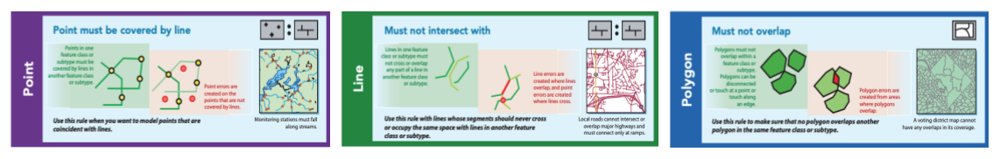](https://pro.arcgis.com/en/pro-app/latest/help/editing/pdf/topology_rules_poster.pdf)

Las restricciones, limitaciones o *constraints* topológicas se pueden definir a nivel de base de datos, pero como veremos en el apartado "[Análisis](#análisis)", también se pueden usar por código (a través de una biblioteca) para detectar errores o arreglar los datos antes de persistirlos.

### Datos vectoriales

Usaremos [datos vectoriales](#datos-vectoriales) para geolocalizar [entidades geográficas](https://en.wikipedia.org/wiki/Geographical_feature) (geographical ***features***, un término que se usa mucho) que tienen una identidad y localización claramente diferenciada a otras entidades geográficas (a veces se les llama entidades discretas), por ejemplo: objetos, edificios, posiciones, perímetros, ... 

La ubicación de estos datos se pueden representar con diferentes tipos de geometrías, y el **tipo de geometrías soportadas** por cada tecnología, **la forma de representarlas internamente**, e incluso **el nombre que se les da**, varía entre unas tecnologías y otras<a href="#6-tipos-de-geometría-geojsongeometrías-en-arcgis-formas-de-google">[6]</a> (bases de datos, SDKs, formatos de archivo, etc). 

#### GEOMETRIAS (*PRIMITIVAS*)

|Tipo|Representación|Ejemplo de uso|
|---|---|---|
|Punto|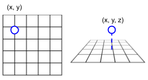|Paradas de taxi, árboles, semáforos ... aunque a veces, lo que podría ser un polígono (por ej: el perímetro de un local, negocio, o tienda), se reduce a un punto (la entrada principal, o el [centroide](https://es.wikipedia.org/wiki/Centroide#:~:text=El%20centroide%20de%20un%20tri%C3%A1ngulo,de%20la%20superficie%20del%20tri%C3%A1ngulo.)).
|Polilínea o linestring|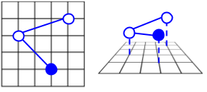|Calles, tendidos eléctricos, redes de tuberías, carreteras, líneas de autobús, metro, rutas comerciales, senderos de montaña, líneas de costa, diques, ríos, cordilleras, fallas geológicas, ...
|Polígono|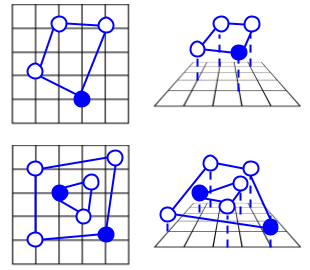|Superficie/huellas de edificios, barrios, municipios, [perímetros](https://www.arcgis.com/home/item.html?id=d957997ccee7408287a963600a77f61f#visualize), parques, zonas industriales, parques naturales, bosques, países, zonas de paso restringidas,  ...
|Malla de triángulos (Mesh)|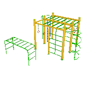|Para representar [objetos](https://developers.arcgis.com/javascript/latest/visualization/symbols-color-ramps/esri-web-style-symbols-3d/#low-poly-vegetation) en [escenarios 3D](https://developers.arcgis.com/javascript/latest/sample-code/?tagged=Mesh) como estructuras o moviliarios hurbano, edificios, vegetación, vehículos, personas, señales de tráfico, iconos 3D, cajeros, fuentes, farolas, antenas de telefonía,  etc..

#### GEOMETRÍAS *COMPUESTAS* ("multipart geometries" en inglés)

|Tipo|Representación|Ejemplo de uso|
|---|---|---|
|Multipuntos|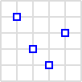|Tracks de GPS, paradas de bus por ciudad, postes de servicios públicos, inventarios de árboles, lugares de pesca, aparcamientos, bocas de incendios, baños públicos, fuentes de agua, etc. 
|Multilíneas|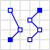|Redes de carreteras, sistemas de ferrocarril, redes de ríos, redes de *utilities*, senderos y caminos, cables subacuáticos, líneas de alta tensión, rutas de avión, etc.
|Multipolígonos|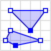 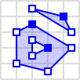| Islas, territorio soberado de países (e.g. [España](https://services.arcgis.com/P3ePLMYs2RVChkJx/ArcGIS/rest/services/World_Countries_(Generalized)/FeatureServer/0/query?where=ISO+%3D+%27ES%27&objectIds=&time=&geometry=&geometryType=esriGeometryEnvelope&inSR=&spatialRel=esriSpatialRelIntersects&resultType=none&distance=0.0&units=esriSRUnit_Meter&relationParam=&returnGeodetic=false&outFields=*&returnGeometry=true&returnCentroid=false&returnEnvelope=false&featureEncoding=esriDefault&multipatchOption=xyFootprint&maxAllowableOffset=&geometryPrecision=&outSR=&defaultSR=&datumTransformation=&applyVCSProjection=false&returnIdsOnly=false&returnUniqueIdsOnly=false&returnCountOnly=false&returnExtentOnly=false&returnQueryGeometry=false&returnDistinctValues=false&cacheHint=false&orderByFields=&groupByFieldsForStatistics=&outStatistics=&having=&resultOffset=&resultRecordCount=&returnZ=false&returnM=false&returnExceededLimitFeatures=true&quantizationParameters=&sqlFormat=none&f=pgeojson&token=)), municipios, comunidades autónomas, parque naturales y reservas, zonas costeras y marítimas, 
|Colección de geometrías o GeometryCollection||Es un tipo de geometría se puede usar para geometrías complejas, esbozar o guardar dibujos o indicaciones a suponer en un mapa, agregaciones de datos, etc.

:::note
**Faltan por hacer:**
* Añadir las representaciones 3D equivalentes.
* Ventajas y limitaciones
<!-- Point cloud, indoor? -->
:::

### Datos raster

Aunque los datos vectoriales son frecuentes en todos los campos y sectores económicos, en algunos como el energético, defensa, agricultura, climatología, medio ambiente, conservación, etc, es muy habitual trabajar con datos de resultantes de la [observación de la tierra](https://en.wikipedia.org/wiki/Earth_observation) que se almacenan en formato [ráster](https://en.wikipedia.org/wiki/Data_model_(GIS)#Raster_data_model), y que se obtienen mediante [teledetección](https://en.wikipedia.org/wiki/Remote_sensing) (a partir de sensores ubicados en satélites, aviones, drones, etc.).

Vínculo entre el sector militar, la teledetección y los datos raster

El impulso de la teledetección y la observación de la tierra está fuertemente ligado al sector militar, ya que a primeros del siglo XX (durante la Primera Guerra Mundial), los militares desarrollaron la fotografía aérea sistemática con objeto de vigilancia y reconocimiento de territorios. Y en la segunda mitad del siglo XX, el desarrollo de satélites artificiales permitió el uso de la teledetección remota a escala global proveyendo información con varios fines (civil, militar y de investigación). 

Más info en: [Historia de la teledetección](https://es.wikipedia.org/wiki/Teledetecci%C3%B3n#Historia).

👀 <strong>Curiosidad</strong>: ¿Sabías que cada día se generan TB de datos abiertos en formato ráster?

A día de hoy:

* Sólo el programa gubernamental de observación de la Tierra de la [Agencia Espacial Europea (Copernicus) proporciona 20 TB de datos](https://www.copernicus.eu/en/news/news/observer-cool-facts-your-next-copernicus-small-talk) abiertos al día.
* La NASA ofrece más de [100 petabytes de datos](https://www.earthdata.nasa.gov/esds/esds-highlights/2023-esds-highlights) científicos sobre la Tierra
* Hay literalmente [miles de satélites observando la Tierra](https://geoxc-apps.bd.esri.com/space/satellite-explorer/) y enviando datos en tiempo casi real (e.j. [aquí puedes encontrar algunas APIs de acceso público](https://livingatlas.arcgis.com/livefeeds-status/)).

Y gran parte de estos datos se presentan en formato ráster.

Estos datos ráster por tanto representan datos espacialmente continuos, y al igual que un [gráfico de mapa de bits](https://en.wikipedia.org/wiki/Raster_graphics), se almacenan como matrices de celdas/píxeles organizadas en filas y columnas, pero en este caso cada celda está asociada a una ubicación real.

[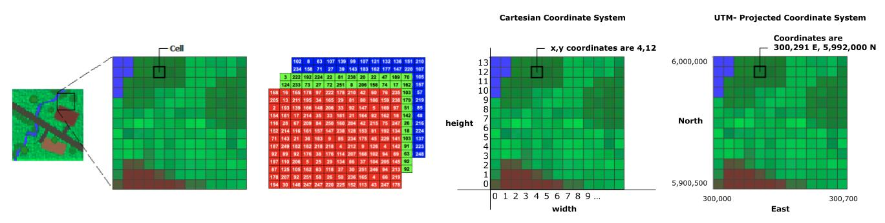](./intro-sig-arcgis/raster-images-representation-and-georeferenciation.jpg)

Al tamaño de la superficie terrestre que representa cada celda/pixel se le llama **resolución espacial** ([GSD](https://en.wikipedia.org/wiki/Ground_sample_distance)) y depende del sensor usado para la captura, la distancia del mismo a la tierra, etc.

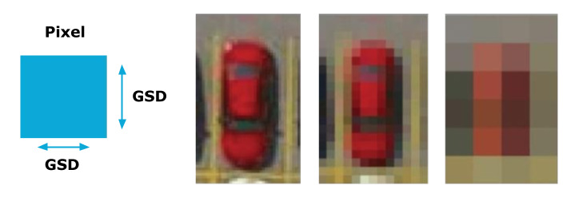

Lo que representa el valor numérico de cada celda variará, pudiendo ser el color de una fotografía aérea, una imagen satélite, un mapa escaneado, la elevación, la temperatura (terrestre o marítima), el [tipo de uso de suelo](https://en.wikipedia.org/wiki/Land_use), etc.

<!-- DEM, DSM, DTM: https://www.linkedin.com/posts/mashford-mahute-012487178_gis-geospatialanalysis-digitalelevationmodel-activity-7255529162709368833-L0-d?utm_source=share&utm_medium=member_desktop -->

[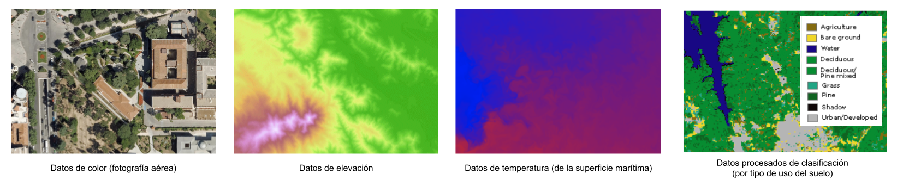](./intro-sig-arcgis/diferentes-tipos-de-datos-raster-color-elevacion-temperatura-tipos-de-uso-de-suelo.png)

**Estas matrices pueden ser bidimensionales, tridimensionales o n-dimensionales**. 

Por ejemplo, una matriz tridimensional podría almacenar valores que representan volúmenes de datos, como por ejemplo la temperatura del mar o los niveles de oxígeno a diferentes profundidades:

[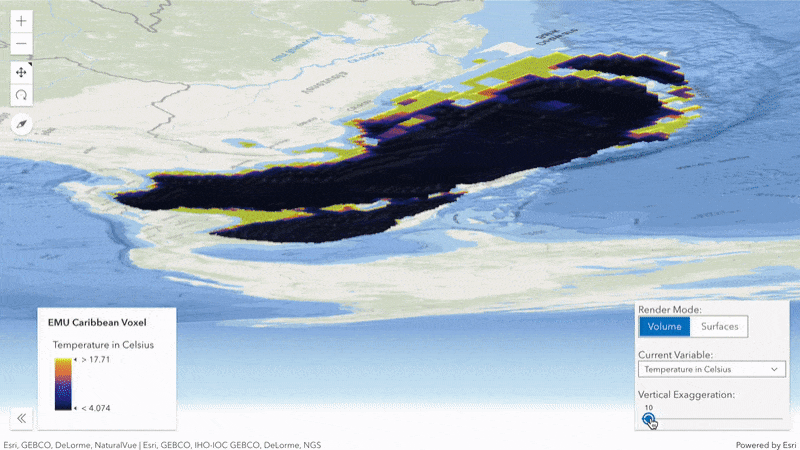](https://developers.arcgis.com/javascript/latest/sample-code/layers-voxel-variable/)

O un satélite capturando el [espectro electromagnético](https://es.wikipedia.org/wiki/Espectro_electromagn%C3%A9tico) en una [imagen multiespectral](https://es.wikipedia.org/wiki/Imagen_multiespectral) que almacena en una matriz n-dimensional los valores de radiación de las diferentes bandas electromagnéticas. Estas contienen información que el ojo humano no captura con sus receptores (rojo, verde y azul), y que luego se puede combinar calcular multitud de cosas, como por ejemplo el estado de salud de la vegetación (mediante el [índice NDVI](https://es.wikipedia.org/wiki/%C3%8Dndice_de_vegetaci%C3%B3n_de_diferencia_normalizada)), o poder ver la [actividad de un fuego a través del humo](https://developers.arcgis.com/javascript/latest/sample-code/widgets-swipe/), monitorizar la [actividad térmica y potenciales focos de fuego en tiempo real](https://livingatlas.arcgis.com/en/browse/?q=fire%20thermal%20activity#d=2&q=fire+thermal+activity):

En definitiva, estos tipos de datos, ya sean procesados o en crudo, son usados por todo tipo de organizaciones (públicas, privadas, con y sin ánimo de lucro), en ámbitos como:
  
* **Gestión del territorio**: Estudiar características del terreno, analizar patrones de uso del suelo, identificar construcciones ilegales (casas, piscinas, etc.), expansión urbana y desarrollo de infraestructuras, monitorizar la evolución de minas, ...
* **Monitorización de cultivos agrícolas**: Monitorizar la salud de los cultivos, controlar plagas y en definitiva optimizar la producción de los cultivos.
* **Meteorología y climatología**: Analizar patrones climáticos y predecir eventos meteorológicos severos (incendios, inundaciones, huracanes, ...).
* **Gestión de desastres**: Dar apoyo en situaciones de emergencia. Evaluar daños por desastres naturales como inundaciones, huracanes e incendios forestales usando imágenes antes y después del evento. 
* **Defensa**: Estudiar y evaluar el terreno en zonas de conflicto, y monitorizar ubicaciones estratégicas.
* **Conservación del medio ambiente**: Monitorizar áreas protegidas, la salud de los bosques, temperaturas oceánicas, rastrear vida marina, analizar el impacto de actividades humanas en hábitats naturales, los cambios ambientales como la deforestación, desertificación, pérdida de hábitats, además de para estudiar ecosistemas costeros y marinos.
* Etc

Más adelante veremos cómo manipular, visualizar, analizar y extraer información de la ingente cantidad de datos disponibles a través de estos formatos.

Algunos recursos adicionales

Aquí tienes tres recursos adicionales si quieres profundizar un poco más:
* [¿Qué son los datos ráster?](https://desktop.arcgis.com/es/arcmap/latest/manage-data/raster-and-images/what-is-raster-data.htm)
* [Conceptos básicos del tratamiento de imágenes y la teledetección](https://geogeeks.maps.arcgis.com/apps/Cascade/index.html?appid=5072b8d56cef4f7bb5d24e5d840461da).
* [Petabytes de información accesibles a través de aplicaciones de observación de la tierra](https://www.arcgis.com/apps/MinimalGallery/index.html?appid=cff0dd2940984c209d29d6ed3c41b99a).
* [Un mini resumen de tipos de datos ráster](https://esri-es.github.io/awesome-arcgis/arcgis/content/data-types/raster/) (hecho hace unos años).
* [Casos de uso de imágenes raster y teledetección](https://learn.arcgis.com/en/gallery/#?c=imagery)

## Capas de datos

De manera análoga a como se trabaja con herramientas de diseño gráfico (ej: Photoshop), los datos en un SIG se suelen organizar y almacenar por capas, principalmente porque se adapta mejor a las necesidades específicas de representación, análisis y visualización de datos geolocalizados.

:::note
Del mismo modo, en [portales de datos abiertos](#datos-abiertos), es habitual encontrar ficheros donde cada uno representa una capa de datos.
:::

Las capas se utilizan a menudo para gestionar y visualizar grandes colecciones de entidades geográficas. Existen dos tipos de capas o colecciones de entidades geográficas:

* **Estructuradas**, son aquellas en las que cada entidad geográfica tiene el mismo tipo de geometría y los mismos atributos.
* **No estructuradas**, aquellas en las que  cada entidad tiene un tipo de geometría diferente o atributos diferentes. 

En la siguiente figura representa conceptualmente una aplicación donde se visualizan varias capas de datos simultáneamente:

[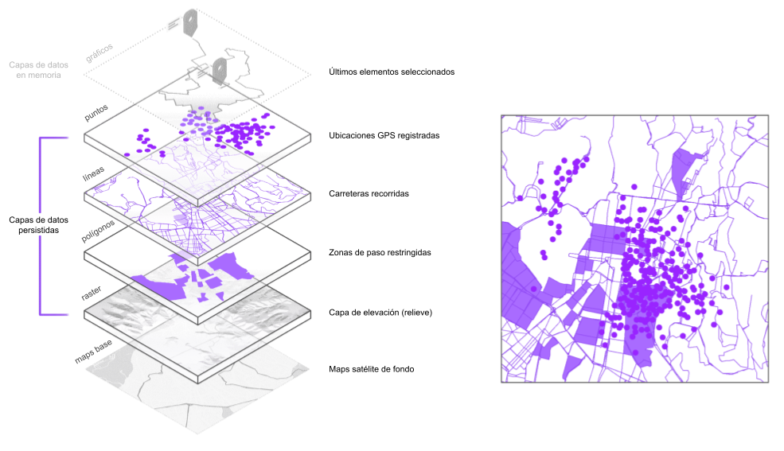](./intro-sig-arcgis/capas-de-datos-gis.png)

En la figura vemos:
* En la parte superior una capa de gráficos (**capa gráfica**), que es una capa no estructurada. Normalmente **se usan para mejorar la usabilidad de las aplicaciones**, y sirven para representar elementos mientras se interactúa con la aplicación (por ejemplo mostrar un "pin"/marcador tras hacer la búsqueda de una dirección, mostrar la traza de una geometría mientras se está dibujando, etc). En este caso contiene diferentes tres geometrías de dos tipos distintos dos marcadores y un polígono). Esta **sólo existe en memoria RAM**.
* En la parte intermedia cada **capa persistida en disco contiene es estructurada, y por tanto contiene un único tipo de geometría** (puntos, líneas, o polígonos) y todas las entidades tienen los mismos atributos.  
* Y en la parte inferior **hay dos capas raster**, la de elevación (relieve) y la del mapa satélite de fondo. Estas capas normalmente se sitúan debajo porque al contener datos contiguos podrían no dejar ver los datos de las capas inferiores.

:::note
Aunque normalmente se trabaja con capas, cuando una aplicación es muy sencilla y se trabaja con pocos datos geolocalizados, estos se puede añadir manualmente en una capa gráfica (ya que trabajar por capas no aporta tanto valor en estos casos). 
:::

Es habitual que cuando estos datos se alojen en un SGBD relacional, cada capa se almacene en una tabla de la base de datos. 

  
¿¿Eso significa que las bases de datos espaciales no se normalizan?? 🤔

  En bases de datos geográficas, la normalización completa de los datos puede no ser práctica debido a la complejidad y la naturaleza espacial de los datos debido a:

  * La **jerarquía espacial**: Los datos geográficos suelen estar organizados en una jerarquía espacial (por ejemplo, país -> estado -> ciudad), y la normalización puede crear esquemas complejos que dificulten la consulta eficiente de datos.

  * El **rendimiento**: La normalización extrema puede afectar al rendimiento, especialmente en consultas espaciales usando *joins*.

  * La **integridad referencial**: Las relaciones espaciales y la necesidad de mantener la consistencia de los datos de ubicación hacen que sea más difícil garantizar la integridad referencial de las bases de datos geográficas.

  En muchos casos, se busca un equilibrio entre la normalización para garantizar la integridad de los datos y la desnormalización para mejorar el rendimiento de las consultas espaciales. 

## Formatos de datos

Antes de pasar a ver las bases de datos, vamos a repasar los **formatos de intercambio y almacenamiento en los que solemos encontrar datos en Internet**, ya sea en archivos estáticos, en texto plano o en binario a través de APIs, y **que sirven para mejorar la interoperabilidad entre sistemas**. Aunque no entraremos en detalle en cómo se representan.

**Algunos de estos formatos se pueden utilizar para crear aplicaciones que sigan funcionando incluso "en modo avión"**, o sea que sigan cargando mapas, calculen rutas, o sean capaces de buscar direcciones postales en zonas sin cobertura como, túneles, metro/subsuelo, bosques, montañas, alta mar, aviones, países extranjeros, etc.

  
El *W3C* de la comunidad geo ➡️ El OGC.

El [Open Geospatial Consortium (OGC)](https://en.wikipedia.org/wiki/Open_Geospatial_Consortium) es un consorcio internacional formado por todo tipo de organizaciones que establece estándares abiertos e interoperables en busca del crecimiento neutral y la interoperabilidad de la comunidad geoespacial (en el marco de los Sistemas de Información Geográfica) y de [La Web](https://es.wikipedia.org/wiki/World_Wide_Web). 
>
> Podríamos decir que es una organización análoga al [W3C](https://es.wikipedia.org/wiki/World_Wide_Web_Consortium) pero en el ámbito "geo". Y veremos cómo **algunos formatos de datos, y posteriormente APIs, están definidos como estándares OGC**.

Algunos de los formator que veremos han sido publicados como [estándares OGC](https://www.ogc.org/standards/bp/) (🥇), o están en proceso (🥈), y otras especificaciones abiertas que se han convertido en estándares de facto (🥉).

### Para datos vectoriales

**Los formatos más sencillos para datos vectoriales no son más que especificaciones**, esquemas, o extensiones **sobre formatos basados en texto plano**. 

Es habitual encontrarlos:
* En aplicaciones que nos ofrecen la posibilidad de exportar nuestros datos en algunos de estos formatos.
* Como en extensiones de bases de datos para trabajar con algunos de estos formatos.
* APIs de empresas que devuelven sus respuestas en estos formatos.
* Además de librerías y SDKs que son capaces de leer, visualizar y transformarlos. 

A continuación vamos a ver algunos de los formatos más sencillos:

* **JSON (JavaScript Object Notation)**:  
  * 🥇 [GeoJSON](https://en.wikipedia.org/wiki/GeoJSON): formato muy sencillo que representar estructuras geoespaciales a partir de sus vértices. Soporta capas estructuradas de puntos, líneas, polígonos, etc., además de *FeatureCollections* (capas no estructuradas). Sólo soporta un sistema de referencia espacial (WGS 84) y está soportado en casi todas las bases de datos.
  * 🥈 [JSON-FG](https://www.geonovum.nl/uploads/documents/220405-JSON-FG.pdf): similar a GeoJSON pero más flexible y soportando más sistemas de referencia.
  * [TopoJSON](https://en.wikipedia.org/wiki/GeoJSON#TopoJSON): permite representar las mismas estructuras que GeoJSON pero de manera más eficiente, reduciendo el tamaño de los archivos y manteniendo las relaciones topológicas.
  * [Esri JSON](https://developers.arcgis.com/rest/services-reference/enterprise/query-feature-service-layer/#json-response-syntax): soporta multitud de sistemas de referencia, geometrías en 2D y 3D, es eficiente como el TopoJSON, e incluye mecanismo de paginación para grandes datasets.
* **XML (Extensible Markup Language)**: 
  * 🥇 [KML](https://en.wikipedia.org/wiki/Keyhole_Markup_Language): permite la visualización sencilla de datos geográficos en tres dimensiones y soporta etiquetas, estilos, descripciones y enlaces. El KMZ es una versión comprimida del KML que puede incluir recursos adicionales como imágenes, modelos 3D, y otros archivos asociados para la representación de los datos. Está soportado nativam en muchas bases de datos.
  * 🥇 [GML](https://es.wikipedia.org/wiki/Geography_Markup_Language): permite representar una amplia gama de datos geoespaciales, desde simples puntos hasta complejas redes y superficies. Soporta la modelación de geometría, propiedades geográficas y relaciones espaciales detalladas. Es adecuado para aplicaciones que requieren una rica estructura de datos geoespaciales y que pueden manejar su complejidad y flexibilidad.
  * 🥇 [GeoRSS](https://en.wikipedia.org/wiki/GeoRSS): permite añadir la ubicación (puntos, líneas y polígonos) a las entradas de feeds como RSS y Atom.
  * 🥉 [GPX](https://en.wikipedia.org/wiki/GPS_Exchange_Format): esta diseñado para intercambiar datos entre dispositivos GPS y herramientas software. Contiene información sobre waypoints (puntos de referencia), rutas y tracks (trazados de rutas).
* **CSV (Comma-separated values)**:
  * 🥉 [GTFS](https://en.wikipedia.org/wiki/GTFS): creado para compatir información sobre los horarios de transporte público y la información geográfica asociada. Sólo contiene información estática (o programada) sobre los servicios de transporte público, no en tiempo real. Contiene entre 6 y 13 ficheros CSV comprimidos en ZIP. 

<!-- Cloud native formats -->
Otros formatos destacables y más avanzandos de intercambio o almacenamiento de datos vectoriales son:
  
  * 🥈 [GeoParquet](https://github.com/opengeospatial/geoparquet/blob/main/format-specs/geoparquet.md): almacena datos geoespaciales en un formato columnar basado en Parquet. Principalmente usado en análisis big data geoespacial con alto rendimiento y comprensión. Está optimizado para procesamiento el paralelo.
  * 🥈 [IMDF](https://docs.ogc.org/cs/20-094/index.html): almacena datos geoespaciales detallados sobre interiores de edificios (habitaciones, pasillos y puntos de interés) usados para la navegación en interiores y gestión de espacios.
  * 🥉 [Shapefile](https://en.wikipedia.org/wiki/Shapefile): formato que consta de múltiples archivos (comprimido en ZIP) almacena datos geoespaciales vectoriales (puntos, líneas y polígonos), ampliamente usando en SIG.
  * [PMTiles](https://github.com/protomaps/PMTiles): almacena teselas vectoriales en un archivo empaquetado (no SQLite) que puede ser accedido usando la [cabecera de petición HTTP *Range*](https://developer.mozilla.org/en-US/docs/Web/HTTP/Range_requests).
  * etc.

Además de estos formatos, dependiendo del proyecto y las industrias en las que trabajemos es habitual encontrar otros formatos de fichero que tienen que ser procesados y/o georefenreciados para poder usarlos en nuestras aplicaciones. Dos ejemplos:

* **Arquitectura y diseño industrial**: Hay ocasiones donde las personas que crean planos de pueblos/ciudades lo hacen con herramientas de diseño asistido por computador (CAD), que generan ficheros DWG, DXF, DGN, ... y que posteriormente se pueden georeferenciar.
* **Ingeniería Civil**: o herramientas de escaneado lidar 3D que generan nubes de puntos en formatos: 🥇 [LAS](https://www.ogc.org/standard/LAS/), LAZ, E57, PLY, etc.

Si quieres explorar más, aquí tienes un [listado de formatos de ficheros para datos geoespaciales](https://esri-es.github.io/awesome-arcgis/arcgis/content/data-storage/file-formats/) que creé hace tiempo.

### Para datos ráster

Hay formatos rásters que también están basados en formatos de imágenes que ya conocemos cono JPEG o TIFF. 

Algunos de los formatos más habituales para almacenar y compartir imágenes georeferenciadas son:

* 🥇 [GeoTIFF](https://en.wikipedia.org/wiki/GeoTIFF): ampliamente usado en SIG, es una imagen que incluye metadatos como la proyección del mapa, sistema de coordenadas, elipsoide y datum.
* 🥇 [Cloud Optimized GeoTIFF (COG)](https://docs.ogc.org/is/21-026/21-026.html): similar a GeoTIFF pero optimizado para ser leído parcialmente (usando HTTP range requests), lo que permite acceder a grandes imágenes a través de la nube.
* 🥇 [NetCDF](https://en.wikipedia.org/wiki/NetCDF): formato de datos multidimensional usado para datos científicos (meteorológicos, oceanográficos, de clima, ...).
* [Tile Package](https://github.com/Esri/tile-package-spec): es una especificación abierta creada por Esri que consiste en un archivo comprimido que contiene múltiples carpetas con la pirámide de imágenes troceadas (teselas) con las que se genera el mosaico que es un mapa base. Puede ser usado en aplicaciones offline.
* [JPEG 2000](https://en.wikipedia.org/wiki/JPEG_2000#GML_JP2_georeferencing): en el año 2006 el OGC [definió los metadatos](https://www.ogc.org/standard/gmljp2/) para poder georreferenciar imágenes JPEG 2000 con usando GML.

  
👀 <strong>Curiosidad</strong>: Cómo comprimir imágenes (ráster) erróneamente puede arriesgar vidas 🛟

Es importante tener cuidado al usar algoritmos de compresión en imágenes GIS ráster, **especialmente cuando se van a usar posteriormente en procesos de análisis**, ya que de no hacerlo se pueden introducir errores con graves consecuencias.

Por ejemplo, hay departamentos de urbanismo de ciudades puede usan capa ráster de elevación para llevar a cabo una **evaluación del riesgo de inundación**, identificando las zonas vulnerables a las inundaciones. Esta evaluación se basa en gran medida en [Modelos Digitales de Elevación (MDE)](https://es.wikipedia.org/wiki/Modelo_digital_del_terreno) que permite modelizar el flujo de agua y predecir las zonas inundables.

Al comprimir los datos se modificarán los valores de las celdas pudiendo llegar a introducir errores que conlleven **cambios sutiles que suavicen la elevación, y los rasgos críticos como pequeñas zanjas y pequeñas crestas se pierden o se representan de forma imprecisa**, lo que podría conllevar a una modelización inexacta de las inundaciones, de los caudales de agua, extensión de las inundaciones, diseño de rutas y planes de evacuación erróneos, ... lo que conllevaría una preparación inadecuada para las inundaciones reales y en definitiva, un **riesgo para la vida de las personas**.

Usar algoritmos de compresión de imágenes adecuados como **"[LERC (Limited Error Raster Compression)](https://www.osgeo.org/projects/lerc-limited-error-raster-compression/)**" , que **permite preservar de la calidad de los datos, mantiendo márgenes de error controlados**, garantizando que la compresión no degradará significativamente la calidad de los datos es esencial para mantener la precisión del análisis y la interpretación espaciales.

Puedes encontrar [otros formatos raster en la Wikipedia](https://en.wikipedia.org/wiki/GIS_file_format#Raster_formats).

:::note
Las fotografías (normales, panorámicas o 360º) con los metadatos [Exif (Exchangeable image file format)](https://en.wikipedia.org/wiki/Exif), conocidos como [GPS tags](https://exiftool.org/TagNames/GPS.html) o [geotags](https://exiftool.org/geotag.html), permiten incluir información como latitud, longitud, altitud, dirección de la brújula, ángulo de inclinación en grados, o el ángulo de balanceo a las imágenes con lo que se pueden geolocalizar (como hace [Google Photos](https://support.google.com/photos/answer/6153599?hl=en&co=GENIE.Platform%3DAndroid) o [ArcGIS Online](https://www.esri.com/about/newsroom/arcwatch/add-geotagged-photos-to-arcgis-online-web-maps/)). Dicho esto, yo no las considero datos ráster al uso (en términos GIS) dado que para ello cada pixel de la imagen/celda debería estar asociada a una posición. Dicho esto, en Esri estamos desarrollando una tecnología llamada [Oriented Imagery](https://pro.arcgis.com/en/pro-app/latest/help/data/imagery/oriented-imagery-overview.htm) que permite procesar y añadir los metadatos necesarios a conjuntos de imágenes para hacerlo ([ver ejemplo](https://www.esri.com/arcgis-blog/products/arcgis/imagery/introducing-oriented-imagery/)). 
:::

:::note
En referencia a la nota anterior, también hay tecnologías que permiten trabajar con [Full-motion video](https://en.wikipedia.org/wiki/Full-motion_video) (FMV) que permiten geolocalizar todos los frames de un vídeo, pudiendo por ejemplo, usar una grabación de una cámara embarcada en un dron, elicóptero, ..., casi como si fuese una capa GIS más. Aquí dejo algunas demos: [Esri FMV videos](https://mediaspace.esri.com/esearch/search?keyword=full%20motion%20video).
:::

### Para ambos

Existen formatos que permiten trabajar tanto con datos vectoriales como datos raster:

* 🥇 [GPKG](https://en.wikipedia.org/wiki/GeoPackage): permite almacenar datos vectoriales (y raster) en una base de datos SQLite.
* [Mobile Map Package](https://pro.arcgis.com/en/pro-app/latest/tool-reference/data-management/create-mobile-map-package.htm): formato propietario de Esri que permite almacenar Esri Geodatabases (datos ráster / vector), grafos (para representar redes de transporte), geocodificadores y todo lo necesario para trabajar en entornos sin conexión a Internet.
* [MBTiles](https://wiki.openstreetmap.org/wiki/MBTiles): almacena teselas vectoriales (o ráster) en una base de datos SQLite que puede usar en aplicaciones offline.

## Manipulación de datos

** ⚠️ Pendiente de hacer**

<!-- 
Cómo se crean, añaden metadatos o leen metadatos a las imágenes, etc
GDAL/OGR (otro proyecto de OsGEO)
linters
Desktop ArcGIS & QGIS(otro proyecto de OsGEO), gvSIG desarrollando en España, transformación, 
https://tool.geoimgr.com/

https://doc.arcgis.com/en/3d/workflows/content/3d-data-management-workflows.htm

https://exiftool.org/
https://exif.tools/

/Users/ral97612/Desktop/exif-info-image.png

Mediante el Análisis
Procesado, feature extraction, mallas/meshes, geoAI, usos de suelo, 
-->

## Bases de datos

** ⚠️ Pendiente de hacer**

<!--

https://en.wikipedia.org/wiki/Spatial_database#List
PostGIS geometries: https://postgis.net/workshops/postgis-intro/geometries.html

geometries, spatial operations (relationships, joins, ...) spatial indexes, projections, rasters, topologies, clustering, 
https://postgis.net/workshops/postgis-intro/index.html

Aunque hay ficheros de datos geoespaciales avanzados, como FBG que usar una base de datos Access. "Enterprise database"..
ventajas de usar bases de datos editar ficheros directamente vs 

Al igual que en cualquier otro sistema, cuando neLo acceso multi usuario, etc

para gestionar eficientemente estos datos, se han creado extensiones, módulos, plugins, ... que se añaden a los SGBDs que conocemos para dotarles de funcionalidades para poder trabajar con datos geolocalizados (por ej: hacer [operaciones geometricas](https://developers.arcgis.com/documentation/mapping-apis-and-services/spatial-analysis/geometry-analysis/introduction/#types-of-geometry-operations) como  calcular distancias entre puntos, buscar puntos dentro de un polígono, ...).

PostGIS extension mantenido por el software geoespacial es OSGEO: https://en.wikipedia.org/wiki/Open_Source_Geospatial_Foundation (but much smaller) Equivalente a la Apache Software Foundation para 

* ¿Habilitar una base de datos relacional como espacial?:
      * Viejo: [Understanding ArcSDE](https://downloads.esri.com/support/documentation/sde_/706understanding_arcsde.pdf) (Database schema)
      * Crear una "Enterprise Geodatabase" de Esri (\== añadir ArcSDE a un SGBD) en PostgreSQL: https://pro.arcgis.com/en/pro-app/3.1/help/data/geodatabases/manage-postgresql/setup-geodatabase-postgresql-windows.htm (mediante la herramienta de escritorio) también se soportan (MS SQL Server, Oracale, SAP HANA, ... [más](https://pro.arcgis.com/en/pro-app/3.1/help/data/geodatabases/introduction/geodatabase-administration.htm)); existen otros tipos de Geodatabases (file geodatabase, mobile geodatabase, ...)
      * Igual extensiones para dotar de capacidades para trabajar con datos geolocalizados a la BD: ArcSDE (de Esri) existen PostGIS (para PostgreSQL), SpatiaLite (para SQLite) [geopoly](https://www.sqlite.org/geopoly.html#geojson)?, Oracle Spatial (para Orace) etc. <- cada una con unas capacidades
duckdb extension
https://duckdb.org/docs/extensions/spatial.html
* ¿Cuál es la UI para diseñar/modificar una Esri Enterprise Geodatabases? (del SGDB):
      * Normalmente se hace a través de herramientas y "Wizards" de escritorio (ArcGIS Pro) ([ejemplo](https://youtu.be/L2hmTvSEK0c?si=GZ2qiy-mF0TBDxjj&t=286))
      * Los usuarios avanzados pueden abrir la UI por defecto el SGBD y ver (aunque se recomienda encareciadamente no tocar directamente)
      * Una vez publicado un servicio, se ofrece una interfaz&API para poder modificar el servicio e incluso modificar esquema (aunque no existe documentación para casos avanzados). Un ejemplo: https://youtu.be/D9PMC2yGJbA?si=vx6ugoQtSDmj18DA&t=647
      * Esta es la misma inte

otros amagos de docs:
* [Introducción a las bases de datos en ArcGIS - GeoDatabases (para informáticos)](https://docs.google.com/document/d/1yVjQg9fi9bTO158IqEnyDrtCKVFvoA_rlE4ziYsUIIc/edit)
* [Introducción a las bases de datos en ArcGIS - GeoDatabases](https://docs.google.com/document/d/1mc1fTGuRax2vEq1EgBQl5cnK8CwJQi4MMDyllCtddbY/edit)
* [Guión de la playlist: Introducción a ArcGIS para "dummies"](https://docs.google.com/document/d/1mx-PDrwcZHjVyNWYsgwN4eZwJK38XT8KNjiUVqYqrGs/edit)
 -->

## Servidores y APIs

** ⚠️ Pendiente de hacer**

<!-- nginx Apache pero para servir, infraestructura backend para servir los datos, etc.
### basemaps

Slippy_map / Tiled web map /cached map service -> Check: "Introduction to GIS for Developers": https://docs.google.com/presentation/d/1X6xfPdGCDkImnSI56CmAZbRfMGHPTnL6S2tyzzVXMWQ/edit#slide=id.g31d1ce484a2_0_0 (by Ahmed) -> feature service vs dynamic map service vs cached map service

https://ogcapi.ogc.org/features/ 

Type of services (tiled, dynamic, etc)https://youtu.be/ULhrWCIH0SQ?si=2mnSKKLLJC-_DVy8&t=1203
https://developers.google.com/maps/documentation/javascript/dds-boundaries/style-polygon

The Billion Dollar Code: https://www.netflix.com/es-en/title/81074012
Intrevista a Brian McClendon (co-founded Keyhole): https://www.mindsbehindmaps.com/episode/brian-mcclendon-the-story-of-google-maps-pokemon-go-amp-keyhole-mbm59

TMS especificación de OSGEO

### data layers/datasets

Feature tile: operational layers for data-drive visualization and analysis
(comparison table: Building Apps with hosted data service PS 2025 PPT)

tabla rosetta de capas 
o share, process and edit geospatial data. Designed for interoperability, it publishes data from any major spatial data source using open standards.

Cuando los datos se ofrecen vía API, se suelen servir en formatos de texto plano, GeoJSON ubitualmente, aunque puede ser KML, JSON, TopoJSON, CSV/GeoCSV, KML, ... 

Cuando los datos son más complejos, la APIs suelen utilizan múltiples endpoints

https://www.postman.com/esridevs/workspace/arcgis-location-services/request/23458780-6701bf15-a46d-4de8-9843-2fe897a3b9b1

Un mapa base con 23 niveles de zoom puede pesar ~240TB (en raster con teselas de 256x256px) 13GBs en vector
[Desktop Mapping: Creating Vector Tiles](https://youtu.be/dqKsEos1iSw?si=JTsb9KtbGRyETyDP&t=732)
[Cómo se crean y almacenan los mapas base](https://www.youtube.com/live/b182O1Yscnc?si=LmaA1Wa5318GpZbT&t=239)

Showing tiles and vertex https://codepen.io/matt9222/pen/OJqdZBV

* Protocol Buffers  Protobuf -> https://github.com/Esri/arcgis-pbf

### Geoprocesos

* Hoy en día se publican servicios/APIs con especificaciones públicas, ya sean estándares (OGC, función equivalente al W3C pero en el ámbito espacial) o vendor specific: https://esri-es.github.io/awesome-arcgis/arcgis/content/data-storage/service-types/

### geocoders

Geocoders son motores de búsqueda que no sólo hacen fuzzy search (o fuzzy string searching / correspondencia aproximada de cadenas) (e.g. google refine [clustering methods](https://openrefine.org/docs/manual/cellediting#cluster-and-edit)) ya que hay muchos lugares en el mundo con varios nombres alternativos (el nombre oficial y otros nombres por los que se les conoce localmente). historical names. https://pro.arcgis.com/en/pro-app/3.1/help/data/geocoding/alternate-name-table-roles.htm (e.g. Interstate 10 in California = Christopher Columbus Transcontinental Highway https://en.wikipedia.org/wiki/Interstate_10_in_California). [Place ID](https://developers.google.com/maps/documentation/places/web-service/place-id) / [GERS](https://overturemaps.org/enriching-overture-maps-data-with-gers/). [Pelias](https://pelias.io/). Multi language / https://openaddresses.io/
Open Cage interview https://podcast.scalingdevtools.com/episodes/ed-freyfogle/transcript (7:00min tried yourself) first learn the developers like to tinker and play, so a lot of people need to first learn the hard lesson that it's, uh, it's better for us to do it for them.
The data is changing continually (OSM gets five to 6 million edits a day). 
Ana Deyde: https://youtu.be/H1SzQtK057k . Why building and maintaining your own geocoder service might not be a good idea? Edge cases, complexities?
In open streetmap https://wiki.openstreetmap.org/wiki/Names#Name_keys
UK postal codes https://en.wikipedia.org/wiki/Postcodes_in_the_United_Kingdom#Formatting
Problema con Place ID: https://www.youtube.com/live/QAgKhprUftM?si=Q0iXMgWo9L3yZZT5&t=1072 (e.g. Santa marta de los barros (https://es.wikipedia.org/wiki/Santa_Marta_(Badajoz)), Sta Marta de los Barros, Santa marta de barros, Sta Mta de los Barros) -> https://www.geonames.org/6355986/santa-marta.html (alternate names), Sevilla, Seville, ... autocompletado/geosearch (predict)
Difficult, not exicting or glamourous.
Comparando 10 geocoders https://slides.com/hhkaos/geocodificadores

Alternate names, alternate spelling's, localised versions of place name. https://www.geonames.org/

limit to loction type: rooftops, (multiple: pickups, ..) street address (entrance) <- depending on the use case

For example, the below two addresses if matched using an exact match algorithm will fail but actually, these are the same places :

* 134 Ashewood Walk, Summerhill Lane, Portlaoise
* 134 Summerhill Ln, Ashewood Walk, Summerhill, Portlaoise, Co. Laois, R32 C52X, Ireland
More: https://prakhargurawa.medium.com/fuzzy-address-matching-algorithm-using-googles-geocoding-api-74c0d8d6a56f

ArcGIS Enterprise vs Online vs Plaform (slides) & GeoServer (otro proyecto de OsGEO)

Enterprise also adds a portal/catalog is a map-centric content management system  in which an organization can utilize the web geographic information system (GIS) portal concept in an infrastructure. Members within an organization can use this for ... ([more](https://wiki.gis.com/wiki/index.php/Portal_for_ArcGIS))

Open api espect of ocg apis? -->

## Datos abiertos

** ⚠️ Pendiente de hacer**

<!-- Una vez comprendidos los diferentes [tipos de datos geolocalizados](#datos-geolocalizados), en qué [formatos](#formatos-de-archivo) en los que se pueden almacenar/exportar y compartir, 
Con todo lo que hemos visto ya estamos preparados para entender

OpenStreetMap
https://openaerialmap.org/
IDEs, etcportales open data, ..

GEOJSON-LD??

Google: https://takeout.google.com/ 
Location History (Timeline)
Your Timeline data, like settings and locations.

como [datos.gob.es](https://datos.gob.es) o [hub.arcgis.com](https://hub.arcgis.com/)

https://github.com/esri-es/open-data-search <- awesome data >
https://medium.com/@ochwada/navigating-the-world-of-free-geospatial-data-a-comprehensive-guide-114ded8b0196
https://docs.google.com/spreadsheets/d/1bF4YYH7bXPSLI___zMfh3tDfSxDlWWZLkkuT5vD4zHQ/edit#gid=746167425 -->

## Visualización

** ⚠️ Pendiente de hacer**

<!-- Stiching... en WebGL, canvas, ... sopo
https://docs.google.com/presentation/d/16wNWpNhnzxVxQ1TXPccERxBfi_q2T8sKBMHHbi6rcOg/edit#slide=id.g6c1957d15_1161

learn Renderers using  mapviewer, scene viewer
VTSE
The mechanism that defines how data appears when displayed is known in Esri and ArcGIS as "Renderers" (or layer renderers), but also known as styles (open layers, leaflet, ...), data-driven styling (Mapbox), etc in others tecnologies. It defines how to visually represent each vector feature
-> same symbol, Unique symbols,  continous values, hearmap, 3D extrusion, animations, ... + examples (continuos data and different type of intervals)

3D magic - Unveiling the Magic: The Secrets Behind 10 Amazing Web Apps
https://mediaspace.esri.com/media/t/1_4eg6ks27

[Thematic Mapping: 101 Inspiring Ways to Visualise Empirical Data](https://amzn.eu/d/68PvGRm)
[Cartography](https://amzn.eu/d/7WcAz4p)

Datos bajo tierra
https://www.linkedin.com/feed/update/urn:li:activity:7169781058283012096?updateEntityUrn=urn%3Ali%3Afs_updateV2%3A%28urn%3Ali%3Aactivity%3A7169781058283012096%2CFEED_DETAIL%2CEMPTY%2CDEFAULT%2Cfalse%29

Visualización de datos raster

https://developers.arcgis.com/javascript/latest/sample-code/layers-imagery-pixelvalues/
https://developers.arcgis.com/javascript/latest/sample-code/layers-imagery-clientside/ -->

import PixelFilterLow from './intro-sig-arcgis/pixel-filter-low.gif';
import PixelFilterAnalysis from './intro-sig-arcgis/pixel-filter-analysis-low.gif';

## Análisis

** ⚠️ Pendiente de hacer**

<!-- Herramientas de escritorio

Spatial analysis: The process of examining locations, attributes, and relationships in spatial data, through overlay and other technicas, to gain useful knowledge

Suitability analysis: a process to determine areas appropiate for a particular use, based on geographic, demographic or other kinds of criteria

geometryEngine -> geometry operators: https://developers.arcgis.com/javascript/latest/release-notes/#geometry-operators-beta : https://developers.arcgis.com/javascript/latest/spatial-analysis/intro-geometry-operators/

SDKs + arcpy

Para asegurar calidad de datos, comprobar topologías, generar nuevos datos
why hexagons https://pro.arcgis.com/en/pro-app/3.1/tool-reference/spatial-statistics/h-whyhexagons.htm

más: https://docs.google.com/presentation/d/1X6xfPdGCDkImnSI56CmAZbRfMGHPTnL6S2tyzzVXMWQ/edit#slide=id.g2d6a2d75e44_0_53
(measurements, network analysis, topological analysis, spatial statistical analysis, surface analysis, geoai?)
 -->

  <iframe class="content" width="560" height="315" src="https://www.youtube.com/embed/y3e5LzMgF1w?si=VRafuHLn9P1u3c4Y" title="YouTube video player" frameborder="0" allow="accelerometer; autoplay; clipboard-write; encrypted-media; gyroscope; picture-in-picture; web-share" allowfullscreen></iframe>

<!-- ### Geoestadística

https://es.wikipedia.org/wiki/Geoestad%C3%ADstica

https://pro.arcgis.com/es/pro-app/latest/help/analysis/geostatistical-analyst/what-is-geostatistics-.htm
reparto de datos Geostadística

https://developers.arcgis.com/rest/geoenrichment/api-reference/data-apportionment.htm

Extracción (semi) automática de entidad, Detección de cambios, predicciones, indentificar patrones
#1-the-birth-and-evolution-of-geoai

https://medium.com/geoai

Gabriel ortiz:
* https://www.linkedin.com/feed/update/urn:li:activity:7198222026031927296?updateEntityUrn=urn%3Ali%3Afs_updateV2%3A%28urn%3Ali%3Aactivity%3A7198222026031927296%2CFEED_DETAIL%2CEMPTY%2CDEFAULT%2Cfalse%29

Chris North: AI:
* https://www.linkedin.com/feed/update/urn:li:activity:7199054131045527552?updateEntityUrn=urn%3Ali%3Afs_updateV2%3A%28urn%3Ali%3Aactivity%3A7199054131045527552%2CFEED_DETAIL%2CEMPTY%2CDEFAULT%2Cfalse%29

[Spatial Statistics Illustrated](https://amzn.eu/d/b2Cj8kI) -->

## Gestión

** ⚠️ Pendiente de hacer**

<!-- interoperability, portal  , geoportal, CMS etc -->

<!-- 

Getting started with ArcGIS
Para frontend developers: https://docs.google.com/document/d/18Eq6y_VTOmbl0e4qIEyPszXixNB9FytumhchoR3lv10/edit?usp=sharing

 Otras innovaciones o especificaciones:
 Web Maps & Web scenes specificaciones (charla de marta)
 i3S
 https://github.com/Esri/cim-spec
xml schema geodatabase: https://support.esri.com/en-us/technical-paper/xml-schema-of-the-geodatabase-695
 -->

## Captura

** ⚠️ Pendiente de hacer**

<!-- 
A veces se captura directamente en ráster, a veces se transforma el dato vectorial a ráster
¿Cómo se crean? topografos, manualmnete, satélites. drones, ground truth
Teledetección
https://es.wikipedia.org/wiki/Verdad_fundamental

https://es.wikipedia.org/wiki/Hito_fronterizo

Agrimensura (surveying o land surveying)
https://es.wikipedia.org/wiki/Agrimensura

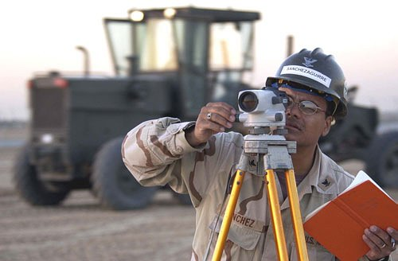

Go to history para formas históricas

https://aws.amazon.com/es/ground-station/

GNSS de alta precisión
Gps, drone (ground truth for GPS) . Precisión y exactitud

Posiciones GPS 

https://en.wikipedia.org/wiki/Ground_truth#Geographical_information_systems 
 -->

## Historia del GIS
 
A veces, que sin conocer la historia y su evolución, cuesta entender en el presente. Por eso, en ~2018 creé la web [Introducción al GIS, ArcGIS y Esri](https://geogeeks.maps.arcgis.com/apps/MapSeries/index.html?appid=5a6400a6d9bb45d4a6c389b11de39b45) con el objetivo de ayudar a entender por qué los sistemas de información geográfica son hoy como son:

[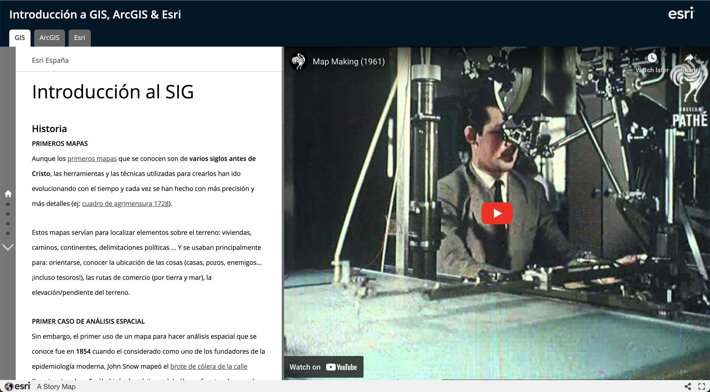](https://geogeeks.maps.arcgis.com/apps/MapSeries/index.html?appid=5a6400a6d9bb45d4a6c389b11de39b45)

## Conclusión

** ⚠️ Pendiente de hacer**

<!-- (diagrama de productos ArcGIS) -->

## Otros recursos

#### \[0\] [The Birth and Evolution of GeoAI](https://resources.esri.ca/education-and-research/geoai-series-2-the-birth-and-evolution-of-geoai) 
#### \[0\] [Geospatial Deep Learning with ArcGIS](https://mediaspace.esri.com/media/t/1_fzvuc2b3/292702072)
#### \[1\] [Coordinate Systems: What's the Difference?](https://www.esri.com/arcgis-blog/products/arcgis-pro/mapping/coordinate-systems-difference/) (datum, referencia espacial y sistema de coordenadas)
#### \[2\] [Tutorial: Elegir la proyección adecuada](https://learn.arcgis.com/es/projects/choose-the-right-projection/)
#### \[3\] [Sistemas de referencia en la ArcGIS Maps SDK for JavaScript](https://developers.arcgis.com/javascript/latest/api-reference/esri-views-View.html#spatialReference)
#### \[5\] [Topology basics](https://pro.arcgis.com/es/pro-app/latest/help/data/topologies/topology-basics.htm)
#### \[6\] Tipos de geometría en diferentes technologías: [GeoJSON](https://en.wikipedia.org/wiki/GeoJSON), [geometrías en ArcGIS](https://developers.arcgis.com/documentation/common-data-types/geometry-objects.htm), [tipos de datos en PostGIS](https://postgis.net/workshops/postgis-intro/geometries.html), [formas en la API JS de Google Maps](https://developers.google.com/maps/documentation/javascript/shapes).

<!-- 
Sistemas de Información Geográfica Un libro libre de Víctor Olaya: https://volaya.github.io/libro-sig/ 
https://www.interactivelearner-gis.com/
-->

<!-- 

 -->
